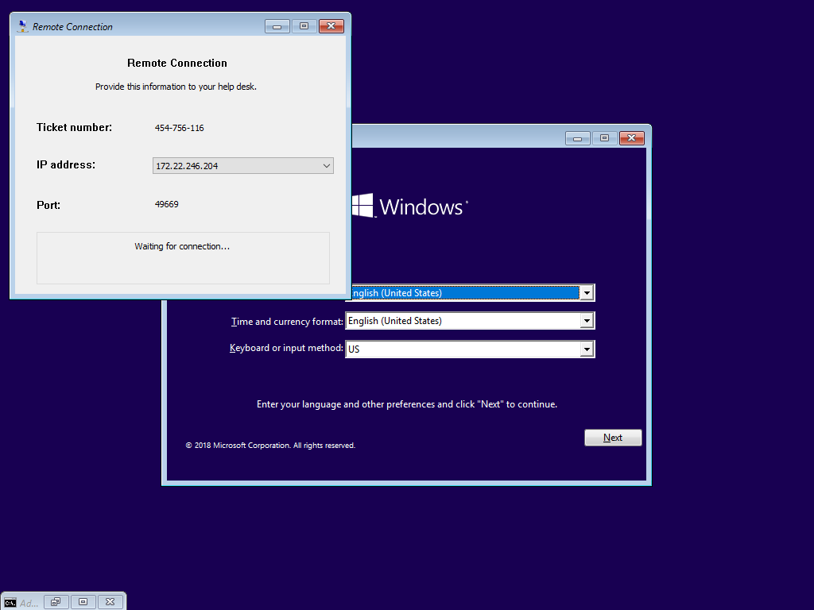

# Windows Setup with DaRT Remote Connection

This is an easy How To.  You must first use OSBuilder to get [Microsoft DaRT in WinPE](add-dart-to-winpe.md).  OSBuilder will add DaRT to WinPE \(Boot.wim Index 1\), WinRE, and Windows Setup \(Boot.wim Index 2\).  Now create an ISO or USB and boot up the OS.


Hold down Shift and F10 and a Command Prompt will open.  Start Network \(hopefully you added WinPE Drivers\) and then Remove Control using the following commands

```text
wpeinit InitializeNetwork
RemoteRecovery
```


Simply press Yes to allow Remote Connections and sit back like a Boss.  Now your Help Desk can install Windows 10 remotely \(I'll detail how to use Windows Setup with a custom image in a later How To\) . . . and yes this works with Server 2016 as well.




