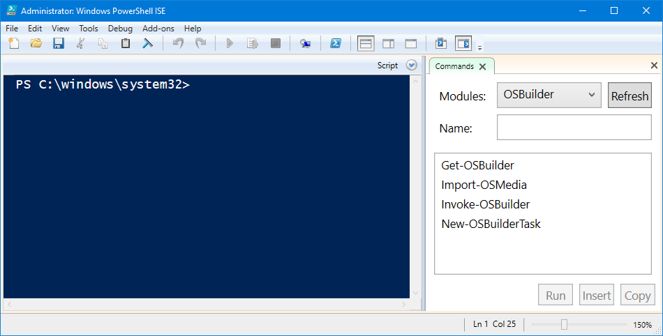

# Installation

OSBuilder is published in the PowerShell Gallery at [https://www.powershellgallery.com/packages/OSBuilder/](https://www.powershellgallery.com/packages/OSBuilder/)  
Make sure you check for updates as needed to support new features and to fix bugs!

Installation of OSBuilder is through a PowerShell command line. Use the following to Uninstall previous versions and to install the latest version.

**PowerShell Uninstall Previous Versions:**

```text
Uninstall-Module -Name OSBuilder -AllVersions -Force
```

**PowerShell Install Latest Version:**

```text
Install-Module -Name OSBuilder -Scope CurrentUser
```

## OSBuilder in PowerShell ISE

After installing the PowerShell Module, OSBuilder can be run in PowerShell ISE



## Admin Rights

OSBuilder requires Admin Rights in PowerShell as you will be manipulating Windows Images. Make sure you launch PowerShell ISE as Administrator when using OSBuilder

