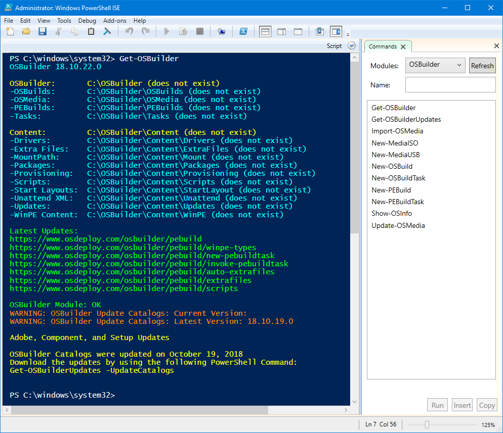

# Installation and Requirements

OSBuilder is published in the PowerShell Gallery at [https://www.powershellgallery.com/packages/OSBuilder/](https://www.powershellgallery.com/packages/OSBuilder/)  
Make sure you check for updates as needed to support new features and to fix bugs!

Installation of OSBuilder is through a PowerShell command line. Use the following to Uninstall previous versions and to install the latest version.

**PowerShell Uninstall Previous Versions:**

```text
Uninstall-Module -Name OSBuilder -AllVersions -Force
```

**PowerShell Install Latest Version:**

```text
Install-Module -Name OSBuilder -Scope CurrentUser -Force
```

## OSBuilder in PowerShell ISE

OSBuilder needs to be executed in PowerShell ISE \(as Elevated Administrator\) due to GridView constraints.



## Admin Rights

OSBuilder requires Admin Rights in PowerShell as you will be manipulating Windows Images. Make sure you launch PowerShell ISE as Administrator when using OSBuilder.  This is a requirement of DISM

## Supported Operating Systems <a id="supported-operating-systems"></a>

You can use the OSBuilder PowerShell Module on Windows 10.  Windows Server 2016, and Windows Server 2019 may be able to work, but this has not been tested.

_**Using the OSBuilder PowerShell Module on Windows 7 or Windows Server 2012 will only cause pain, grief, and sorrow.**_

You can use OSBuilder with Windows 10, Windows Server 2016, and Windows Server 2019 Media.

## Hardware Requirements

Offline Servicing of Windows 10 can take a considerable amount of time, especially on older releases. The process of Mounting a WIM, Applying a Cumulative Update, and performing DISM Image Cleanup will take as little as 30 minutes \(1803 x86\) on a healthy Intel Core i7 computer with a SSD, to almost 2 hours \(1607 x64\) on the same system.

I strongly recommend using a Workstation class system in performing these updates.

Since OSBuilder will mount Windows Images, I strongly recommend that you do not have any running Anti-Virus scanning files ON ACCESS. McAfee will prevent the dismounting of images properly.


OSBuilder works best on a stand alone Workgroup computer without an AntiVirus performing On Access Scanning.  Use a Virtual Machine \(with some power\) as an alternate solution


## OSMedia

If you used my previous attempt at this called OSMedia, you will need to get rid of it first.


