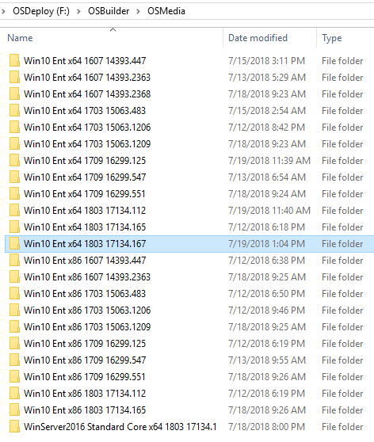
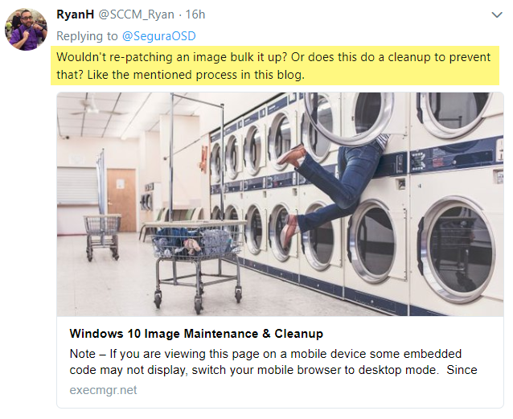
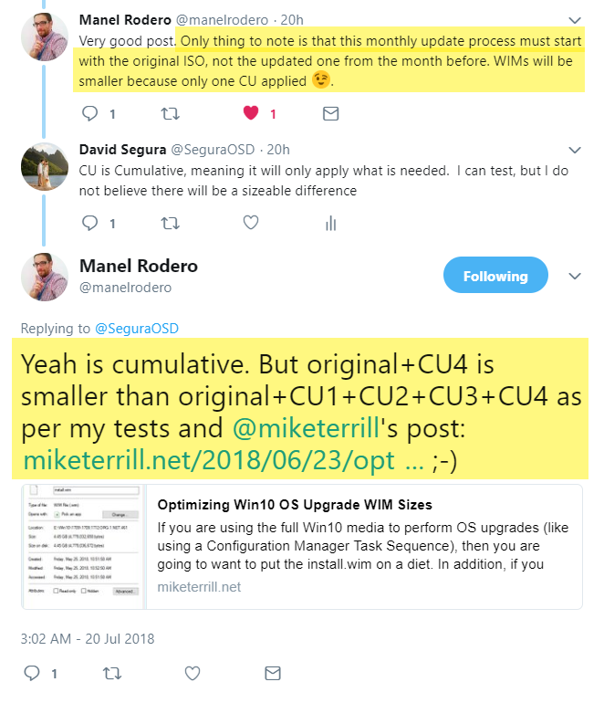
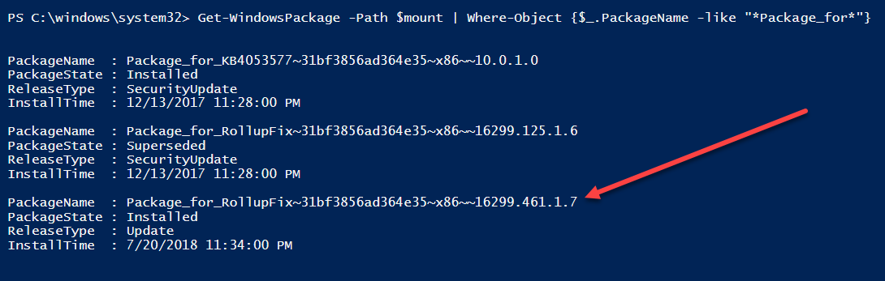
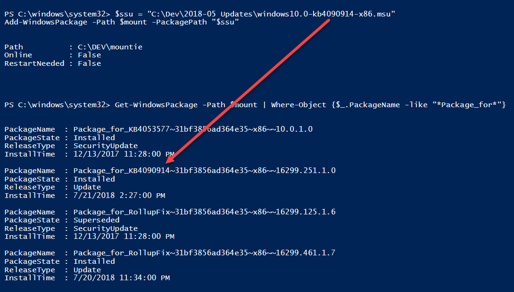
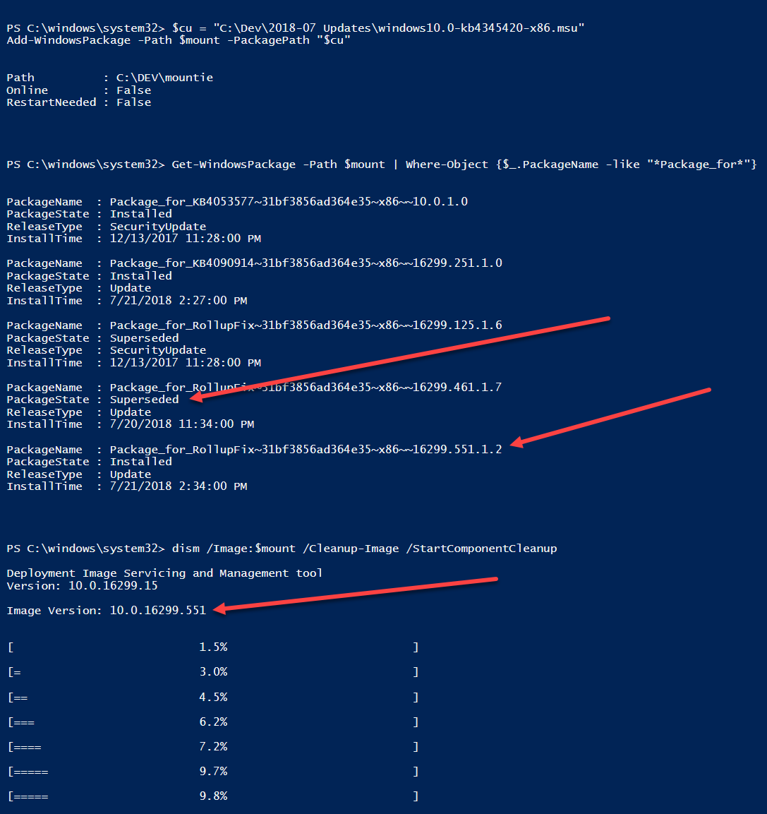
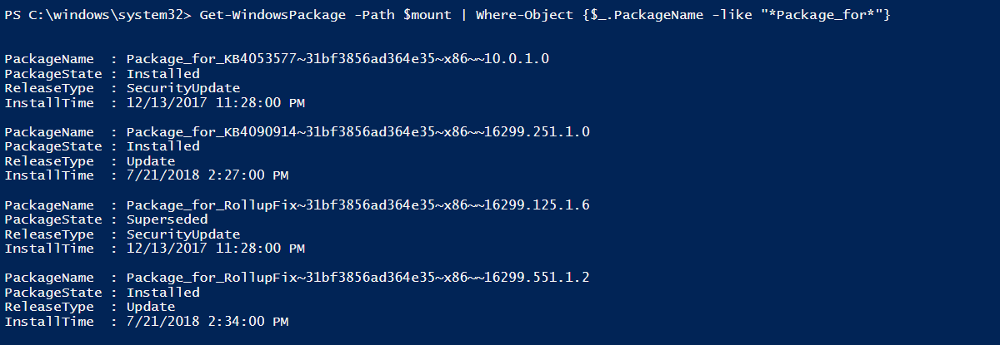
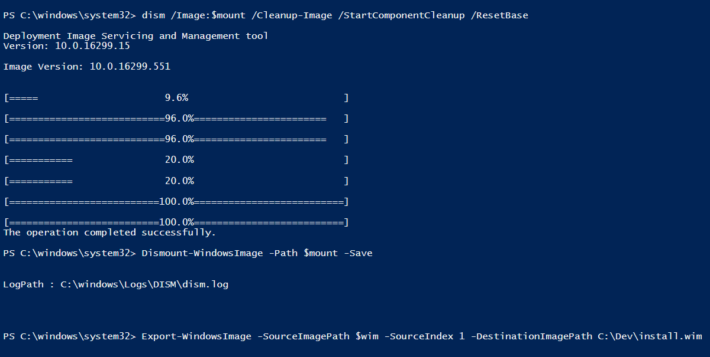
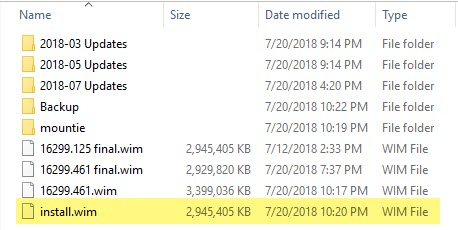
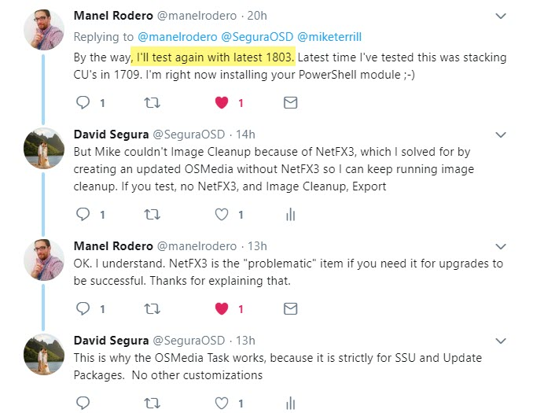

# Updating an Updated WIM

I designed OSBuilder to allow you to update OSMedia as part of a Task with an updated Cumulative Update and then use the updated OSMedia as a starting point. In layman terms, you Import-OSMedia, which we will call OSMedia 0. Then you apply July updates which is an update from OSMedia 0, so this is now OSMedia 0 + 1. OK so now you have already stacked updates, did it grow? We generally accept a 0 + 1 scenario, but August rolls around, now our release is OSMedia 0 + 1 + 2.

Logic says that this image will get larger and larger, the more Cumulative Updates are stacked, and your OSMedia Library starts looking something like this

## Confusion One

So logic kicks in . . . we shouldn't stack because the image will grow. And you read a great article from [Dan Padgett](https://twitter.com/danjpadgett) describing a problem in ConfigMgr, similar scenario where the image grows. Dan is correct, and RyanH apparently read find print that you have to do a DISM Image Cleanup, which ConfigMgr doesn't do when applying updates from the console \(and your multi-indexes\)

[https://execmgr.net/2018/06/07/windows-10-image-maintenance/](https://execmgr.net/2018/06/07/windows-10-image-maintenance/)

## Confusion Two

But there is still confusion, it still doesn't add up. We have always been told to start from the RTM when we inject our Cumulative Updates. Maybe it is because we need NetFX3 and can't run DISM Image Cleanup. Who knows. Be honest, most of us believe this is true. Great article by [Mike Terrill](https://twitter.com/miketerrill) by the way.

## The Test

So let's find out one way or the other by crafting a test.

* Media: Windows 10 x86 1709 16299.125 \(Updated Dec '17 MVLS ISO\)
* Patch A: May 21, 2018 — KB4103714 \(OS Build 16299.461\)
* Patch B: July 16, 2018 — KB4345420 \(OS Build 16299.551\)

So why 32-bit? Because the testing process is much faster than 64-bit

Keep in mind that my Media already has a patch in it, so even though we are supposed to start with a "Clean Image", we are already working with an OSMedia 0 + 1.

So I complete the following steps:

* Mount RTM Install.wim
* Apply Cumulative Update KB4103714
* DISM Image Cleanup with Reset Base
* Dismount and Save
* Export WIM

And while I was mounted I managed to get a list of my installed Packages. Yup, my CU installed properly. Also in this list is the 16299.125 Update which is marked as Superseded. So I am officially OSMedia 0 + 1 + 2

Now time to patch again. I create a copy of the WIM that was made in the last step and complete the following steps

* Mount the WIM
* Apply Servicing Stack KB4090914
* Apply Cumulative Update KB4345420
* DISM Image Cleanup with Reset Base
* Dismount and Save
* Export WIM

Here you can see the Servicing Stack installed without issues.

Next up, time to install the Cumulative Update. Pay attention to the previous Cumulative Update marked as Superseded and my CU gets me to 16299.551. This is also shown when I run a DISM Image Cleanup where it shows "Image Version"

So now I have an OSMedia 0 \(RTM\) + 1 \(Dec '17 MVLS\) + 2 \(KB4103714\) + 3 \(KB4345420\)

Now time to check my packages again. WTH? KB4103714 \(OS Build 16299.461\) is now gone! Well it was Superseded anyway.

And before anyone calls me out on not using doing a Reset Base, yes it was done before I did a Dismount and Save. After the dismount was complete, time to export my WIM

## The Result

As you can see, the new install.wim with the stacked Cumulative Updates is exactly the same size I started with \(quite odd indeed\), and my previous version 16299.461 was about 26MB smaller.

In other words . . .

## Conclusion

Feel free to update your last updated WIM without any issues!

OSBuilder was designed to stack Cumulative Updates to reduce the time needed to apply. The reduction is because there are much fewer changes when going from month to month vs starting with RTM.

Hopefully this test will bring some understanding into the design. This is also the reason why NetFX3 should not be enabled unless you are generating an OSBuild, because you cannot shrink your WIM after this feature is enabled

## Looping Back

Manel gets it, and no need to test by the way, I got you bro. **Please take the time to share this article if you found it helpful, and let's clear up some confusion in the Offline Servicing process.**

