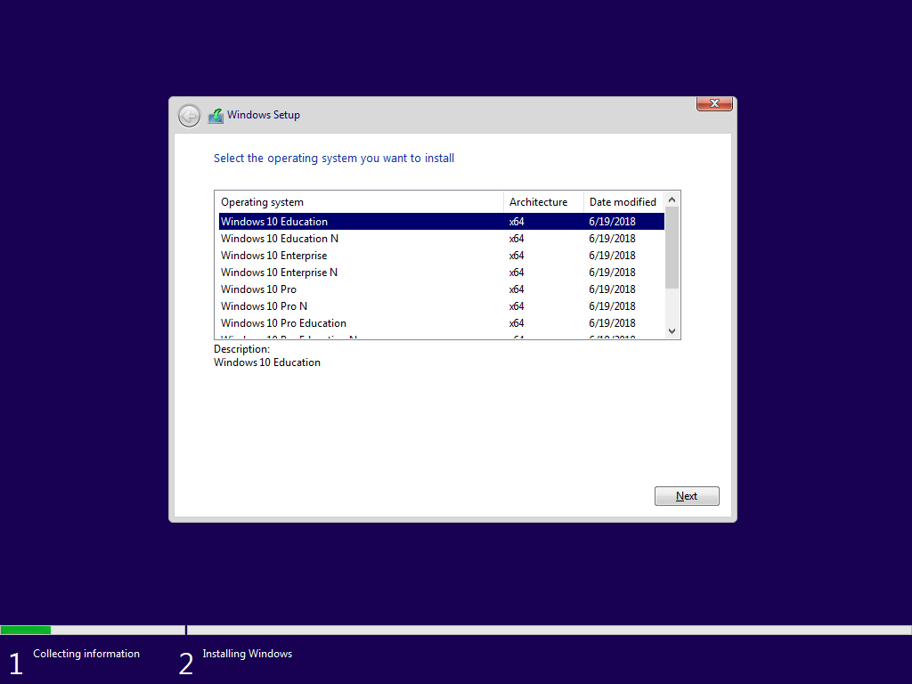
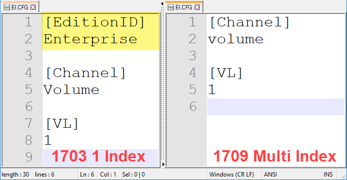
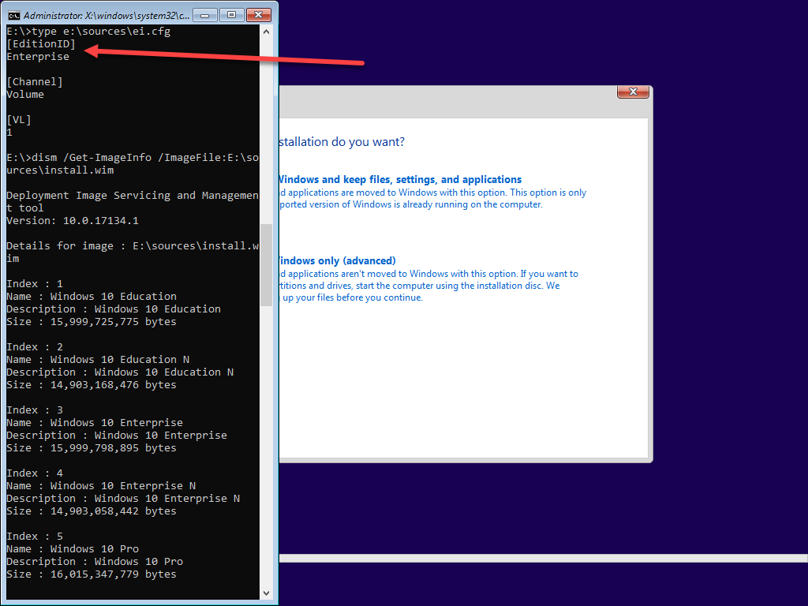
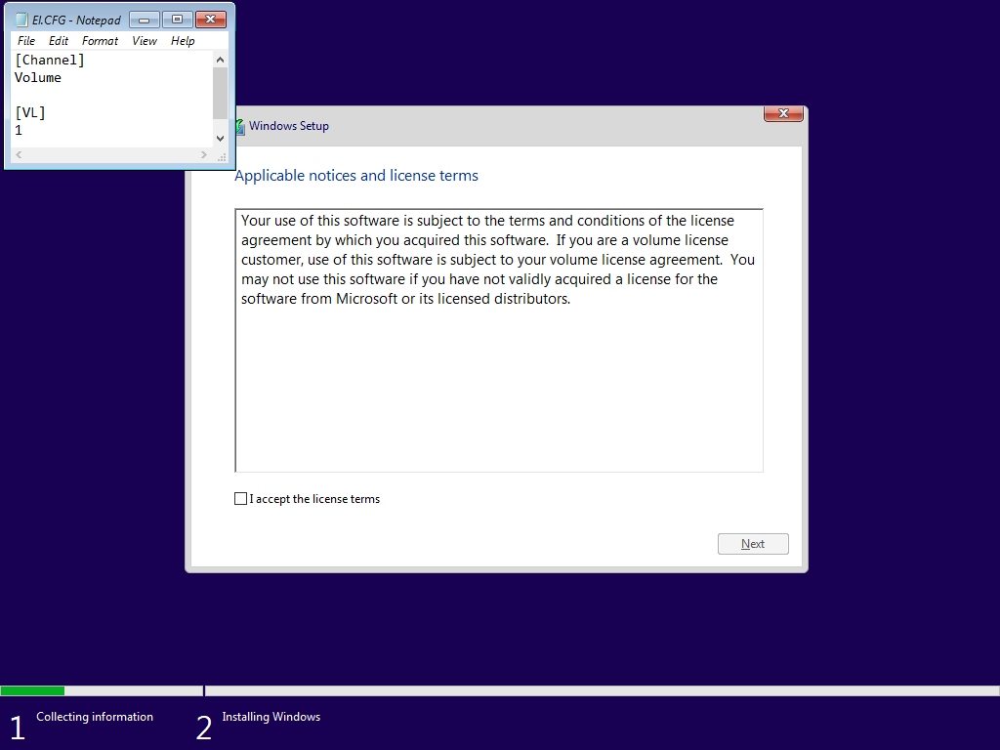
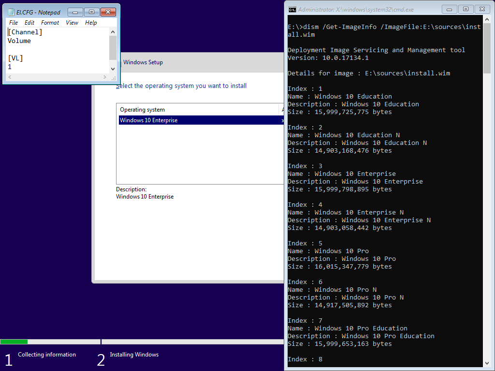
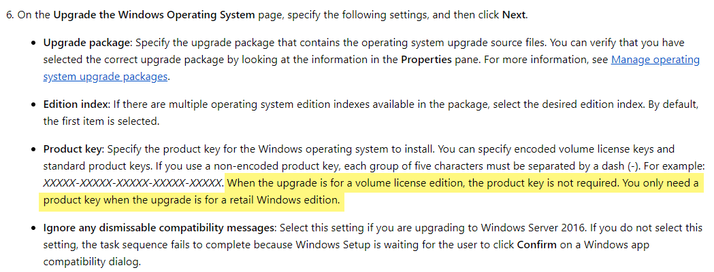
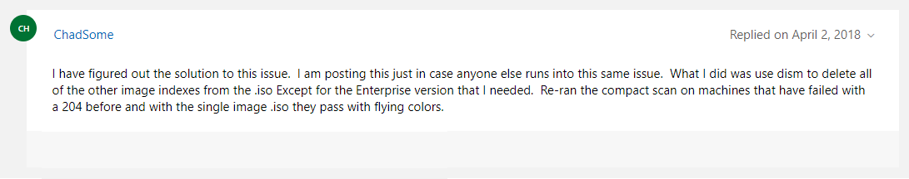

# Windows 10 Setup and the ei.cfg

Windows 10 1709 and 1803 Volume License media includes multiple Indexes in the WIM.  When booting one of these ISO's in a VM and starting Windows Setup, we can see the different options for installation.  This screen was not displayed prior to 1709 as those ISO's contain a single Index in the WIM.



### ei.cfg

Additionally, older Media had a file called ei.cfg in the SOURCES directory which contained the EditionID \(ei\).  Since Multi Index ISO's contain multiple versions of Windows, this file does not contain the EditionID.




Learn more about EI.cfg and PID.txt from Microsoft Hardware Dev Center

[Windows Setup Edition Configuration and Product ID Files \(EI.cfg and PID.txt\)](https://docs.microsoft.com/en-us/windows-hardware/manufacture/desktop/windows-setup-edition-configuration-and-product-id-files--eicfg-and-pidtxt)


### Install.wim Multi-Index and ei.cfg with EditionID

I can modify the ei.cfg by adding the EditionID and then create a new ISO.  During Windows Setup, I am not prompted to select an Edition, even though my install.wim has multiple Indexes.



### Install.wim Single-Index and ei.cfg without EditionID

The Install.wim only has the Enterprise Index, and the ei.cfg does not contain the EditionID.  In this case, no prompt to select an Edition.



### Install.wim Multi-Index and ei.cfg without EditionID with AutoUnattend.xml Key

Because why not.  In this example I have added the KMS Client Setup Key to a simple AutoUnattend.xml

```text
<?xml version="1.0" encoding="utf-8"?>
<unattend xmlns="urn:schemas-microsoft-com:unattend">
    <settings pass="windowsPE">
        <component name="Microsoft-Windows-Setup" processorArchitecture="amd64" publicKeyToken="31bf3856ad364e35" language="neutral" versionScope="nonSxS" xmlns:wcm="http://schemas.microsoft.com/WMIConfig/2002/State" xmlns:xsi="http://www.w3.org/2001/XMLSchema-instance">
            <UserData>
                <ProductKey>
                    <Key>NPPR9-FWDCX-D2C8J-H872K-2YT43</Key>
                </ProductKey>
            </UserData>
        </component>
    </settings>
</unattend>
```


[Microsoft KMS Client Setup Keys](https://docs.microsoft.com/en-us/windows-server/get-started/kmsclientkeys)


Windows Setup knows which Key corresponds with the proper Edition



When using the AutoUnattend.xml, include the WillShowUI entry with a value of Never to hide the Select Operating System screen.

```text
<?xml version="1.0" encoding="utf-8"?>
<unattend xmlns="urn:schemas-microsoft-com:unattend">
    <settings pass="windowsPE">
        <component name="Microsoft-Windows-Setup" processorArchitecture="amd64" publicKeyToken="31bf3856ad364e35" language="neutral" versionScope="nonSxS" xmlns:wcm="http://schemas.microsoft.com/WMIConfig/2002/State" xmlns:xsi="http://www.w3.org/2001/XMLSchema-instance">
            <UserData>
                <ProductKey>
                    <Key>NPPR9-FWDCX-D2C8J-H872K-2YT43</Key>
                    <WillShowUI>Never</WillShowUI>
                </ProductKey>
            </UserData>
        </component>
    </settings>
</unattend>
```

### Upgrade Issues

Adam Gross encountered an issue when upgrading Windows 7 to Windows 10 in a CM Task Sequence that started happening on version 1709 \(Multi Index\) 

[http://www.asquaredozen.com/2018/01/16/windows-7-windows-10-fall-creators-update-1709-place-upgrade-fails-error-0xc1900204-invalid-sku/](http://www.asquaredozen.com/2018/01/16/windows-7-windows-10-fall-creators-update-1709-place-upgrade-fails-error-0xc1900204-invalid-sku/)

According to Microsoft, the product key is not required, but apparently in the case of a Multi-Index Install.wim you have to.


[Microsoft: Create a task sequence to upgrade an operating system in System Center Configuration Manager](https://docs.microsoft.com/en-us/sccm/osd/deploy-use/create-a-task-sequence-to-upgrade-an-operating-system)




### OSDeploy Recommendation

To reduce the risk of any issues, always include the proper KMS Client Setup Key in the Task Sequence.  **No changes to OSBuilder to modify the ei.cfg are planned unless I receive confirmation that it needs to be edited.  Since all OSMedia imported in OSBuilder is a Single Index, it appears that this issue will not occur.**

[See this link for more information](https://answers.microsoft.com/en-us/windows/forum/windows_7-windows_install-winsubother/windows-10-1709-compatability-check-failure/8c41147b-d51a-47ef-a5f3-2d0bad204f3f)




