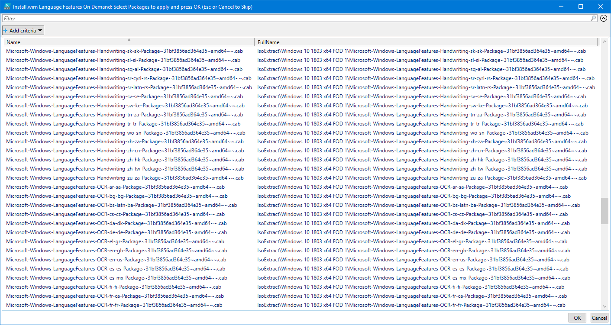

# IsoExtract Content

**IsoExtract** is a directory that can be found at **C:\&lt;OSBuilder&gt;\Content\IsoExtract**

The purpose of this directory is to extract the contents of the following Microsoft ISOs

* Windows 10 Enterprise Features on Demand
* Windows 10 Enterprise Language Pack

## Download ISO

Download of Copy the Microsoft ISOs into the **C:\&lt;OSBuilder&gt;\Content\IsoExtract** directory

## Extract ISO

Using a tool like 7zip, extract the ISOs

## Rename Directories

Give the directories a Friendly name, and include the Windows Version and Architecture if applicable

## Remove ISOs

No need to keep the ISOs once they are extracted

## Language Packs

When adding the **Language Pack ISO** to the **IsoExtract** directory, creating a [**`New-OSBuildTask`**](../new-osbuildtask/) will enable the prompt to select **Language Packs**

## Language Interface Packs

When adding the **Language Pack ISO** to the **IsoExtract** directory, creating a [**`New-OSBuildTask`**](../new-osbuildtask/) will enable the prompt to select **Language Packs**

## Features on Demand

When adding the **Features on Demand ISO** to the **IsoExtract** directory, creating a [**`New-OSBuildTask`**](../new-osbuildtask/) will enable the prompt to select **Features on Demand**

## Language Features on Demand

When adding the **Features on Demand ISO** to the **IsoExtract** directory, creating a [**`New-OSBuildTask`**](../new-osbuildtask/) will enable the prompt to select **Language Features on Demand**

