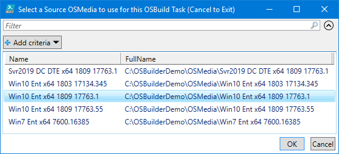

# New-OSBuildTask


An OSBuild Task will take an existing OSMedia and apply customizations. You can leave the BuildName blank, unless you have two different configurations where they will be named the same.

## -TaskName

The name of the Task you are creating.  This name will be used for naming the Task JSON file.  This parameter is required

```text
New-OSBuildTask -TaskName "Win10 x64 1809"
```

## -BuildName

OSBuilds are saved as the name of the Operating System, Arch, and UBR.  If you require something more friendly, use this parameter

```text
New-OSBuildTask -TaskName "Win10 x64 1809" -BuildName "Engineering Build"
```

## -EnableNetFX3

If you want to enable NetFX3 in your OSBuild \(recommended\), use this parameter

```text
New-OSBuildTask -TaskName "Win10 x64 1809" -EnableNetFX3
```

## Run PowerShell Command Line

This example uses the following command line

```text
New-OSBuildTask -TaskName "Win10 x64 1809" -EnableNetFX3
```

### Select a Source OSMedia

Select a source [**`OSMedia`**](../../osmedia/) to use for the OSBuild Task.  It is not necessary to select the latest version as OSBuilder will automatically select the newest version when using [**`New-OSBuild`**](../new-osbuild.md)**\`\`**



### Task JSON

A Task will be created at "C:\OSBuilderDemo\Tasks\OSBuild Win10 x64 1809.json" and will look similar to the Task below.  In this Task are all the values needed for creating an OSBuild


