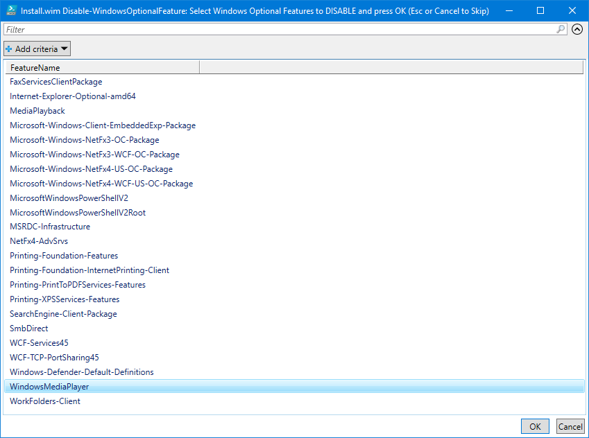
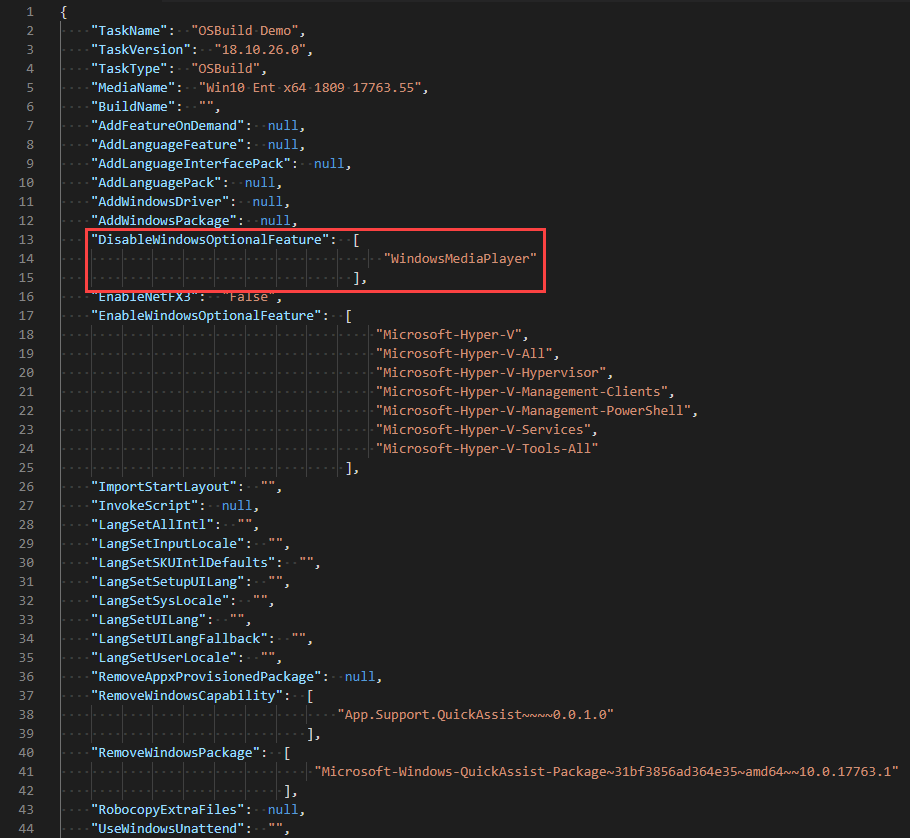

# Disable Windows Optional Feature

When creating an OSBuild for Windows 10, your have the option to disable a Windows Optional Feature

## -DisableWindowsOptionalFeature

Using this parameter with [**`New-OSBuildTask`**](./), you will be prompted to select Windows Optional Features to disable in your OSBuild.

```text
New-OSBuildTask -TaskName Demo -DisableWindowsOptionalFeature
```

Simply multi-select the Windows Optional Features to disable and press OK



The selected Windows Optional Features will be added to the OSBuild Task.  When executing [**`New-OSBuild`**](../new-osbuild.md), these Windows Optional Features will be disabled



