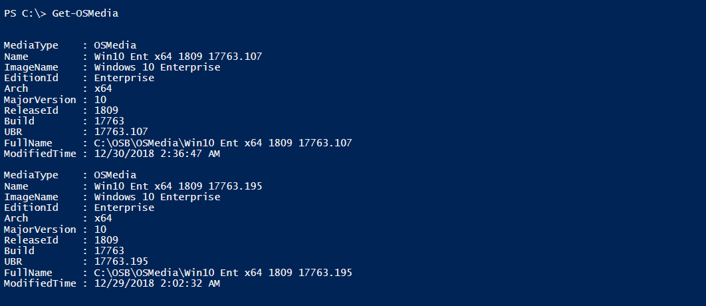
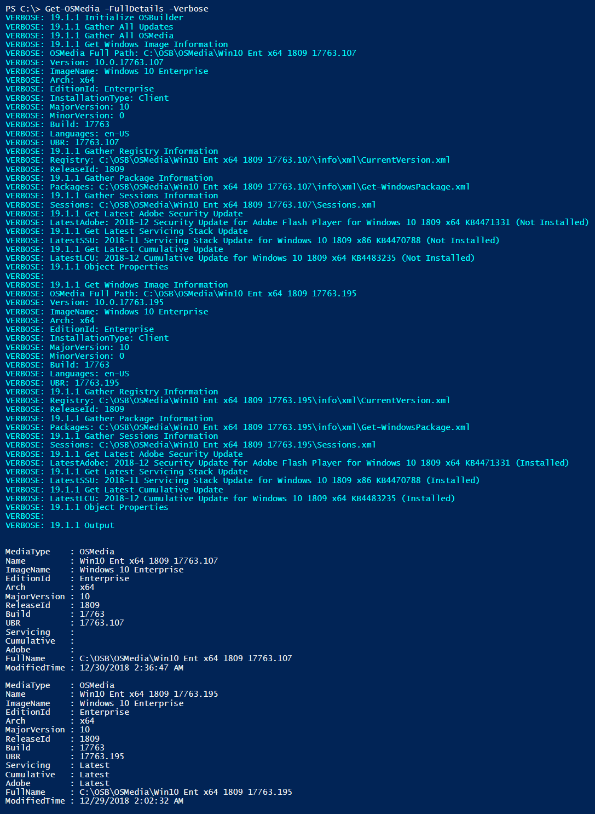
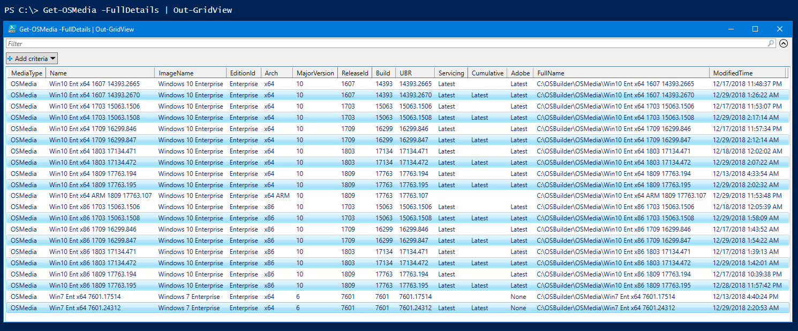
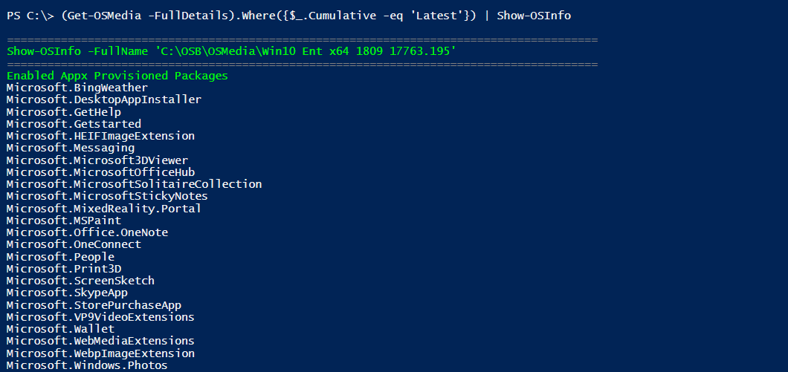
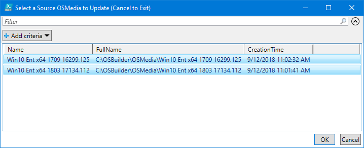
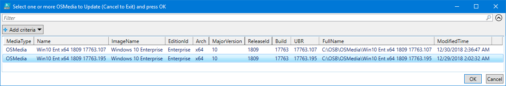

# Get-OSMedia

**`Get-OSMedia`** will return all [**`OSMedia`**](../docs/functions/osmedia/) as a PowerShell Custom Object

## Get-OSMedia -FullDetails

This will determine if the Updates are the Latest available.  Cumulative Update information is obtained by parsing an exported Sessions.xml file \(exported in OSBuilder 18.12.5 or newer\).

## Get-OSMedia -FullDetails -Verbose

Even more detail can be viewed when using the -Verbose parameter.  This will display information about the Updates that are validated.  This process can take up to a minute for multiple OSMedia

## Get-OSMedia -FullDetails \| Out-GridView

You can pipe Out-GridView to display the results in this format

## Display only Latest CU

Or just display the OSMedia with the Latest Cumulative Update

**`(Get-OSMedia -FullDetails).Where({$_.Cumulative -eq 'Latest'})`**

## Show-OSInfo

You can also pipe OSMedia to some other OSBuilder functions like[**`Show-OSInfo`**](../docs/functions/osbuilder/show-osinfo.md) using any of the following commands

**`Get-OSMedia -FullDetails | Out-GridView -PassThru | Show-OSInfo`**

**`Get-OSMedia -FullDetails | Where-Object {$_.Cumulative -eq 'Latest'} | Show-OSInfo`**

**`(Get-OSMedia -FullDetails).Where({$_.Cumulative -eq 'Latest'}) | Show-OSInfo`**

## Get-OSMedia in OSBuilder Functions

**`Get-OSMedia`** will be used in additional OSBuilder functions.  For example, [**`Update-OSMedia`**](../docs/functions/osmedia/update-osmedia/) used a simple selection based on Directories contained in OSMedia

**`Get-OSMedia`** will allow more detailed information in the selection of OSMedia to Update

