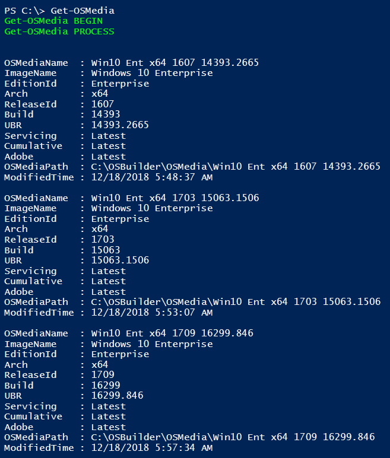
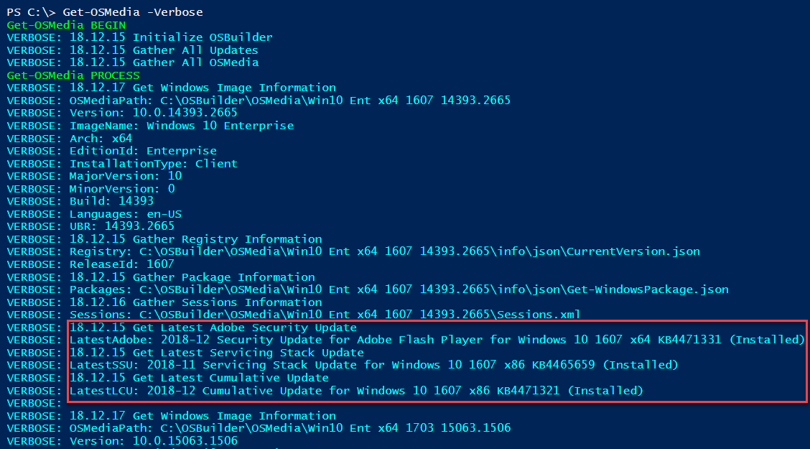
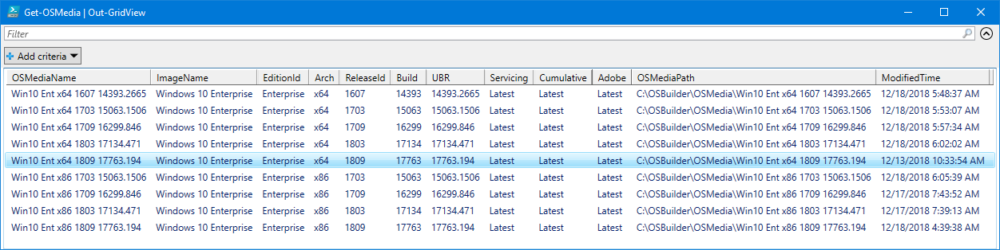
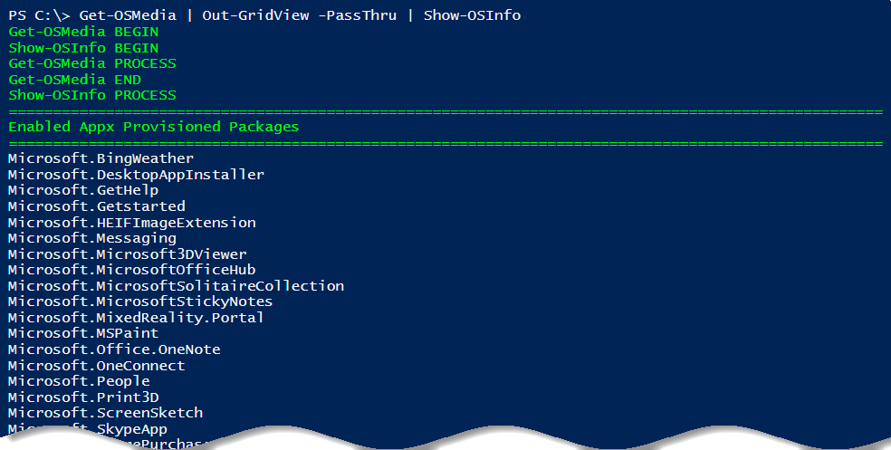

# Get-OSMedia

Get-OSMedia will return all OSMedia as a PowerShell Custom Object with detailed information about the OSMedia



## Get-OSMedia -Verbose

Even more detail can be viewed when using the -Verbose parameter



## Get-OSMedia \| Out-GridView

Displays all OSMedia in a simple Grid



## Get-OSMedia \| Out-GridView -PassThru \| Show-OSInfo

You can use Get-OSMedia to [**`Show-OSInfo`**](../docs/how-to/show-osinfo.md)**\`\`**

Or accomplish the same thing using this command line

```text
Get-OSMedia | ? {$.Arch -eq 'x64' -and $.ReleaseId -eq '1809'} | Show-OSInfo
```




## 


