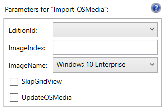
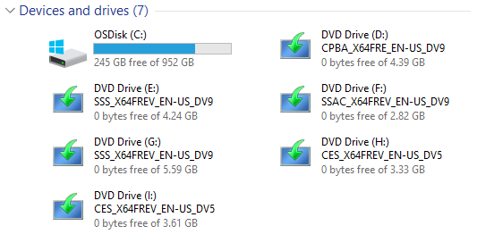
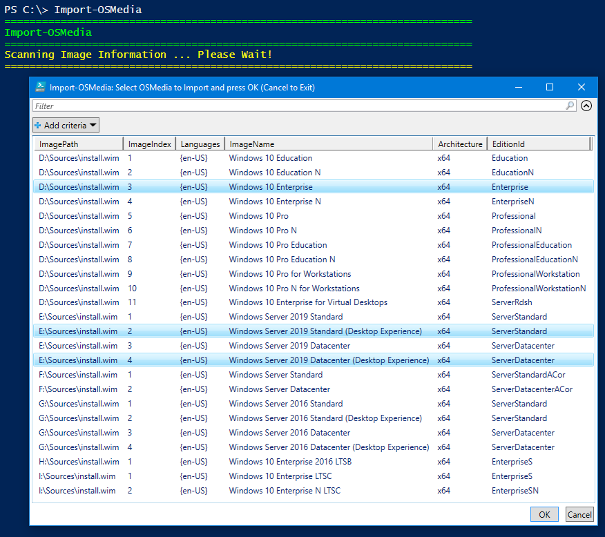

# Import-OSMedia

Importing an Operating System into OSBuilder is one of the first steps that should be taken.  In this example, I have mounted several ISO's that were downloaded from Microsoft MVLS

**`Import-OSMedia`** can be run without any parameters.  Once executed it will will search all attached Drives for install.wim or Install.esd files.  This process should take about a minute, be patient and let the scan finish.

Once the scanning is complete, a Grid will be displayed with all the available Operating Systems. Multi-select the ones you want to import and press OK.

## -UpdateOSMedia

Optionally, you can add the **`-UpdateOSMedia`** parameter to automatically patch the Imported Operating System using [**`Update-OSMedia`**](../update-osmedia/).  This option will automatically download any required Updates.  You will need an Internet connection and keep in mind the Cumulative Updates are quite large, so don't do this with a Metered Connection.

## -EditionId

You can filter the Operating System Edition ID by using this parameter

**Example:**  `Import-OSMedia -EditionId Enterprise`

The following values can be used with this parameter

* Education
* EducationN
* Enterprise
* EnterpriseN
* EnterpriseS
* EnterpriseSN
* Professional
* ProfessionalEducation
* ProfessionalEducationN
* ProfessionalN ProfessionalWorkstation
* ProfessionalWorkstationN
* ServerDatacenter
* ServerDatacenterACor
* ServerRdsh
* ServerStandard
* ServerStandardACor

## -ImageIndex

## -ImageName

## -SkipGridView

## Import Phase

The following steps will occur in this phase

* Install.wim will be mounted directly from the attached Media
* UBR will be determined
* Name and UBR will be gathered so a named directory can be created in C:\OSBuilder\OSMedia
* Operating System files will be copied to the new directory
* Information concerning the mounted Operating System will be collected
* The selected Install.wim Index that was selected will be exported to the Imported Media directory
* All PE's will be exported to a WinPE subdirectory \(boot.wim, setup.wim, winpe.wim, winre.wim\)
* Install.wim will be dismounted
* Configuration information will be collected on the WIMs

**Right click and open the following image in a new tab for a better look at the output**

## Reporting Phase

In this phase, all the configuration about the imported Operating System will be displayed. All of this is saved in the OSMedia logs as well as the PowerShell transcript.

**Right click and open the following image in a new tab for a better look at the output**

## Complete

The process of importing an Operating System into OSMedia took about 1 minute of actual work, with 6 minutes of processing. In the end, the Operating System is fully copied into OSMedia and ready to update.

Repeat this process for all your Operating Systems and run Get-OSBuilder. The imported Operating Systems will show up in OSMedia

