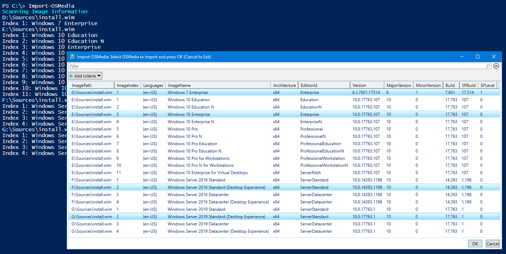
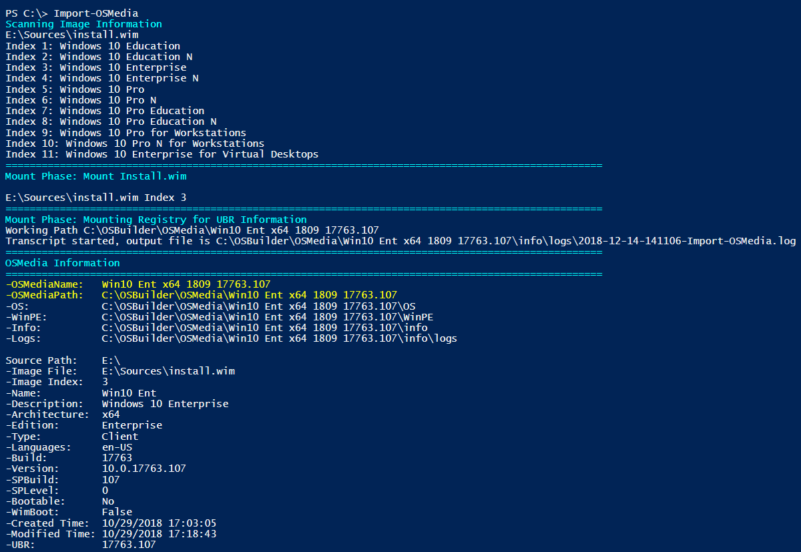
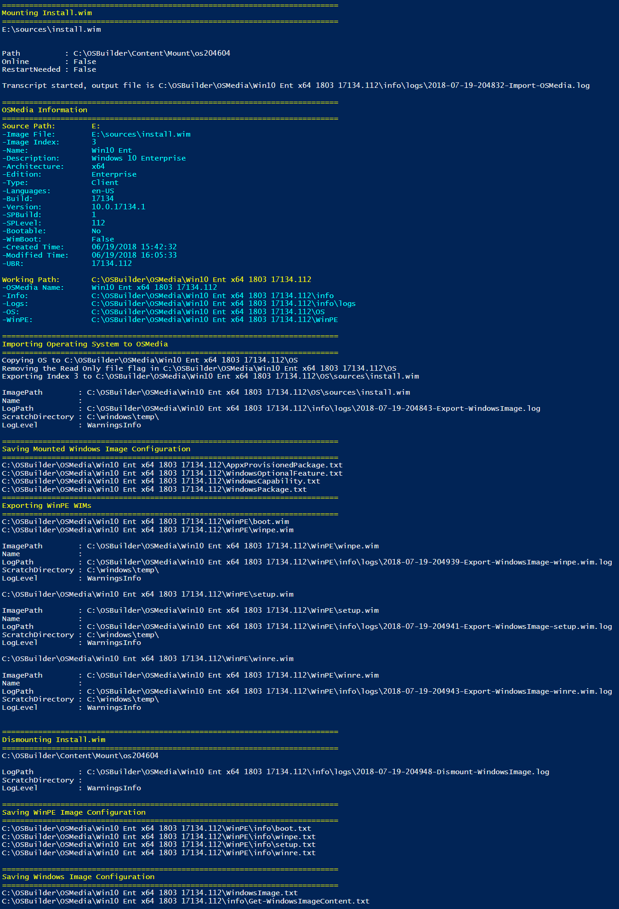
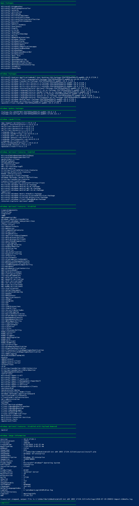

# Import-OSMedia

## Parameters



* \[switch\] NewMediaISO
* \[switch\] ShowOSInfo
* \[switch\] UpdateOSMedia



* \[string\] EditionId
* \[int\] ImageIndex
* \[string\] ImageName
* \[switch\] NewMediaISO
* \[switch\] ShowOSInfo
* \[switch\] SkipGridView
* \[switch\] UpdateOSMedia



```text
-NewMediaISO [<SwitchParameter>]
    Executes New-MediaISO -OSMediaPath $OSMediaPath to creates an ISO after Import

-ShowOSInfo [<SwitchParameter>]
    Executes Show-OSInfo -OSMediaPath $OSMediaPath to display the OS Information after Import

-UpdateOSMedia [<SwitchParameter>]
    Executes Update-OSMedia -OSMediaName $OSMediaName -DownloadUpdates -Execute after Import

-EditionId <String>
    Operating System Edition to import

-ImageIndex <Int32>
    Operating System Index to Import

-ImageName <String>
    Operating System Image Name to Import

-SkipGridView [<SwitchParameter>]
    Used to bypass the ISE GridView Operating System Selection
```

## Setup

Importing an Operating System into OSBuilder is one of the first steps that should be taken.  In this example.  Multiple Operating System Versions and Editions can be imported at the same time.  In this example I have mounted MVLS ISO's for the following:

* Windows 7 SP1 x64
* Windows 10 x64
* Windows Server 2016
* Windows Server 2019


## Import-OSMedia

**`Import-OSMedia`** can be run without any parameters in PowerShell ISE \(for GridView functionality\).  Once executed, it will will search all attached Drives for install.wim or Install.esd files.  This process should take about a minute, so be patient and let the scan finish.

Once the scanning is complete, a GridView will display with all the available Operating Systems and Editions. Multi-select the ones you want to import and press OK.



#### Mount Phase

After selection, the Install.wim or Install.esd will be mounted so OSBuilder can gater additional information.  Two important pieces of information will be displayed

* **OSMediaName** - This is the Name of the Operating System as defined by OSBuilder.  This is used in the Directory Name of the OSMedia.  It contains the following information in an abbreviated format
  * **&lt;Operating System&gt; &lt;Edition&gt; &lt;Architecture&gt; &lt;Version&gt; &lt;UBR&gt;**
* **OSMediaPath** - This is the FullName or Path of the OSMedia

It is important to understand this naming structure as these can be used as Parameters in other OSBuilder functions



#### Import Phase

When the Mount Phase is complete, the Operating System can be copied into **OSBuilder\OSMedia** in a directory name matching the **OSMediaName**


## -ShowOSInfo

**Usage:  `Import-OSMedia -ShowOSInfo`**

Displays the full OSMedia Information by executing the OSBuilder [**`Show-OSInfo`**](../../how-to/show-osinfo.md) function



## -UpdateOSMedia

**Usage:  `Import-OSMedia -UpdateOSMedia`**

Automatically applies patches to the imported Operating System using the OSBuilder [**`Update-OSMedia`**](../update-osmedia/) function

This option will automatically download any required Updates.  You will need an Internet connection and keep in mind the Cumulative Updates are quite large, so don't do this with a Metered Connection.



## -EditionId

You can filter the Operating System by Edition ID using this parameter

**Example:**  `Import-OSMedia -EditionId Enterprise`

The following values can be used with this parameter

* Education
* EducationN
* Enterprise
* EnterpriseN
* EnterpriseS
* EnterpriseSN
* Professional
* ProfessionalEducation
* ProfessionalEducationN
* ProfessionalN ProfessionalWorkstation
* ProfessionalWorkstationN
* ServerDatacenter
* ServerDatacenterACor
* ServerRdsh
* ServerStandard
* ServerStandardACor

## -ImageIndex

If you know the Image Index, then you can specify this to filter the Operating Systems

**Example:**  `Import-OSMedia -ImageIndex 3`

## -ImageName

You can filter the Operating System by Image Name using this parameter

**Example:**  `Import-OSMedia -ImageName 'Windows 10 Enterprise'`

The following values can be used with this parameter

* Windows 10 Education
* Windows 10 Education N
* Windows 10 Enterprise
* Windows 10 Enterprise 2016 LTSB
* Windows 10 Enterprise for Virtual Desktops
* Windows 10 Enterprise LTSC
* Windows 10 Enterprise N
* Windows 10 Enterprise N LTSC
* Windows 10 Pro
* Windows 10 Pro Education
* Windows 10 Pro Education N
* Windows 10 Pro for Workstations
* Windows 10 Pro N
* Windows 10 Pro N for Workstations
* Windows Server 2016 Datacenter
* Windows Server 2016 Datacenter \(Desktop Experience\)
* Windows Server 2016 Standard
* Windows Server 2016 Standard \(Desktop Experience\)
* Windows Server 2019 Datacenter
* Windows Server 2019 Datacenter \(Desktop Experience\)
* Windows Server 2019 Standard
* Windows Server 2019 Standard \(Desktop Experience\)
* Windows Server Datacenter
* Windows Server Standard

## -SkipGridView

To fully automate the import of an Operating System, use this parameter to skip the PowerShell GridView selection.  It is recommended on Multi-Index Media that you specify an **`-EditionId`**, **`-ImageIndex`**,  or **`-ImageName`**

**Example:**  `Import-OSMedia -EditionId Enterprise -SkipGridView`

## Import Phase

The following steps will occur in this phase

* Install.wim will be mounted directly from the attached Media
* UBR will be determined
* Name and UBR will be gathered so a named directory can be created in C:\OSBuilder\OSMedia
* Operating System files will be copied to the new directory
* Information concerning the mounted Operating System will be collected
* The selected Install.wim Index that was selected will be exported to the Imported Media directory
* All PE's will be exported to a WinPE subdirectory \(boot.wim, setup.wim, winpe.wim, winre.wim\)
* Install.wim will be dismounted
* Configuration information will be collected on the WIMs

**Right click and open the following image in a new tab for a better look at the output**



## Reporting Phase

In this phase, all the configuration about the imported Operating System will be displayed. All of this is saved in the OSMedia logs as well as the PowerShell transcript.

**Right click and open the following image in a new tab for a better look at the output**



## Complete

The process of importing an Operating System into OSMedia took about 1 minute of actual work, with 6 minutes of processing. In the end, the Operating System is fully copied into OSMedia and ready to update.

Repeat this process for all your Operating Systems and run Get-OSBuilder. The imported Operating Systems will show up in OSMedia


