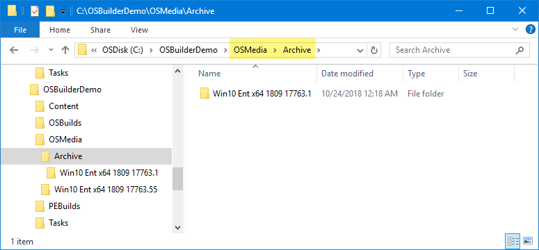

# Archive

When you perform a successful Update-OSMedia, the OSMedia directory will now contain multiple directories with different UBRs.

This may also lead to confusion when presented with multiple selections

I strongly recommend moving previous UBRs into an Archive subdirectory of OSMedia

This results in less confusion going forward \(future releases of OSBuilder may do this automatically\)

