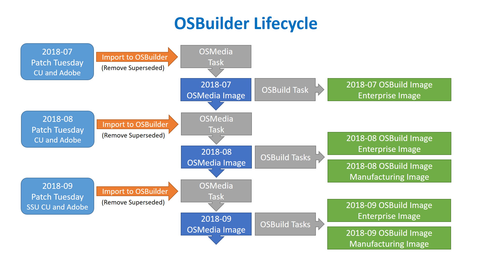

# OSBuilder Overview

OSBuilder is a PowerShell module to help you perform Offline Servicing to a Windows Operating System Image. By using an Offline method of configuring an Operating System, it can then be imported in MDT or SCCM and used like any other OS Deployment. This includes being able to use in an Upgrade Task Sequence, which you cannot do with a Captured Image.

The main difference between OSBuilder and other scripted methods for Servicing a Windows Image Offline is that OSBuilder creates an answer file called a Task \(think Task Sequence\). Since the Task has all the information it needs to update the Windows Image, there is no interaction necessary, and as long as the content \(updates\) are updated regularly, the Task can be repeated as needed.

Since the configuration is also saved in a Task, it is possible to select multiple tasks to run, and they will execute one right after another. This makes performing a monthly update take a few minutes to kick off. After a few hours, everything will be complete!

## OSBuilder Design

Most people are visual, so to help you understand how OSBuilder will work, here is the OSBuilder Lifecycle. So let's talk about how this works.

## Import-OSMedia

Before working with an Operating System, you must first Import it into OSBuilder.  This will generate a full inventory of the Operating System so you can later make custom OSBuilds.

## Update-OSMedia

The second step is to Update the Imported Operating System.  You should perform this step after you Import the Operating System and after every Patch Tuesday.  This will perform the following actions

* **Media**
  * Expand Setup Update
* **WinPE** \(WinPE.wim, WinRE.wim, Setup.wim\)
  * Apply Servicing Stack
  * Apply Cumulative Update
  * Apply Dynamic Component Updates
* **OS**
  * Apply Servicing Stack
  * Apply Cumulative Update
  * Apply Dynamic Component Updates
  * Apply Adobe Security Updates

## New-OSBuildTask

If you want to customize the Operating System by removing Appx Packages or enable NetFX3, then you need to first create an OSBuild Task.  The following options can be customized:

* **WinPE** \(WinPE.wim, WinRE.wim, Setup.wim\)
  * Add ADK Packages
  * Add MS DaRT
  * Add Drivers
  * Add ExtraFiles
  * Execute custom PowerShell scripts
* **OS**
  * Enable NetFX3
  * Remove Appx Provisioned Packages
  * Remove Windows Packages
  * Remove Windows Capabilities
  * Enable Windows Optional Features
  * Disable Windows Optional Features
  * Apply Features on Demand
  * Apply Language Packs
  * Apply Language Interface Packs
  * Apply Language Features on Demand
  * Apply Start Layout
  * Apply Unattend.xml
  * Add Drivers
  * Add ExtraFiles
  * Add Packages
  * Execute custom PowerShell scripts
  * Set International Settings

## New-OSBuild

After the OSBuild Task is created, you can then create your OSBuild

## New-PEBuildTask

Just like a you can customize your Operating System, you can also customize WinPE

## New-PEBuild

After the PEBuild Task is created, you can create your PEBuild

## New-MediaISO

You can create an ISO of any OSMedia, OSBuild, or PEBuild

## New-MediaUSB

You can create bootable USB of any OSMedia, OSBuild, or PEBuild

## The Cycle

This is where your process repeats. When Microsoft releases a new round of updates, use Get-OSBuilderUpdates to download the updates you need, and remove the ones you don't from.  This step is completely optional as OSBuilder can automatically download the updates as needed.

Use Update-OSMedia to get all your imported Operating Systems up to date.  You can update all of them at the same time as this will take a while to process, typically 30 minutes per Operating System.

Once all the OSMedia is up to date, use New-OSBuild to regenerate all your customizations.

## OSBuilder PowerShell Module

To keep things easy, OSBuilder is a PowerShell module and integrates well into PowerShell ISE

## References

* [Johan Arwidmark: Windows 10 Servicing Script - Creating the better In-Place upgrade image](https://deploymentresearch.com/Research/Post/672/Windows-10-Servicing-Script-Creating-the-better-In-Place-upgrade-image)
* [EXEC\|MGR: Windows 10 Image Maintenance and Cleanup](https://execmgr.net/2018/06/07/windows-10-image-maintenance/)
* [Mike Terrill: Optimizing Win10 OS Upgrade WIM Sizes](https://miketerrill.net/2018/06/23/optimizing-win10-os-upgrade-wim-sizes/)

