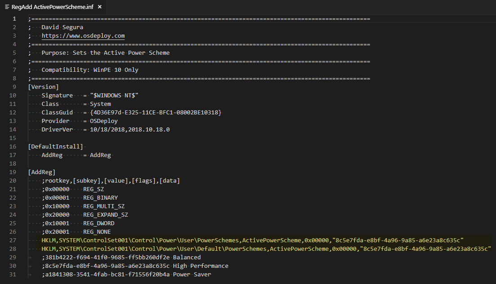
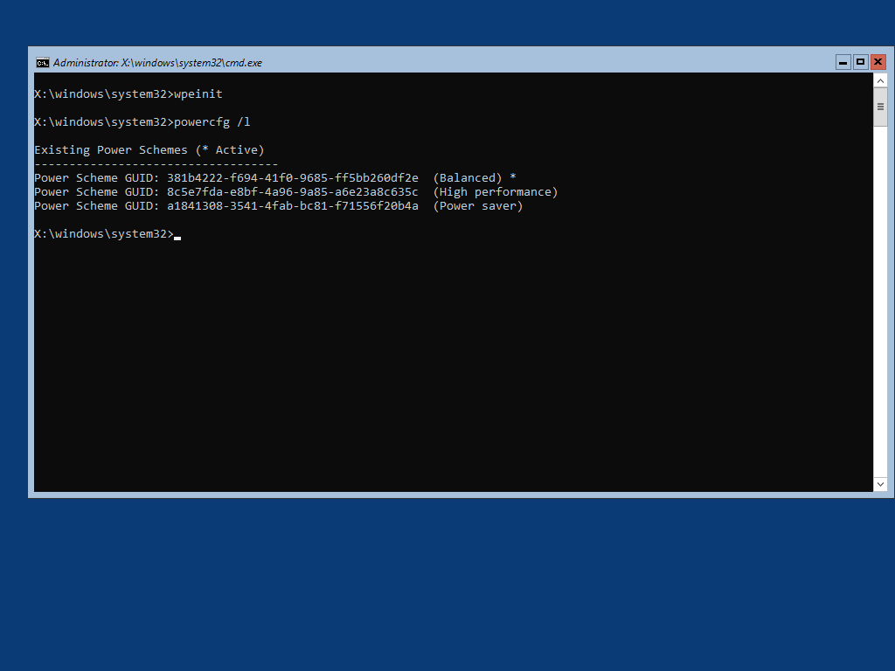
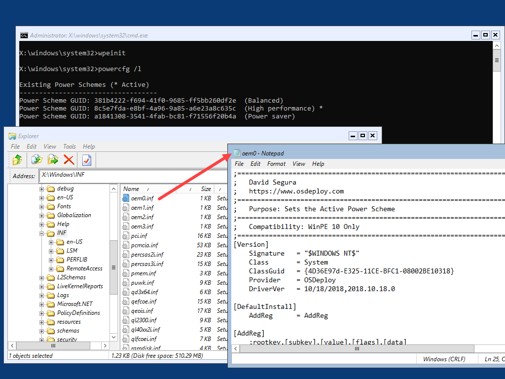

# RegAdd ActivePowerScheme



How many people set the Power Scheme in WinPE to High Performance during an OS Deployment?  Did you know you can change this setting by adding a simple Driver to WinPE?

## OSBuilder.Public Repository

This Driver is included in the OSBuilder.Public Repository at: **OSBuilder.Public\Content\WinPE\Drivers\RegAdd ActivePowerScheme**



## 

