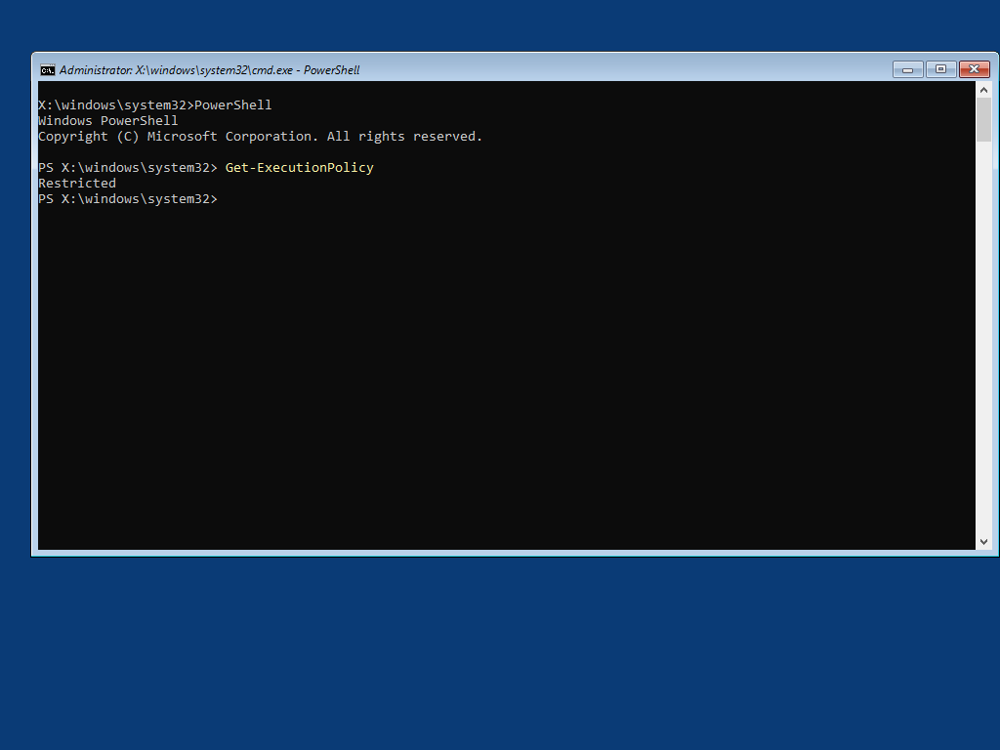
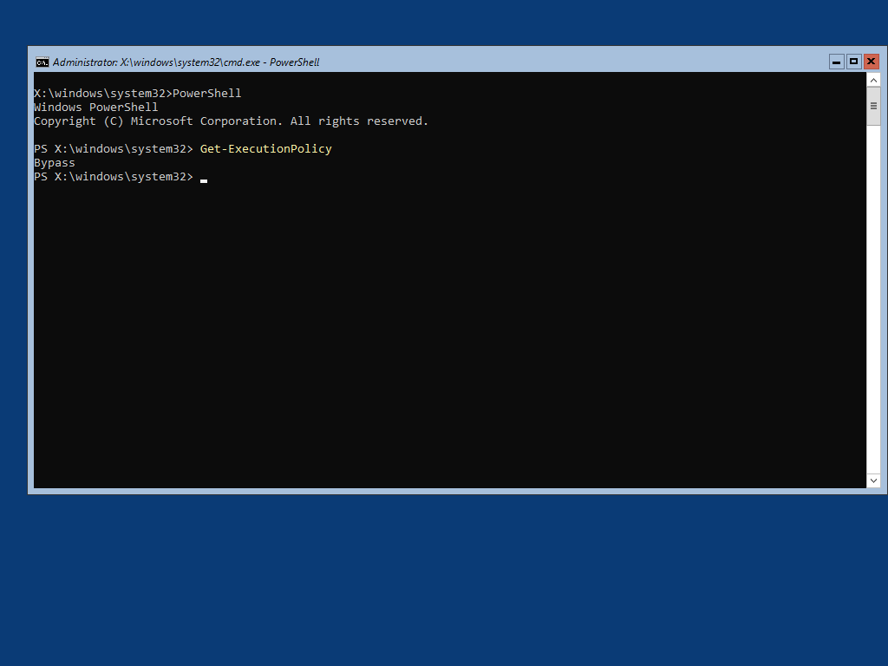

# RegAdd PowerShell ExecutionPolicy



By default, WinPE has the PowerShell ExecutionPolicy set to **Restricted**

If you want to set this to **Bypass**, just add the RegAdd PowerShell ExecutionPolicy Driver to make this change automatically.  No need to run PowerCfg or mount the WinPE Registry

## OSBuilder.Public Repository

This Driver is included in the OSBuilder.Public Repository at: **OSBuilder.Public\Content\WinPE\Drivers\RegAdd PowerShell ExecutionPolicy**



## 

