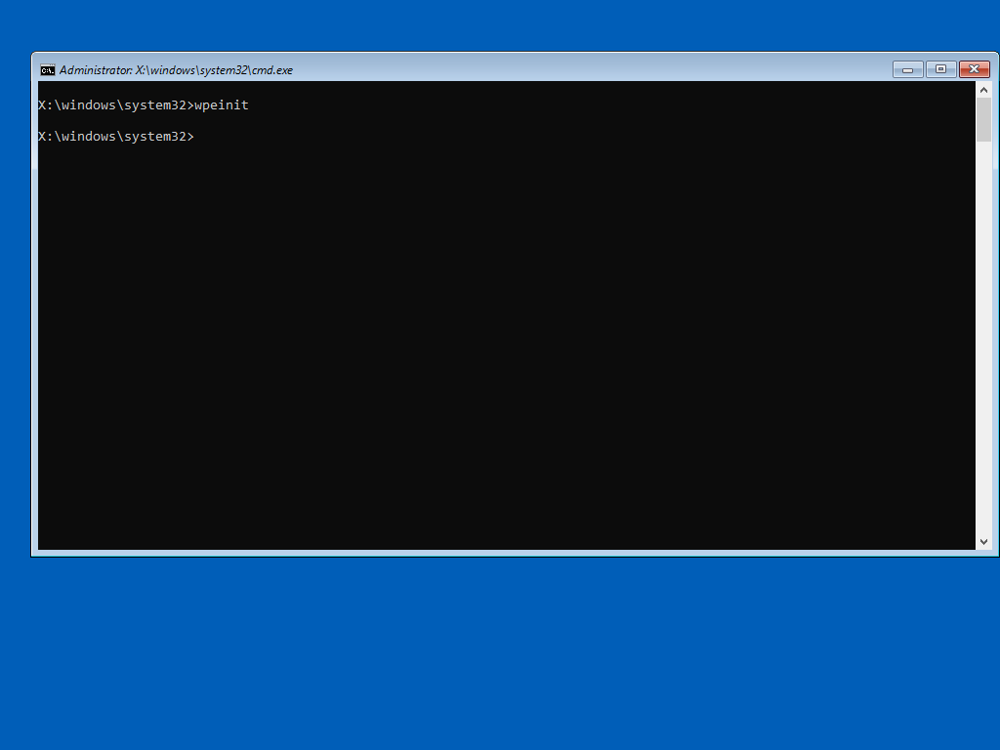
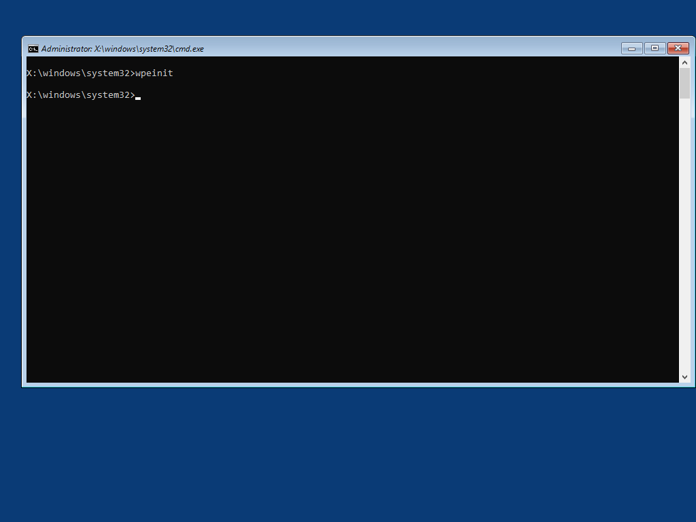
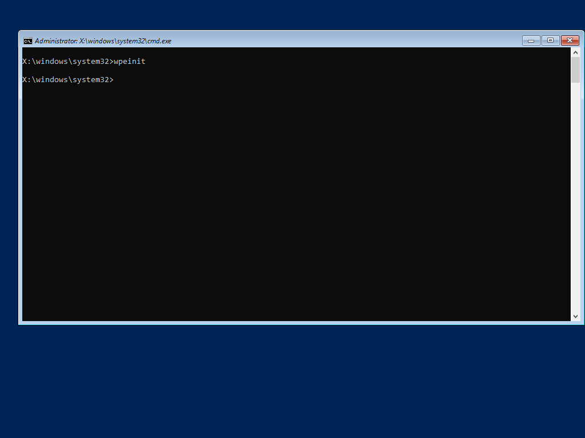

# Wallpaper

Looking to add some color to WinPE?  Simply add your Wallpaper as ExtraFiles making sure that your wallpaper will overwrite the ones in WinPE \(Windows\System32\)

When creating your New-PEBuildTask, select the Wallpaper Files when prompted to add WinPE Extra Files

## Sample Content

You can clone my OSBuilder Public Repository and copy the files in Content\WinPE\ExtraFiles



## Examples

