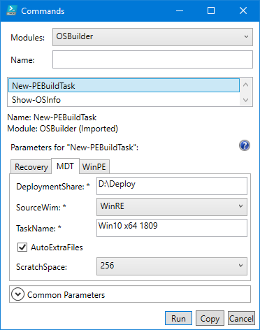
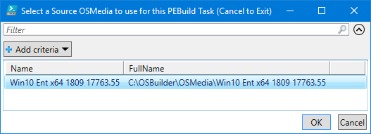
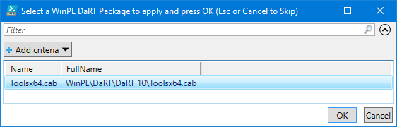
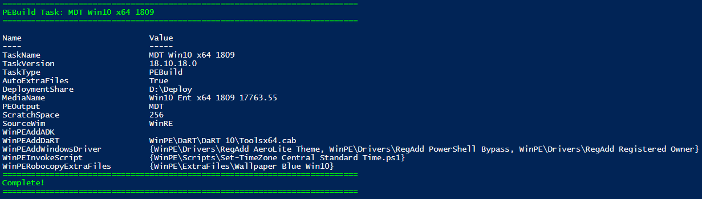
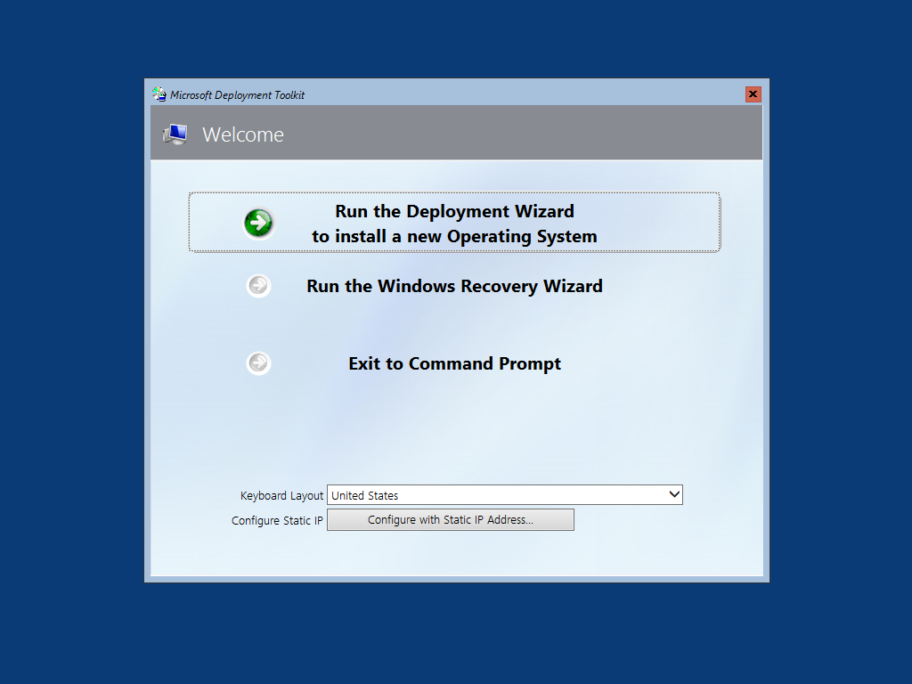

# MDT

Start by selecting New-PEBuildTask and select the MDT tab.  Keep the Task Name simple, and remember MDT will be automatically added as a Task Name prefix.

You have the option to use WinPE.wim or WinRE.wim as the base image to create MDT Media.  I always recommend selecting WinRE as it already contains the default ADK Packages you need to run MDT.  You can always add MDAC or PowerShell if necessary.

You also have the option to include [AutoExtraFiles](../auto-extrafiles.md) and set the Scratch Space.  The default Scratch Space for WinPE is 32MB, but if you do not select an option \(since this is not a Mandatory parameter\), this will automatically be set to 128MB.

Make sure you put your MDT DeploymentShare.  In the example below, I used USB media \(since I keep my OSBuilder disconnected from my Corporate Network\)

## Select OSMedia

You will be prompted to select an OSMedia to use for the PEBuild Task.  By design, if you entered a Windows Version in the Task Name \(1803, 1809\) you will only be shown OSMedia that matches that Windows Version.

## WinPE Additional Content

If you have added WinPE Content to OSBuilder \(DaRT, Drivers, Extra Files, ADK Package\), you will be able to select them to complete the Task.

## Complete Task

Once the Task is complete, you can use Invoke-PEBuildTask to build the Recovery Media

## Demo

Everything looks good, and no need to use the Deployment Workbench to create updated Boot Images

