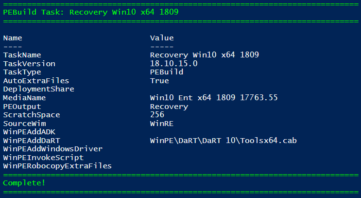

# Recovery

Start by selecting New-PEBuildTask and the Recovery tab.  This task will use WinRE.wim to create Recovery Media.  You have the option to include [AutoExtraFiles](../auto-extrafiles.md) and set the Scratch Space.  The default Scratch Space is 32MB, but if you do not select an option \(since this is not a Mandatory parameter\), this will automatically be set to 128MB.



New-PEBuild










Name of the Task










```

```






## Select OSMedia

You will be prompted to select an OSMedia to use for the PEBuild Task.  By design, if you entered a Windows Version in the Task Name \(1803, 1809\) you will only be shown OSMedia that matches that Windows Version.


## WinPE Additional Content

If you have added WinPE Content to OSBuilder \(DaRT, Drivers, Extra Files, ADK Package\), you will be able to select them to complete the Task.


## Complete Task

Once the Task is complete, you can use Invoke-PEBuildTask to build the Recovery Media




