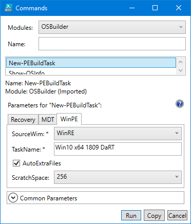
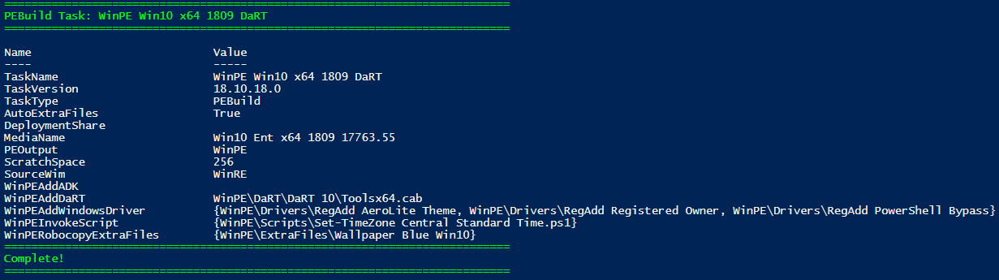
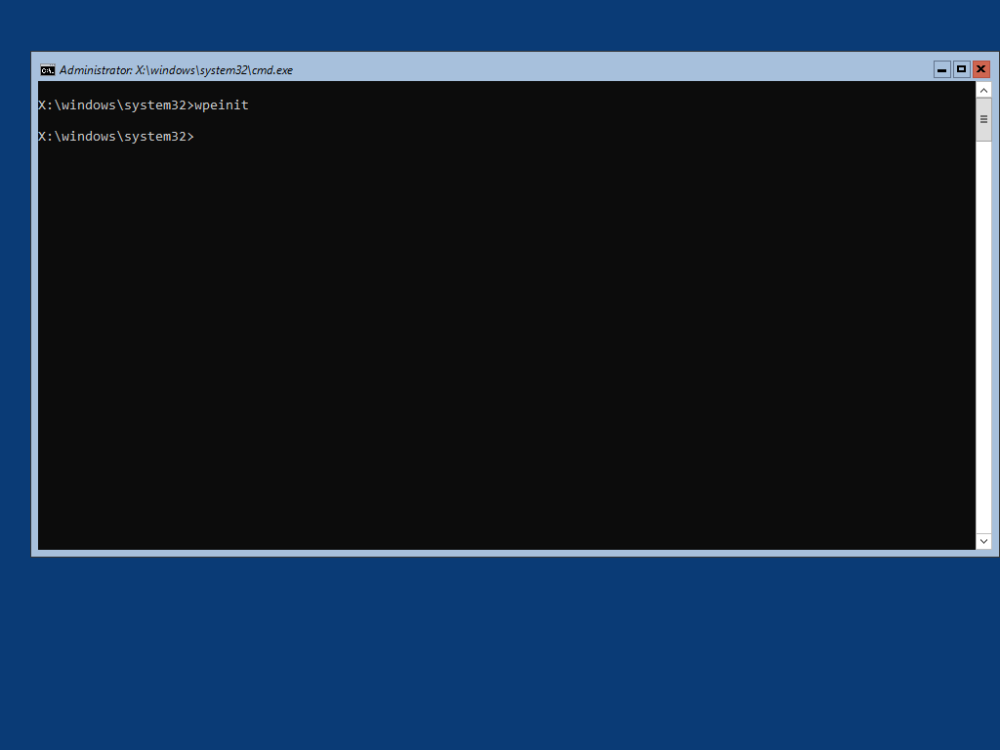

# WinPE

Start by selecting New-PEBuildTask and select the WinPE tab.  Keep the Task Name simple, and remember WinPE will be automatically added as a Task Name prefix.

You have the option to use WinPE.wim or WinRE.wim as the base image to create WinPE Media.  I always recommend selecting WinRE

You also have the option to include [AutoExtraFiles](../auto-extrafiles.md) and to set the Scratch Space.  The default Scratch Space for WinPE is 32MB, but if you do not select an option \(since this is not a Mandatory parameter\), this will automatically be set to 128MB.

## Select OSMedia

You will be prompted to select an OSMedia to use for the PEBuild Task.  By design, if you entered a Windows Version in the Task Name \(1803, 1809\) you will only be shown OSMedia that matches that Windows Version.

## WinPE Additional Content

If you have added WinPE Content to OSBuilder \(DaRT, Drivers, Extra Files, ADK Package\), you will be able to select them to complete the Task.

## Complete Task

Once the Task is complete, you can use Invoke-PEBuildTask to build the Recovery Media

## Demo

And this is what you expect to see from WinPE.  You can customize this further by adding your own Frontend, use it with MDT, or even use it as a ConfigMgr Boot Image

