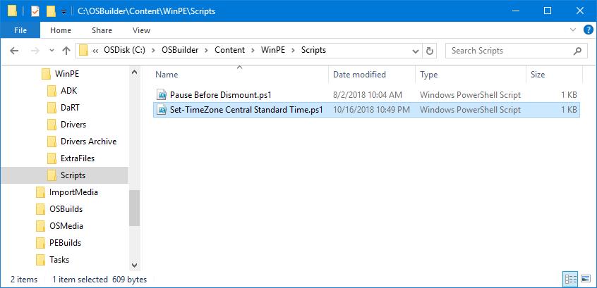
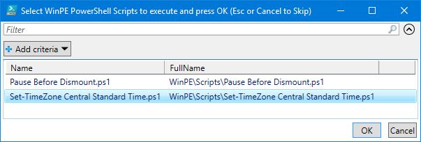
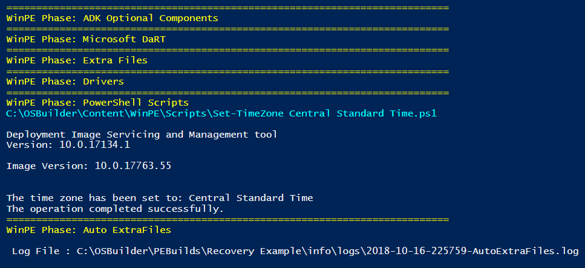

# Scripts

You can write custom PowerShell Scripts to make further changes to WinPE, simply place your PowerShell Scripts in C:\OSBuilder\Content\WinPE\Scripts



## New-PEBuildTask

When creating a New-PEBuildTask, select the Script to add to the Task



## Set-TimeZone

Here is a simple PowerShell script to set the TimeZone of WinPE

```text
#======================================================================================
#	Set Time Zone to Central Standard Time
#======================================================================================
Dism /Image:"$MountDirectory" /Set-TimeZone:"Central Standard Time" /LogPath:"$Logs\$((Get-Date).ToString('yyyy-MM-dd-HHmmss'))-Dism-SetTimeZone.log"

#======================================================================================
#	Testing
#======================================================================================
#	[void](Read-Host 'Press Enter to continue')
```

Or you can download it here



## Invoke-PEBuild

When running Invoke-PEBuild, the script will be executed




