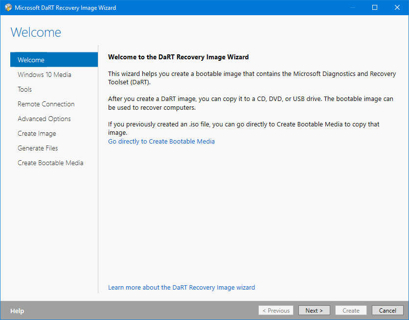
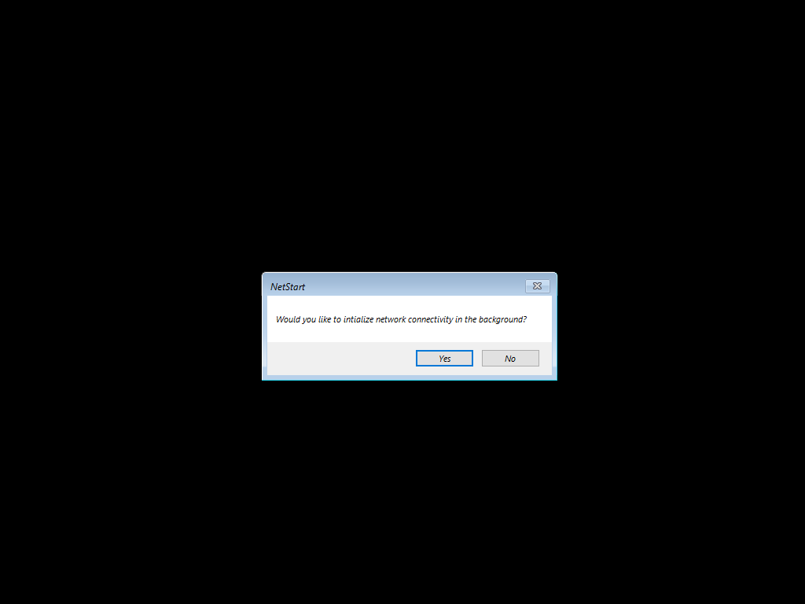
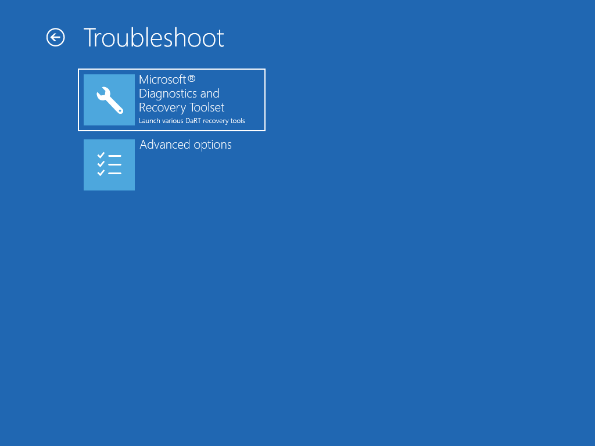
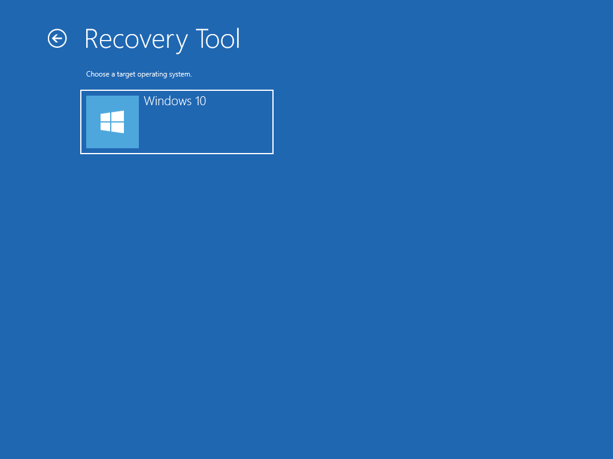
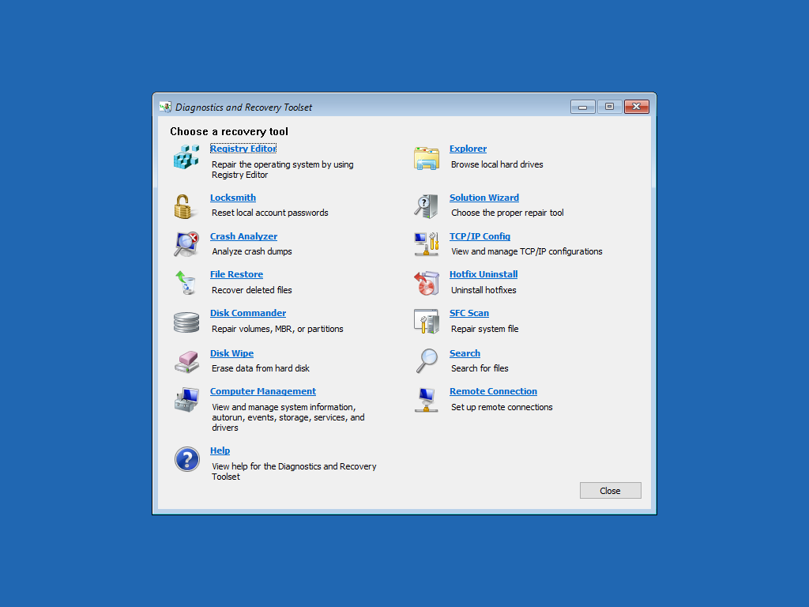

# Recovery DaRT \(WinRE.wim\)

You can use the Microsoft DaRT Recovery Image Wizard to add DaRT to WinRE



## PEBuild Recovery with DaRT

You can also use PEBuild to complete the same process

## New-PEBuildTask

The following New-PEBuildTask JSON was used to create a Recovery Image with DaRT

```text
{
    "TaskName":  "Recovery Win10 x64 1809 DaRT",
    "TaskVersion":  "18.10.15.0",
    "TaskType":  "PEBuild",
    "AutoExtraFiles":  "True",
    "DeploymentShare":  "",
    "MediaName":  "Win10 Ent x64 1809 17763.1",
    "PEOutput":  "Recovery",
    "ScratchSpace":  "256",
    "SourceWim":  "WinRE",
    "WinPEAddADK":  null,
    "WinPEAddDaRT":  "WinPE\\DaRT\\DaRT 10\\Toolsx64.cab",
    "WinPEAddWindowsDriver":  null,
    "WinPEInvokeScript":  null,
    "WinPERobocopyExtraFiles":  null
}
```

## Demo











