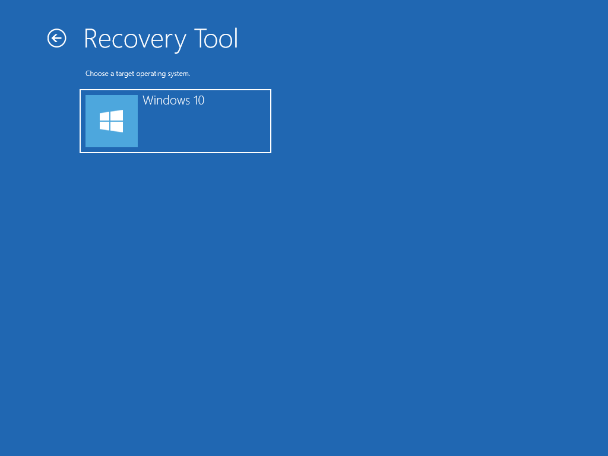

# Recovery DaRT

Microsoft DaRT is also used to create Recovery Image with DaRT integration


## PEBuild Recovery DaRT

PEBuild Recovery DaRT uses WinRE.wim

## New-PEBuildTask

You need to start by creating a PEBuild Task.  I recommend the following:

```text
New-PEBuildTask -TaskName "Win10 x86 1809" -AutoExtraFiles -ScratchSpace 256
```

This will create a Task saved as a JSON file that can later be executed.  Here is the contents of the Task:

## 

## 

## PEBuild Recovery with DaRT

You can also use PEBuild to complete the same process

## New-PEBuildTask

The following New-PEBuildTask JSON was used to create a Recovery Image with DaRT

```text
{
    "TaskName":  "Recovery Win10 x64 1809 DaRT",
    "TaskVersion":  "18.10.15.0",
    "TaskType":  "PEBuild",
    "AutoExtraFiles":  "True",
    "DeploymentShare":  "",
    "MediaName":  "Win10 Ent x64 1809 17763.1",
    "PEOutput":  "Recovery",
    "ScratchSpace":  "256",
    "SourceWim":  "WinRE",
    "WinPEAddADK":  null,
    "WinPEAddDaRT":  "WinPE\\DaRT\\DaRT 10\\Toolsx64.cab",
    "WinPEAddWindowsDriver":  null,
    "WinPEInvokeScript":  null,
    "WinPERobocopyExtraFiles":  null
}
```

## Demo





