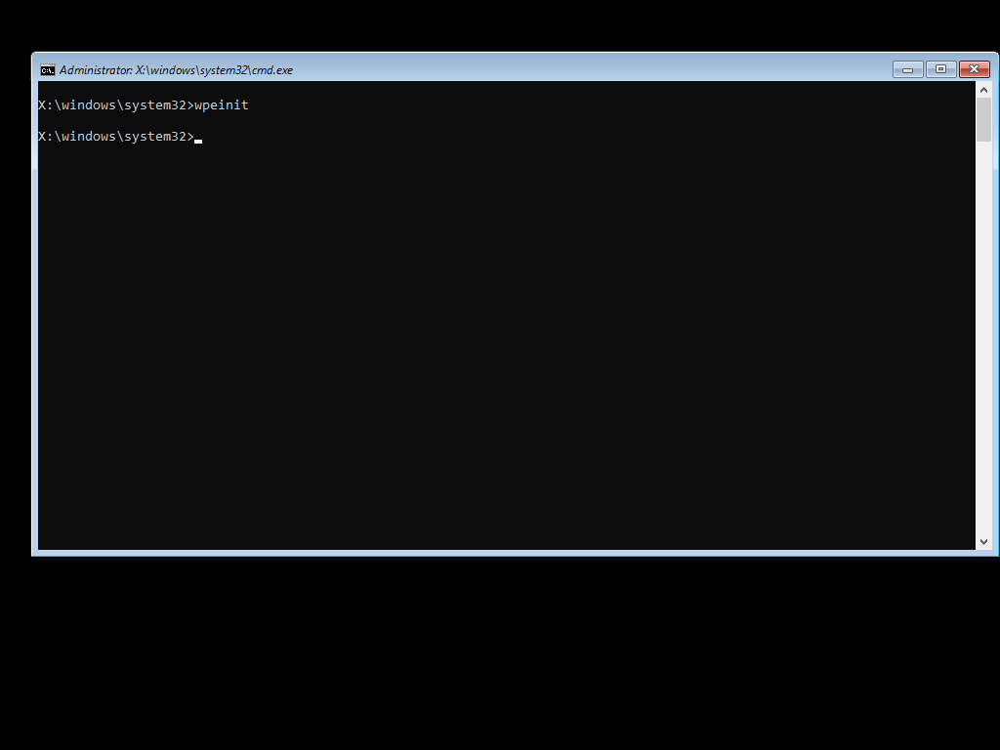

# Windows PE

WinPE Boot Images can be used within MDT or as a Configuration Manager Boot Image.  The benefit of creating this content in OSBuilder is that you can fully control the integrated Cumulative and Dynamic Updates, adding ADK Packages, and injecting Drivers that are needed.  You no longer have to add these Boot Image Drivers to MDT or CM as they are already done.

## New-PEBuildTask

You need to start by creating a PEBuild Task.  WinRE.wim will be automatically used for this Task.  To create WinPE Media, use either of the following PowerShell command:

```text
New-PEBuildTask -SourceWim WinPE -TaskName "Win10 x64 1809" -AutoExtraFiles -ScratchSpace 256
New-PEBuildTask -SourceWim WinRE -TaskName "Win10 x64 1809" -AutoExtraFiles -ScratchSpace 256
```

If you have added MS DaRT to OSBuilder, you will be prompted to add it.  When complete, a Task JSON file will be created which can be used with `New-PEBuild`

The WinPE Prefix will be added automatically to the Task Name, so unless you want '**WinPE WinPE Win10 x64 1809**' as your Task Name, just leave it out.

## SourceWim

The SourceWim Parameter is the difference between creating Recovery Media and WinPE.  Since WinRE is already assumed when creating Recovery Media, specifying it with SourceWim changes the output from Recovery Media to WinPE.  Technically the only difference between the two is that winpeshl.ini is not present in WinPE, so Startnet.cmd is used. Winpeshl.ini in Recovery launches the Recovery Environment.

## MDT Integration

You can use the generated Boot.wim in MDT by replacing the winpe.wim found in the following locations

```text
C:\Program Files (x86)\Windows Kits\10\Assessment and Deployment Kit\Windows Preinstallation Environment\amd64\en-us
C:\Program Files (x86)\Windows Kits\10\Assessment and Deployment Kit\Windows Preinstallation Environment\x86\en-us
```

But I would generally be against this method, and just use OSBuilder to generate the MDT Boot Image instead

## Task JSON

```text
{
    "TaskName":  "WinPE Win10 x64 1809",
    "TaskVersion":  "18.10.15.0",
    "TaskType":  "PEBuild",
    "AutoExtraFiles":  "True",
    "DeploymentShare":  "",
    "MediaName":  "Win10 Ent x64 1809 17763.1",
    "PEOutput":  "WinPE",
    "ScratchSpace":  "256",
    "SourceWim":  "WinPE",
    "WinPEAddADK":  null,
    "WinPEAddDaRT":  "",
    "WinPEAddWindowsDriver":  null,
    "WinPEInvokeScript":  null,
    "WinPERobocopyExtraFiles":  null
}
```

## Demo




