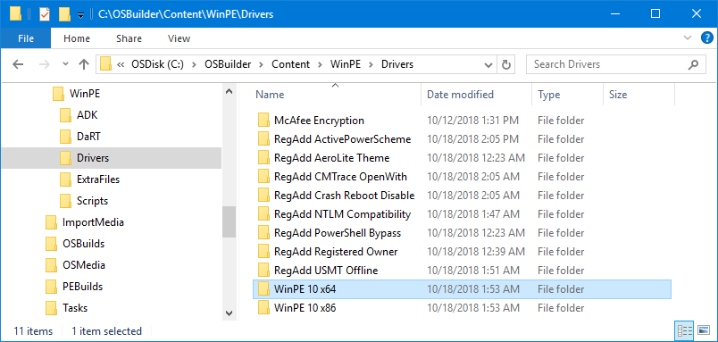
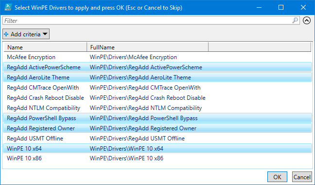

# Drivers

If you plan on adding Drivers to WinPE, simply create a Directory in C:\OSBuilder\Content\WinPE\Drivers.

When creating a New-PEBuildTask, select the Directories that you want to apply to WinPE

