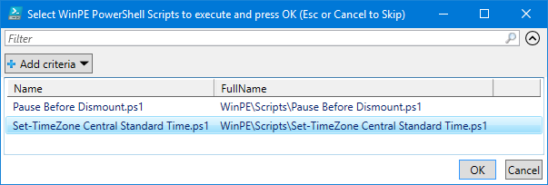
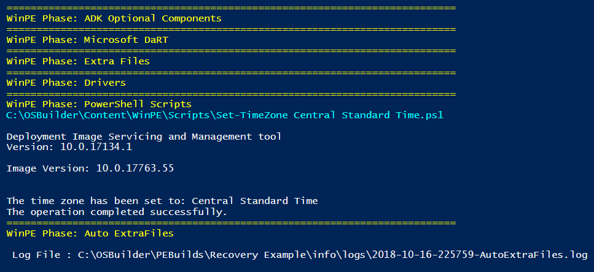

# Scripts


Public Scripts: [https://github.com/OSDeploy/OSBuilder.Public/tree/master/Content/WinPE/Scripts](https://github.com/OSDeploy/OSBuilder.Public/tree/master/Content/WinPE/Scripts)


You can write custom PowerShell Scripts to make further changes to WinPE, simply place your PowerShell Scripts in C:\OSBuilder\Content\WinPE\Scripts

## New-PEBuildTask

When creating a New-PEBuildTask, select the Script to add to the Task

## New-PEBuild

When running New-PEBuild, the script will be executed

