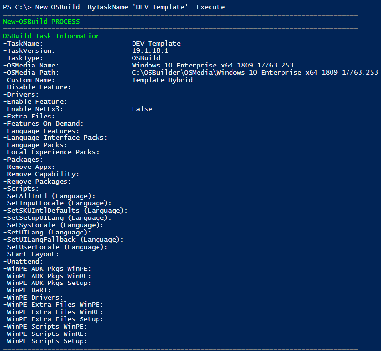
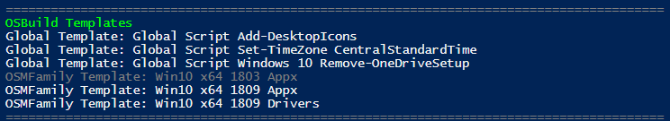

# OSBuilder New-OSBTemplate

So I have this idea of creating OSBuild Templates.  This would be used with New-AutoOSBuild which will be Template only.  The thought is to create conditional templates that would always be included if the conditions are met.  Requesting Feedback, no guarantees that this will be released anytime soon

### Remove Provisioned Appx

This Template would remove specific Provisioned Appx Packages every time a specific OSMedia Family \(Windows 10 x64 1809\) is selected

### Enable NetFX3

This will ensure that all my OSBuilds have NetFX3 enabled, no matter which OS I build

### PowerShell Script

I want to ensure that every Client \(Windows 10\) processes this Template to remove OneDrive

### Component

Templates can be made from any component

### State

Templates can be Enabled or Disabled \(separate function can do this\)

### Scope

A few options here, even an Orphan which can used in a method to select Templates

## OSBTemplate Update \(January 19\)

I am making some progress.  The following screenshots are from New-OSBuild using a Task without any settings.  The image below shows that nothing has been set other than the Operating System

New-OSBuild sees the Templates and determines which ones to process

Task Information with the Template settings are displayed

So far so good, although no ETA when this will be complete

