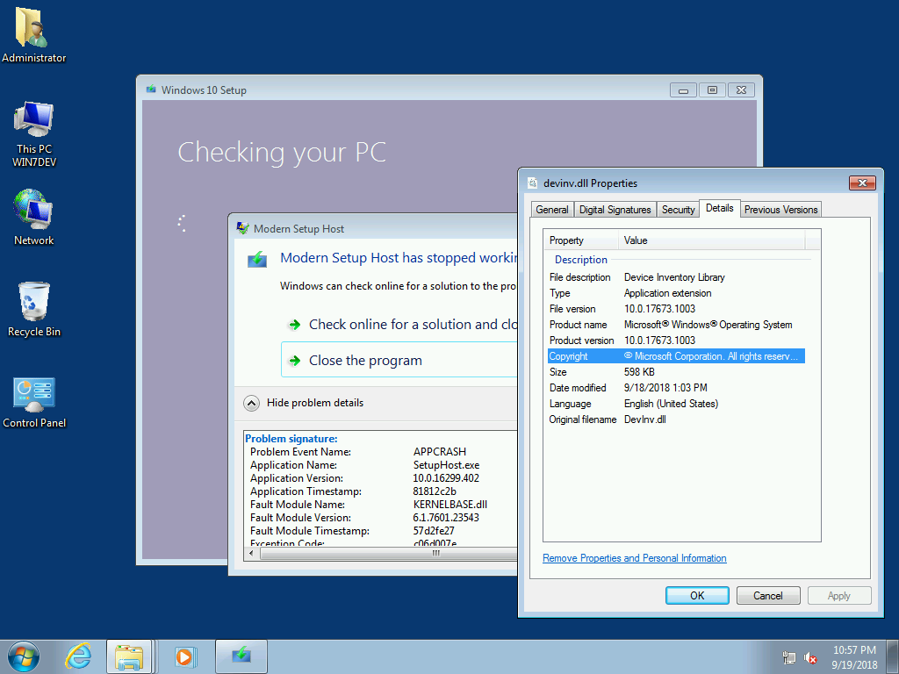
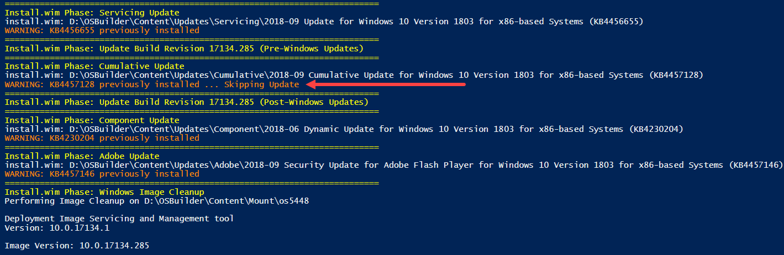
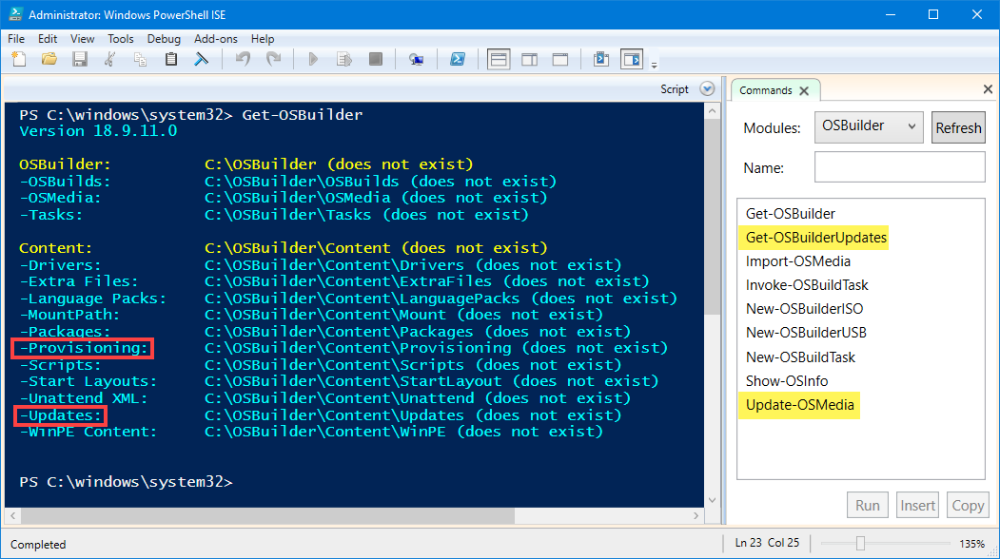
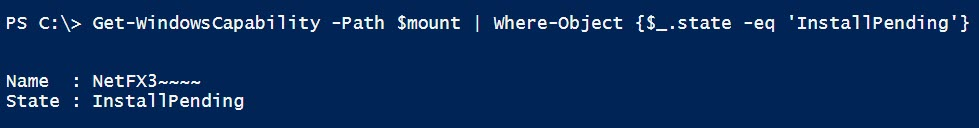
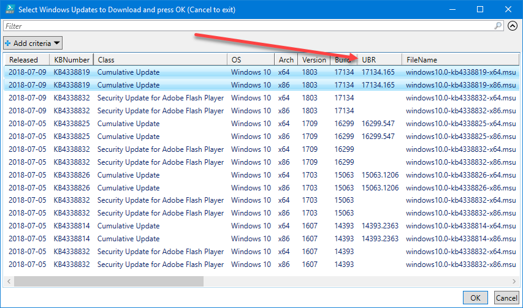
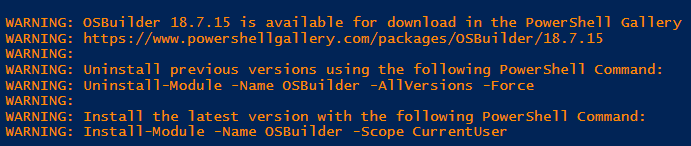
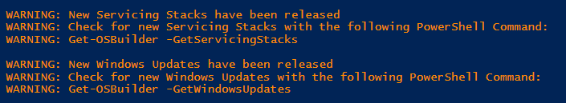

# Release Information

## 18.9.20.\* \(September 20, 2018\)


Updating Sources with Robocopy and extracting Setup Component to Sources are causing issues with Upgrade Task Sequences

After applying this OSBuilder Update, you should Update-OSMedia from the original Import-OSMedia.  OSBuilds will have to be recreated after OSMedia has been updated


* **Import-OSMedia**
  * Modified method for calculating UBR, now gathered through Rollup Package information
* **Update-OSMedia**
  * Modified method for calculating UBR, now gathered through Rollup Package information
  * Removed Robocopy of Sources directory
* **Invoke-OSBuildTask**
  * Modified method for calculating UBR, now gathered through Rollup Package information
  * Removed Robocopy of Sources directory



## 18.9.14.\* \(September 14, 2018\)

* **Import-OSMedia**
  * UpdateOSMedia parameter added to automatically download Microsoft Updates and to execute Update-OSMedia
* **Update-OSMedia**
  * ByName parameter added to prevent GridView selection
  * DownloadUpdates parameter added to automatically download Microsoft Updates that are needed for execution
* **Invoke-OSBuildTask**
  * DownloadUpdates parameter added to automatically download Microsoft Updates that are needed for execution

## 18.9.13.\* \(September 13, 2018\)

* Resolved an issue where the UBR is not updated properly in ntdll.dll / ntoskrnl.exe
* Added detection method \(Sessions.xml\) to determine if a Cumulative Update was installed.  This allows for the skipping of a reinstall



## 18.9.12.\* \(September 12, 2018\)

* **Content**
  * Removed Test-Build directory
  * Removed Content\UpdateStacks directory
  * Removed Content\UpdateWindows directory
  * Content\Updates directory contains all updates \(Adobe, Component, Cumulative, Setup, Servicing\)
  * Content\Provisioning directory has been added, but not used at this time \(future\)
* **Functions**
  * Get-OSBuilder - removed DownloadUpdates parameter
  * Get-OSBuilderUpdates - new function to download all Updates
  * Invoke-OSBuildTask
    * Rename of Invoke-OSBuilderTask
    * OSMedia tasks have been removed
    * ExecutionMode has been removed and replaced with an Execute parameter
    * TestMode has been removed
    * Stepped has been removed
    * Information of the Task is displayed when the Execute parameter is not present
  * New-OSBuildTask
    * Rename of New-OSBuilderTask
    * Used for creating an OSBuild, from OSMedia
  * Update-OSMedia
    * Used to update OSMedia



## 18.8.6.1 \(August 6, 2018\)

* Support for executing PowerShell scripts during an OSBuild Task.  Simply place your scripts in OSBuilder\Content\Scripts and select then when creating an OSBuild Task.
* Resolved issue in WinRE.wim where winpeshl.ini had a -prompt parameter.  Modified to -network.  This caused an issue where Operating System Upgrades would wait for interaction.

## 18.8.5.\* \(August 5, 2018\)

* Extra Files now uses Robocopy /b to resolve replacing files protected by Trusted Installer in the Install.wim

## 18.8.2.\* \(August 2, 2018\)

**This update is all about customizing WinPE!**

* New-OSMediaTask now validates Admin Rights are required
* New-OSBuilderISO now displays the Parent directory \(OSMedia and OSBuilds\)
* Get-OSBuilder will create the following new directories
  * OSBuilder\Content\WinPE\ADK\Win10 x64 1709
  * OSBuilder\Content\WinPE\ADK\Win10 x64 1803
  * OSBuilder\Content\ExtraFiles
  * OSBuilder\Content\Scripts
* New-OSBuildTask
  * Validates Admin Rights are required
  * Corrected selecting MSDaRT CAB to -OutputMode Single
  * Added prompted selection of WinPE Scripts
  * Added prompted selection of WinPE Extra Files
  * Added prompted selection of WinPE ADK Packages
* Invoke-OSBuilderTask
  * Added support for WinPE Scripts
  * Added support for WinPE Extra Files
  * Added support for WinPE ADK Packages
* **New Documentation**
  * [How To: Add Drivers to WinPE](how-to/add-drivers-to-winpe.md)
  * [How To: Add DaRT to WinPE](how-to/add-dart-to-winpe.md)
  * [How To: OSBuild WinPE Scripts](how-to/osbuild-winpe-scripts.md)
  * [How To: Add ADK Packages to WinPE](how-to/add-adk-packages-to-winpe.md)
  * [How To: Add Extra Files to WinPE](how-to/add-extra-files-to-winpe.md)

## 18.7.26.1 \(July 26, 2018\)

* Create a Bootable OS USB with [New-OSBuilderUSB](how-to/create-an-os-usb.md)
* Migrated [osdeploy.com](https://www.osdeploy.com/) to updated [GitBook](https://www.gitbook.com/) framework
* JSON files used for OSBuilder Module version checking has moved to [GitHub](https://github.com/OSDeploy/OSBuilderJSON)
  * Previous versions of OSBuilder cannot check for Updates
* JSON files used for DownloadUpdates has moved to [GitHub](https://github.com/OSDeploy/OSBuilderJSON)
  * Previous versions of OSBuilder can no longer check for updated Servicing Stacks, Cumulative Updates, and Adobe Security Updates
* **New Documentation**
  * [How To: Create an OS USB](how-to/create-an-os-usb.md)

## 18.7.25.\* \(July 25, 2018\)

* Resolved an issue where Winpeshl.ini was not removed from WinPE.wim.  If you have created OSBuilds with MSDaRT, they will need to be rebuild or they may fail OS Upgrades

## 18.7.24.\* \(July 24, 2018\)

* **Windows Server 2016 now supported**
* **Added** [**Show-OSInfo**](how-to/show-os-information.md) **function**
* **New Documentation**
  * [How To: Show OS Information](how-to/show-os-information.md)
  * [Knowledge: OSBuilder OS Information](knowledge/osbuilder-os-information.md)
  * [How To: ExecutionMode - Information]()
  * [How To: ExecutionMode - Test Build]()
  * [How To: ExecutionMode - Execute Stepped]()
  * [How To: ExecutionMode - Execute]()
* **Updated Documentation**
  * [How To: Create an OSMedia Task]()
  * [How To: Create an OSBuild Task](how-to/create-an-osbuild-task.md)

## 18.7.23.\* \(July 23, 2018\)

The notable change in this update is the inclusion of Language Support. For more information, see [Work with Languages](https://www.osdeploy.com/osbuilder/how-to/work-with-languages.html)

Due to these changes, Tasks will have to be recreated to support this change.

* DISM Image Cleanup will now be evaluated to determine if there are Pending Operations.  Previously this step was only executed in an OSMedia Task, but it will now work in an OSBuild Task if there is nothing pending

```text
Get-WindowsCapability -Path $mount | Where-Object {$_.state -eq 'InstallPending'}
```



## 18.7.21.\* \(July 21, 2018\)

* Corrected an issue where multiple Update directories were being created.  [Thanks for pointing this out Bruce!](https://twitter.com/BruceSaaaa/status/1020709356642414594)

## 18.7.19.\* \(July 19, 2018\)

* **Online Documentation has not been updated yet to detail the changes.  I'll work on that over the weekend.  Thanks for understanding!**
* Modified Paths to WindowsUpdates and ServicingStacks
* TestMode renamed to -ExecutionMode "Test Builds"
* Operating System names are abbreviated
  * Windows 10 x64 Enterprise 1803 \(old format\)
  * Win10 x64 Ent 1803 \(new format\)
  * It is recommended that you rename these manually, or **run it through an OSMedia Task again and it will apply the new name format, and update the Sources directory at the same time**
* Abbreviated OS Names consistent throughout OSBuilder
* Abbreviated OS Names for Servicing Stack and Windows Update downloads will be applied during the next CU Release
* Added ExecutionMode to Invoke-OSBuilder
  * Information - This will show the information about the selected Task without running it
  * Test Build - Performs a simulation and copies the output to OSBuilder\TestBuilds.  Recommend to run this with -Verbose
  * Execute Stepped - This option will enable a "Press Enter to continue" so you can manually manipulate the process
  * Execute - This will execute the Task
* Added UseLatestSource to Invoke-OSBuilder
  * If you have a Task specifically points to an Operating System \(Win10 Ent x64 1803 17134.112\), enabling this option will search for a newer UBR and execute with that source.
  * For this to work, make sure your UBR is at the end of your OSMedia source
* OSMedia and OSBuild Tasks will update the Sources directory of the Media automatically.  **If you have previously updated an OSMedia, run it through an OSMedia Task again and it will apply the corrections.**
* Enabling NetFX3 in a Task will force a selection for reapplying the Cumulative Update
* OSBuild Tasks no longer include SSU or CU \(unless enabling NetFX3\)
* OSMedia Tasks are specific to updating the SSU, CU, and Sources.  No other customizations are allowed.  This method allows you to continually update OSMedia without having to use the original source Media from Microsoft
* Tasks have changed and all previous Tasks will need to be rebuilt.  Delete existing ones

## 18.7.17.\* \(July 17, 2018\)

* **New-OSBuildTask**
  * Removed OSMedia ParameterSet
* **New-OSMediaTask**
  * Resolved issue where Task Name was not allowed

## 18.7.16.\* \(July 16, 2018\)

* **Get-OSBuilder**
  * DownloadUpdates joins GetServicingStacks and GetWindowsUpdates parameters
  * DownloadUpdates has the option for Latest and Historic Updates.  Going forward, Historic will contain previous updates added to OSBuilder
* **Invoke-OSBuilderTask**
  * Replaces Invoke-OSBuilder
  * DaRT now added to Windows Setup \(Boot.wim Index 2\)
* **New-OSBuilderISO**
  * Initial Release
  * Allows the creation of an ISO of any OSMedia or OSBuild
* **New-OSBuildTask**
  * Replaces the New-OSBuilder OSBuild option
  * CUs are no longer applied to Windows Setup \(Boot.wim Index 2\) to prevent a setup.exe compatibility issue
    * [https://support.microsoft.com/en-us/help/4041170/windows-installation-cannot-find-driver-boot-wim](https://support.microsoft.com/en-us/help/4041170/windows-installation-cannot-find-driver-boot-wim)
* **New-OSMediaTask**
  * Replaces the New-OSBuilder OSMedia option
  * CUs are no longer applied to Windows Setup \(Boot.wim Index 2\) to prevent a setup.exe compatibility issue
    * [https://support.microsoft.com/en-us/help/4041170/windows-installation-cannot-find-driver-boot-wim](https://support.microsoft.com/en-us/help/4041170/windows-installation-cannot-find-driver-boot-wim)

If you have previously created OSMedia or OSBuilds and integrated the CU with Windows Setup, it is recommended that you rebuild your media. I will work on a solution for this issue.

## 18.7.15.1 \(July 13, 2018\)

* Corrected an issue in Invoke-OSBuilder.ps1 script error

## 18.7.15 \(July 13, 2018\)

* Initial Public release

## Changes from Versions prior to 18.7.15

* Only Windows 10 Operating Systems can be imported at this time.  Support for Windows Server will be in the next week or so
* UBR \(Update Build Revision\) is appended to all Builds
* Directory naming convention convention has changed to the following format

```text
OSMedia: <OS with Edition> <Arch> <Version> <UBR>
Example: Windows 10 Enterprise x64 1803 17134.165

Servicing Stacks: <OS> <Architecture> <Build>\<Release Date> <KB> Servicing Stack Update <OS> <Arch> <Version> <Build>\*.msu
Example: Windows 10 x64 1709\2018-07-05 KB4339420 Servicing Stack Update Windows 10 x64 1709 16299\*.msu

Cumulative Updates: <OS> <Architecture> <Build>\<Release Date> <KB> Cumulative Update <OS> <Arch> <Version> <UBR>\*.msu
Example: Windows 10 x64 1803\2018-07-09 KB4338819 Cumulative Update Windows 10 x64 1803 17134.165\*.msu

Other references to the Pilot format of <OS> <Version> <Arch> should be changed manually to <OS> <Arch> <Version>
for consistency
```

### Servicing Stacks and Windows Update Downloads

Now displays the UBR of the download. This can be validated against the OSMedia or OSBuild to ensure proper integration



### Module Update Checking

When running Get-OSBuilder, it will automatically check for a newer version and display a message if an update is recommended. Internet connection required for this function to work



### Servicing Stack and Windows Update Checking

When running Get-OSBuilder, it will automatically check for newer Servicing Stacks and Windows Updates and display a message if an update is recommended. Internet connection required for this function to work



