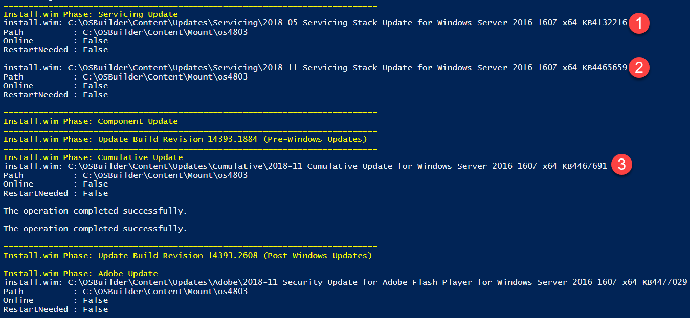
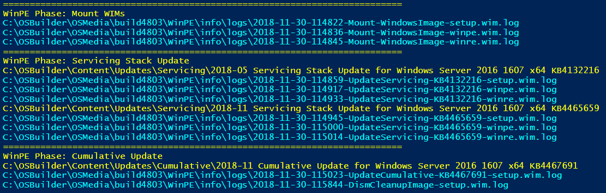
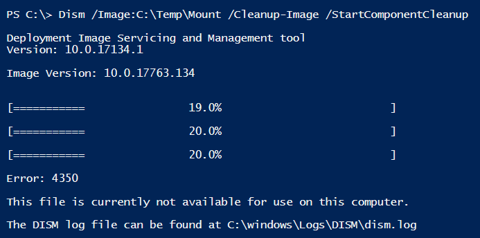
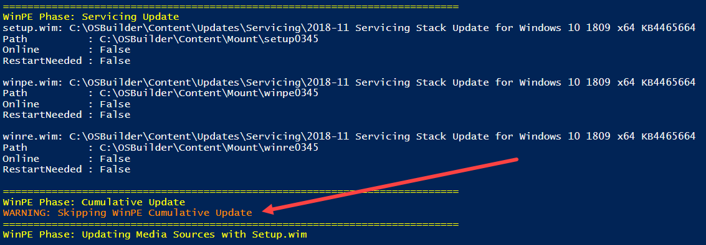

# 2018-11

## 18.11.30.0 \(November 30, 2018\)

* **Import-OSMedia**
  * Scanning for OSMedia will display the Image Path and Index of the currently scanned WIM
* **New-MediaISO**
  * ISO Naming changed to accommodate 32 character limit for Label
* **New-OSBuild**
  * Modified sorting method for multiple Servicing Stacks to install in the proper order
  * Resolved incorrect Write-Host output error with ADK Packages
  * Resolved issues where ISO would not be created
* **New-PEBuild**
  * Naming change for root Output WIM when creating WinPE and WinRE
  * Resolved issue where Auto ExtraFiles were added, even when not selected
  * Modified output ISO
* **Update-OSMedia**
  * Removed SkipWinpeCU Parameter.  This was initially added as a result of the Mounting 'Optimize' issue and is no longer required
  * Modified sorting method for multiple Servicing Stacks to install in the proper order
  * Log Files are now displayed for easier troubleshooting for some steps.  This will be slowly added to all OSBuilder functions

## 18.11.17.0 \(November 17, 2018\)

**\`\`**[**`Mount-WindowsImage`**](https://docs.microsoft.com/en-us/powershell/module/dism/mount-windowsimage?view=win10-ps) used in OSBuilder will not longer use the **`-Optimize`** parameter as this causes issues with Offline Servicing Windows 10 1809



## 18.11.14.0 \(November 14, 2018\)

* **Update-OSMedia**
  * Add Parameter **`SkipWinpeCU`** to skip the Cumulative Update from applying to WinPE
* **New-OSBuild**
  * Add Parameter **`SkipWinpeCU`** to skip the Cumulative Update from applying to WinPE

Windows 10 1809 2018-11 Cumulative Update when applied to WinPE does not allow Dism Image Cleanup to work, causing WinPE to grow large.  This will cause issues with WinRE when applied to the Recovery Partition during Imaging as it will be too big.  

Use **`Update-OSMedia -SkipWinpeCU`** or **`New-OSBuild -SkipWinpeCU`** to bypass updating WinPE with the 2018-11 Cumulative Update

## 18.11.13.0 \(November 13, 2018\)

* **New-MediaISO**
  * Add Parameter FullName \(Full Path to Media\)
* **New-OSBuild**
  * Add Parameter CreateISO
  * Add Parameter ByTaskName
* **New-PEBuild**
  * Add Parameter CreateISO
  * Automatically Creates LiteTouchPE\_&lt;Arch&gt;.wim
  * Add Auto ExtraFiles Browse DLLs
    * ShellStyle.dll
    * ExplorerFrame.dll
    * StructuredQuery.dll
    * EDPUtil.dll
  * Add Auto ExtraFiles Wireless Support Dlls
    * dmcmnutils.dll
    * mdmregistration.dll
    * [Build a WinPE with Wireless Support](http://www.scconfigmgr.com/2018/03/06/build-a-winpe-with-wireless-support/)
* **Update-OSMedia**
  * Add Parameter CreateISO

**`-ByTaskName`** parameter allows the automation of [**`New-OSBuild`**](../osbuild/new-osbuild.md) and the **`-CreateISO`** parameter automatically creates a [**`New-MediaISO`**](../docs/shared-functions/new-mediaiso.md)**\`\`**

