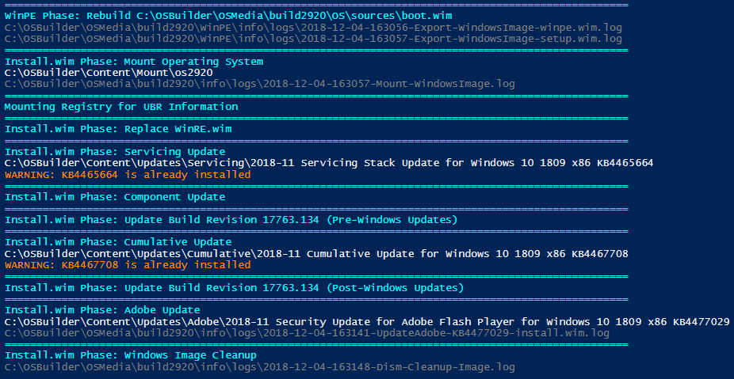

# Release Information

## 19.1.1 \(January 1, 2019\) UNRELEASED

* Get-OSBuilds
  * New function to return all OSBuilds as a PowerShell Custom Object
* [**Get-OSMedia**](../docs/functions/osmedia/get-osmedia.md)\*\*\*\*
  * New function to return all OSMedia as a PowerShell Custom Object
* Get-PEBuilds
  * New function to return all PEBuilds as a PowerShell Custom Object
* Import-OSMedia
  * **`NewMediaISO`** parameter added.
    * Executes [**New-MediaISO**](../docs/functions/osbuilder/new-mediaiso.md)\*\*\*\*
  * **`ShowOSInfo`** parameter added
    * Information is not displayed by default
    * Executes [**Show-OSInfo**](../docs/functions/osbuilder/show-osinfo.md)\*\*\*\*
* New-MediaISO
  * **`FullName`** parameter is now a Pipeline Value By Property Name 
* New-MediaUSB
  * **`FullName`** parameter is now a Pipeline Value By Property Name

## 18.12.19.0 / 18.12.20.0 \(December 19-20, 2018\)

* Sessions.xml Export \(for real in the second release\)
* BCP47\*.dll Export

## 18.12.5.x \(December 5, 2018\)

* **OSBuilder Console Output**
  * Log files displayed for easier **self**-troubleshooting
  * Circus color scheme replaced for easier readability
  * Robocopy output is logged only
* \*\*\*\*[**New-OSBUpdate**](../docs/functions/updates/new-osbupdate.md)\*\*\*\*
  * New function to add new Updates to OSBuilder
* **Import-OSMedia**
  * **`EditionId`** now includes **`ServerRdsh`** \(Windows 10 Enterprise for Virtual Desktops\)
  * Scanning Image Information now contains ImageName
* **New-OSBuild**
  * **`CustomCumulativeUpdate`** parameter removed.  This is replaced by **`New-OSBUpdate`**
  * **`CustomServicingStack`** parameter removed.  This is replaced by **`New-OSBUpdate`**
* **Update-OSMedia**
  * **`CustomCumulativeUpdate`** parameter removed.  This is replaced by **`New-OSBUpdate`**
  * **`CustomServicingStack`** parameter removed.  This is replaced by **`New-OSBUpdate`**







