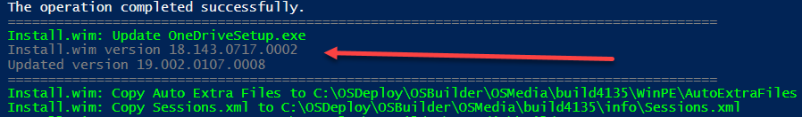
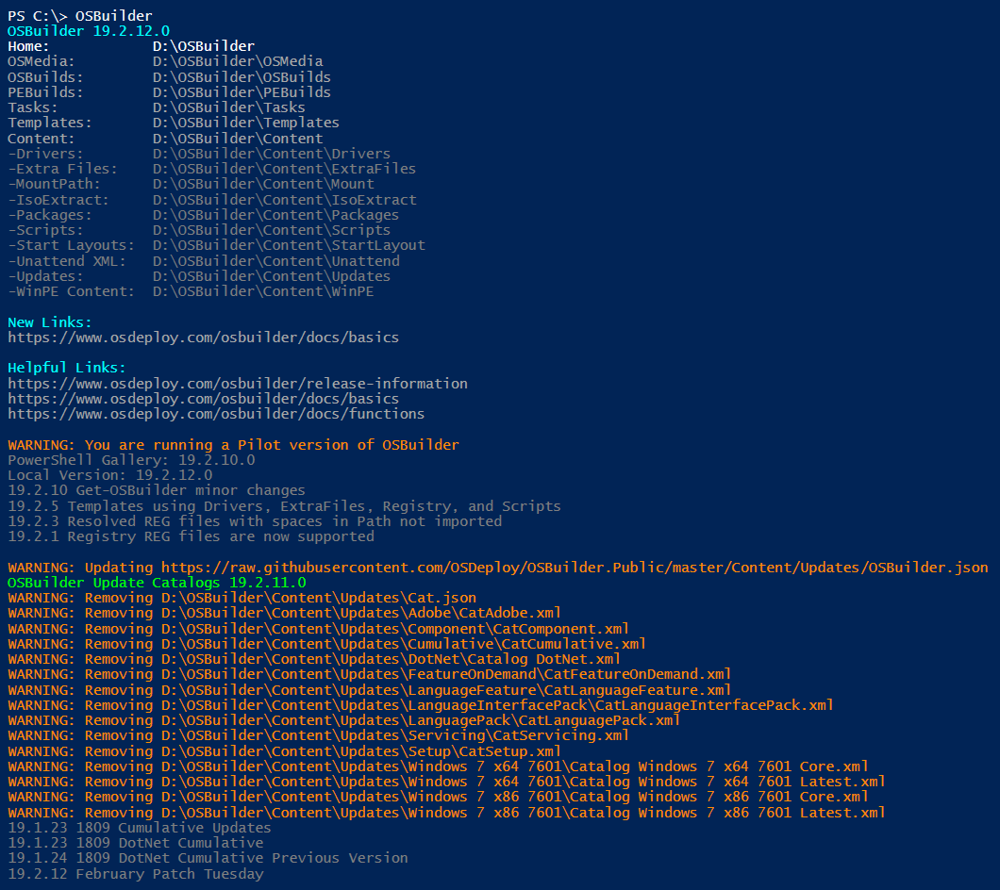
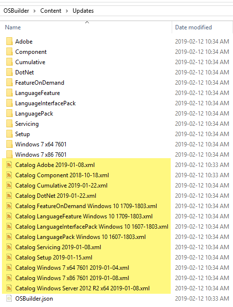

# Release Information

## Update OSBuilder

```text
Uninstall-Module -Name OSBuilder -AllVersions -Force
Install-Module -Name OSBuilder -Force
Import-Module -Name OSBuilder -Force
```

## 19.2.12 \(February 12, 2019\) "Patch Tuesday"


**You need this version to get the latest Microsoft Updates**


* **Get-OSBuilder**
  * Automatically downloads Microsoft Update Catalogs
* **Update-OSMedia**
  * Method for injecting updated OneDriveClient.exe
  * Not fully automated due to Production vs Enterprise versions
* **New-OSBuild**
  * Method for injecting updated OneDriveClient.exe
  * Not fully automated due to Production vs Enterprise versions
* **New-OSBUpdate**
  * Downloads now use Net.Webclient instead of BITS Transfer
  * Download Progress is not displayed \(this was a function of BITS\)
  * Interactive Login no longer required
  * Parameter IseGridView changed to GridView
* **Update Catalogs**
  * Updated online source path
  * https://raw.githubusercontent.com/OSDeploy/OSBuilder.Public/master/Content/Updates/OSBuilder.json
  * Catalogs have Date information in the file name

### OneDriveSetup.exe Update

Place an updated OneDriveSetup.exe at **&lt;OSBuilderHome&gt;\Content\OneDrive\OneDriveSetup.exe** to have it automatically injected during **`Update-OSMedia`** or **`New-OSBuild`**.  This is a manual copy due to different Rings \(Enterprise vs Production\)



### Automatic Update Catalog Download

If you are online and run OSBuilder, the Update Catalogs will be validated for a newer version.  If there is an update available, old Update Catalogs will be removed and new ones will be downloaded as needed.  Catalogs have a Date or Version information in the file name as needed and are relocated to the Updates root





## 19.2.10 \(February 10, 2019\)

* **Get-OSBuilder**
  * Changes to console output to display updated information and proper steps for updating OSBuilder
* **New-OSBMediaISO** \(internal\)
* **New-OSBMediaUSB** \(internal\)
* **New-OSBuildTask** \(internal\)
* **Show-OSBMediaINFO**
  * Separated Language from primary groups

### OSBuilder Basics

This section should help anyone get started with using OSBuilder



## 19.2.5 \(February 5, 2019\)

* Registry has moved to Templates.  This will be moved automatically
* Drivers, ExtraFiles, and Scripts are added as Templates

Learn how to use these as Templates with a game of **Frogger**



## 19.2.3 \(February 3, 2019\)

* **Registry REG** - Resolved issue where REG files with a space in the path were not imported

## 19.2.1 \(February 1, 2019\)

A quick change to **OSBuild Registry** to allow you to add **REG** files is now complete









