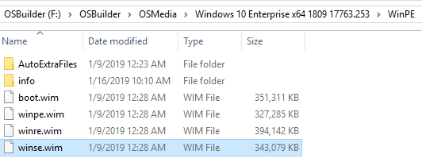
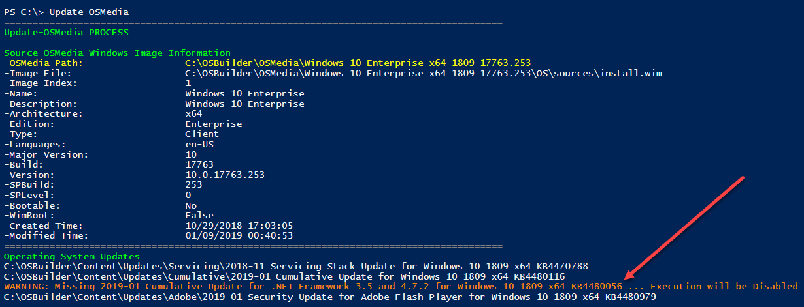
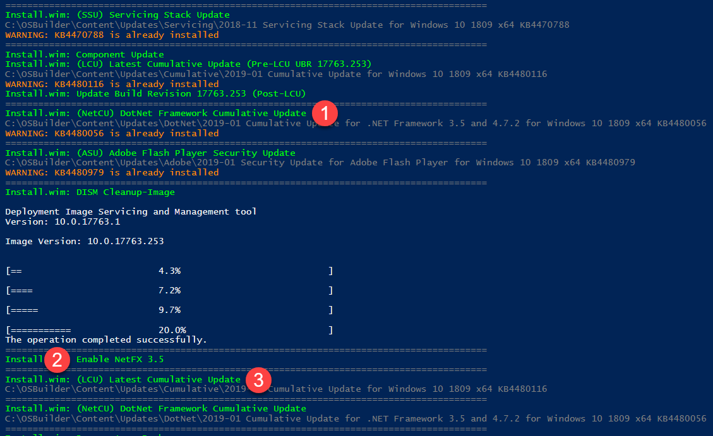
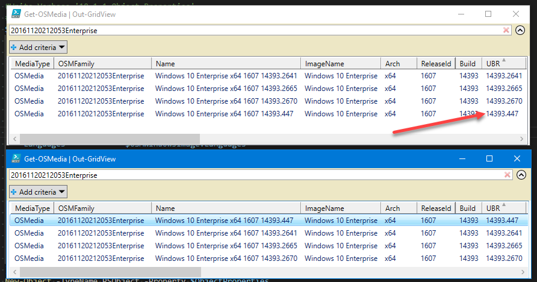

# Release Information

## 19.1.20 \(January 20, 2019\)

* **New-OSBMediaISO**
  * Resolved issue in All Media array.  Thanks [**Rytis** ](https://twitter.com/LRytis)from Lithuania!
* **New-OSBMediaUSB**
  * Resolved issue in All Media array
* **New-OSBuild**
  * Template Support in Development
* **New-OSBuildTask**
  * Updated IsoExtract logic
* **New-OSBUpdate**
  * Resolved International Date issue.  Thanks [**Sune**](https://twitter.com/SuneThomsenDK)!
* **Show-OSBMediaInfo**
  * Resolved issue in All Media array

## 19.1.18 \(January 18, 2019\)

Updated to resolve issues with Language Packs not being installed

* **Sample PowerShell Scripts**
  * Updated to resolve issue with HKLM Registry Settings not being applied
  * Added Windows 10 x64 1809 Add-CapabilityRSAT.ps1



## 19.1.17.x \(January 17, 2019\)

Changes to Features on Demand and Language Experience Packs are included in this release. Documentation on the Language Experience Packs will be added tonight









## 19.1.16.x \(January 16, 2019\)

This update brings .NET Framework Cumulative Updates for 1809

* **New-OSBuild**
  * Includes .NET Framework Cumulative Updates
* **Show-OSBMediaInfo**
  * Resolved an issue with displaying the Windows Image information.  Thanks [@SuneThomsenDK](https://twitter.com/SuneThomsenDK)
* **Update-OSMedia**
  * Includes .NET Framework Cumulative Updates

#### WinSE

Previous versions of OSBuilder used Setup.wim to refer to the Windows **Setup Environment** Boot.wim Partition 2.  This build changesthe name from Setup.wim to WinSE.wim to fall in line with WinPE and WinRE.  Setup.wim will be renamed automatically for all existing OSBuilder Media

* WinPE - Windows Preinstallation Environment \(Boot.wim Index 1\)
* WinRE - Windows Recovery Environment
* WinSE - Windows Setup Environment \(Boot.wim Index 2\)

## 19.1.14 \(January 14, 2019\)

* Resolved issues with New-OSBMediaISO
* Modified New-PEBuild to set the Background to winpe.jpg \(from winre.jpg\) as Windows 10 WinPE.wim has this value set in the registry.

## 19.1.11 \(January 11, 2019\)

Create a patched OSMedia Windows 7 x86

Make sure you read the Windows 7 Guide



## 19.1.10 \(January 10, 2019\)

I had to do a quick update to resolve a sort issue where the UBR was sorted as a number, and not as a version.  Sorry!

## 19.1.9 \(January 9, 2019\)


**This is not an "update the Module and keep rolling" release.  Follow these steps, in this order:**



1. **`Uninstall-Module -Name OSBuilder -AllVersions -Force`**
2. **`Install-Module -Name OSBuilder -Scope CurrentUser -Force`**
3. Close all PowerShell sessions
4. Launch PowerShell ISE as Admin
5. **`Get-OSMedia`** \(this may take a while on first run\)
6. **`Rename-OSMedia`**
7. **`Repair-OSBuildTask`**
8. **`Repair-PEBuildTask`**
9. Enjoy


**This update brings some major changes to OSMedia and Tasks**

* \*\*\*\*[**Get-OSMedia**](../docs/functions/osmedia/get-osmedia.md)\*\*\*\*
  * Updated to include OSMFamily and OSMGuid information
  * FullDetails parameter is not longer required for extended Servicing information
  * Generates a real time OSMFamily Id
* [**Import-OSMedia**](../docs/functions/osmedia/import-osmedia/)\*\*\*\*
  * Updated to generate a unique OSMGuid
  * Updated Full Name Format
* \*\*\*\*[**New-OSBMediaISO**](../docs/functions/osbmedia/new-osbmediaiso.md)\*\*\*\*
  * ISO and Label naming format change
* \*\*\*\*[**New-OSBuild**](../docs/functions/osbuild/new-osbuild.md)\*\*\*\*
  * Updated to support the updated Task format 
* \*\*\*\*[**New-OSBuildTask**](../docs/functions/osbuild/new-osbuildtask/)\*\*\*\*
  * Updated Task format with more detailed Source OSMedia information
* \*\*\*\*[**New-PEBuild**](../docs/functions/pebuild/new-pebuild.md)\*\*\*\*
  * Updated to support the updated Task format
* \*\*\*\*[**New-PEBuildTask**](../docs/functions/pebuild/new-pebuildtask/)\*\*\*\*
  * Updated Task format with more detailed Source OSMedia information
* \*\*\*\*[**Rename-OSMedia**](../docs/functions/maintenance/rename-osmedia.md)\*\*\*\*
  * Renames OSMedia to proper Full Operating System Name
* \*\*\*\*[**Repair-OSBuildTask**](../docs/functions/maintenance/repair-osbuildtask.md)
  * Repairs an existing OSBuild Task to the new format
  * Requires selecting an existing OSMedia to complete the Repair
* \*\*\*\*[**Repair-PEBuildTask**](../docs/functions/maintenance/repair-pebuildtask.md)
  * Repairs an existing PEBuild Task to the new format
  * Requires selecting an existing OSMedia to complete the Repair

#### OSMGuid

This is an abbreviation for OSMedia Guid.  This is generated by [**Import-OSMedia**](../docs/functions/osmedia/import-osmedia/) for new Media, and [**Get-OSMedia**](../docs/functions/osmedia/get-osmedia.md) for existing OSMedia. This allows OSMedia to be renamed, as Builds will no longer be tied to a Directory Name

#### OSMFamily

I need a method for ensuring that Operating Systems were kept in an OSMedia Family for Updating.  This is a combination of the CreatedTime and EditionId which is gathered from an Install.wim using Get-WindowsImage

#### Full Name Format

Previous versions of OSBuilder would abbreviate the OSMedia Directory Name of the Operating System and use the Directory Name for matching updates of the same OSMedia.  Since OSBuilder has moved to a Family and Guid format for keeping track of OSMedia, there are no issues with renaming any OSMedia directory.  Use [**Rename-OSMedia**](../docs/functions/maintenance/rename-osmedia.md) first before doing any Task modification if you feel the need to rename, but keep in mind, going forward every OSMedia or OSBuild going forward will be with the Full Name format, so rename now.

#### Tasks

Tasks have been updated to contain more detailed information about the OSMedia that is used for the task.  This change requires an update to all existing OSBuild and PEBuild Tasks.  You can easily see the additional OSMedia information contained in the Task with the update

## 19.1.2 \(January 2, 2019\)


**Several functions were renamed or changed, it is important that you review the changes for each of them before using in custom Scripts**


* [**Get-OSMedia**](../docs/functions/osmedia/get-osmedia.md)\*\*\*\*
  * New function to return all OSMedia as a PowerShell Custom Object
* \*\*\*\*[**Get-OSBUpdate**](../docs/functions/osbupdate/get-osbupdate.md)\*\*\*\*
  * _**Rename of Get-OSBuilderUpdates**_
* \*\*\*\*[**New-OSBMediaISO**](../docs/functions/osbmedia/new-osbmediaiso.md)\*\*\*\*
  * _**Rename of New-MediaISO**_
  * **`FullName`** parameter is now a Pipeline Value By Property Name 
* \*\*\*\*[**New-OSBMediaUSB**](../docs/functions/osbmedia/new-osbmediausb.md)\*\*\*\*
  * _**Rename of New-MediaUSB**_
  * **`FullName`** parameter is now a Pipeline Value By Property Name
* \*\*\*\*[**Show-OSBMediaInfo**](../docs/functions/osbmedia/show-osbmediainfo.md)\*\*\*\*
  * _**Rename of Show-OSInfo**_

#### **Windows 7**

Yup, its supported.  Here is what you need to know



**Documentation**

To make things easier to follow, I will be moving and organizing documentation under the Docs section.  Links may change over the next few weeks as documentation is updated



#### Functions

Here is the latest on all the OSBuilder Functions



#### Verbose Logging

Detailed information requires using the -Verbose parameter



**Function Rename**

Several functions were renamed so they could be grouped by commonality.  This will impact any scripts you have based on the older names

#### Comment Based Help

All functions have updated Comment Based Help including Online Links.  For Online with a Function, use the **`Get-Help <function> -Online`**

