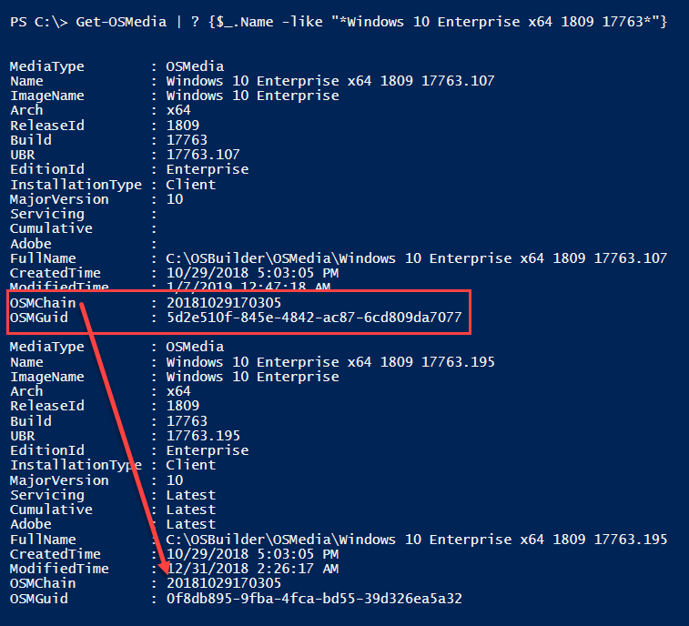

# Release Information

## 19.1.x \(Unreleased Preview\)

This update brings some major changes to OSMedia and Tasks

* \*\*\*\*[**Import-OSMedia**](../docs/functions/osmedia/import-osmedia.md)\*\*\*\*
  * Updated to include OSMChain and OSMGuid
* \*\*\*\*[**Get-OSMedia**](../docs/functions/osmedia/get-osmedia.md)\*\*\*\*
  * Updated to include OSMChain and OSMGuid
* \*\*\*\*[**Repair Functions**](../docs/functions/repair/) have been added to update existing OSBuild and PEBuild Tasks
  * \*\*\*\*[**Repair-OSBuildTask**](../docs/functions/repair/repair-osbuildtask.md) - Repairs an existing OSBuild Task to the updated format.  You will need to select an existing OSMedia to complete the Repair
  * **Repair-PEBuildTask** - Repairs an existing PEBuild Task to the updated format.  You will need to select an existing OSMedia to complete the Repair

#### OSMChain and OSMGuid

These values are added to each Imported and Updated **OSMedia** to allow proper Image associations for Tasks.  This also allows directories to be renamed without impacting associations.  This change is what requires Tasks to be Repaired using [**Repair-OSBuildTask**](../docs/functions/repair/repair-osbuildtask.md) and **Repair-PEBuildTask**

#### Naming Format

Previous versions of OSBuilder would abbreviate the Directory Name of the Operating System.  This release allows for proper full names to be used as all the necessary information needed is in the Get-WindowsImage information

#### Tasks

Tasks have been updated to contain more detailed information about the OSMedia that is used for the task.  This change requires an update to all existing OSBuild and PEBuild Tasks.  You can easily see the additional OSMedia information contained in the Task

## 19.1.2 \(January 2, 2019\)


**Several functions were renamed or changed, it is important that you review the changes for each of them before using in custom Scripts**


* [**Get-OSMedia**](../docs/functions/osmedia/get-osmedia.md)\*\*\*\*
  * New function to return all OSMedia as a PowerShell Custom Object
* \*\*\*\*[**Get-OSBUpdate**](../docs/functions/osbupdate/get-osbupdate.md)\*\*\*\*
  * _**Rename of Get-OSBuilderUpdates**_
* \*\*\*\*[**New-OSBMediaISO**](../docs/functions/osbmedia/new-osbmediaiso.md)\*\*\*\*
  * _**Rename of New-MediaISO**_
  * **`FullName`** parameter is now a Pipeline Value By Property Name 
* \*\*\*\*[**New-OSBMediaUSB**](../docs/functions/osbmedia/new-osbmediausb.md)\*\*\*\*
  * _**Rename of New-MediaUSB**_
  * **`FullName`** parameter is now a Pipeline Value By Property Name
* \*\*\*\*[**Show-OSBMediaInfo**](../docs/functions/osbmedia/show-osbmediainfo.md)\*\*\*\*
  * _**Rename of Show-OSInfo**_

#### **Windows 7**

Yup, its supported.  Here is what you need to know



**Documentation**

To make things easier to follow, I will be moving and organizing documentation under the Docs section.  Links may change over the next few weeks as documentation is updated



#### Functions

Here is the latest on all the OSBuilder Functions



#### Verbose Logging

Detailed information requires using the -Verbose parameter



**Function Rename**

Several functions were renamed so they could be grouped by commonality.  This will impact any scripts you have based on the older names

#### Comment Based Help

All functions have updated Comment Based Help including Online Links.  For Online with a Function, use the **`Get-Help <function> -Online`**

