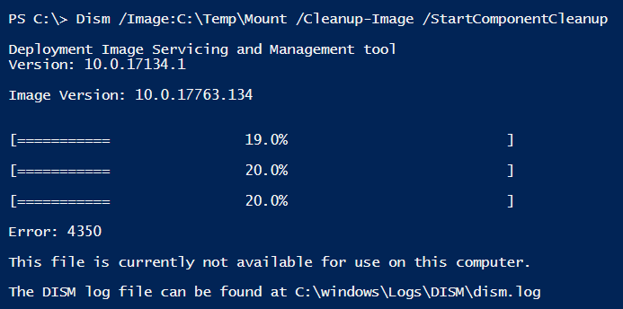

# Release Information

## 18.11.17.0 \(November 17, 2018\)

Mount-WindowsImage will not longer use the **`-Optimize`** parameter as this causes issues with Windows 10 1809.



## 18.11.14.0 \(November 14, 2018\)

* **Update-OSMedia**
  * Add Parameter **`SkipWinpeCU`** to skip the Cumulative Update from applying to WinPE
* **New-OSBuild**
  * Add Parameter **`SkipWinpeCU`** to skip the Cumulative Update from applying to WinPE

Windows 10 1809 2018-11 Cumulative Update when applied to WinPE does not allow Dism Image Cleanup to work, causing WinPE to grow large.  This will cause issues with WinRE when applied to the Recovery Partition during Imaging as it will be too big.  

Use **`Update-OSMedia -SkipWinpeCU`** or **`New-OSBuild -SkipWinpeCU`** to bypass updating WinPE with the 2018-11 Cumulative Update

## 18.11.13.0 \(November 13, 2018\)

* **New-MediaISO**
  * Add Parameter FullName \(Full Path to Media\)
* **New-OSBuild**
  * Add Parameter CreateISO
  * Add Parameter ByTaskName
* **New-PEBuild**
  * Add Parameter CreateISO
  * Automatically Creates LiteTouchPE\_&lt;Arch&gt;.wim
* **Update-OSMedia**
  * Add Parameter CreateISO
  * Add Auto ExtraFiles Browse DLLs
    * ShellStyle.dll
    * ExplorerFrame.dll
    * StructuredQuery.dll
    * EDPUtil.dll
  * Add Auto ExtraFiles Wireless Support Dlls
    * dmcmnutils.dll
    * mdmregistration.dll
    * [Build a WinPE with Wireless Support](http://www.scconfigmgr.com/2018/03/06/build-a-winpe-with-wireless-support/)

**`-ByTaskName`** parameter allows the automation of [**`New-OSBuild`**](../osbuild/new-osbuild.md) and the **`-CreateISO`** parameter automatically creates a [**`New-MediaISO`**](../how-to/new-mediaiso.md)**\`\`**

