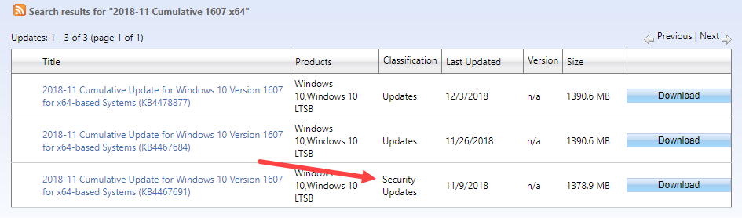

# Latest Latest Cumulative Update \(Latest LCU\)

OSBuilder uses Microsoft Updates that are published in WSUS, but these may not be the latest versions available

## Latest Latest Cumulative Update

This was originally a typo that [**Sudhagar**](https://twitter.com/sudhagart) ****made on Twitter, but there may be more to the story.





**You see, while WSUS typically releases a Windows LCU \(Latest Cumulative Update\) on Patch Tuesday, once a month, additional non-Patch Tuesday Cumulative Updates can be released as needed and posted to Microsoft Update Catalog.**  I believe that these non-Patch Tuesday updates are not published in WSUS to allow an Enterprise to maintain a proper update cadence by not making multiple mandatory Cumulative Updates in a given month.

If you were to look at the Windows 10 and Server 2016 Update History link



You will see that the 2018-11 Patch Tuesday Cumulative Update \(posted in WSUS\) is not the **Latest** Latest Cumulative Update

## Microsoft Update Catalog

A quick look in the Microsoft Update Catalog will show similar results

{% embed url="https://www.catalog.update.microsoft.com/Search.aspx?q=2018-11%20Cumulative%201607%20x64" %}

The 2018-11 Patch Tuesday release \(November 9, 2018\) is noted as a Security Update, whereas newer releases are Classified as Updates.  What this means is that if your Client is managed by WSUS, the Latest Cumulative Update you will receive will be the Security Update, but **if your Client is not managed by WSUS, you should receive the Latest Latest Cumulative Update**.  In this case, the latest 2018-11 November Cumulative Update you receive will be the one posted in December.  ???????

## Summary

**OSBuilder uses the Latest Cumulative Update published in WSUS,** but this may not be the Latest Latest Cumulative Update that is posted to the Microsoft Update Catalog.  Got it?

