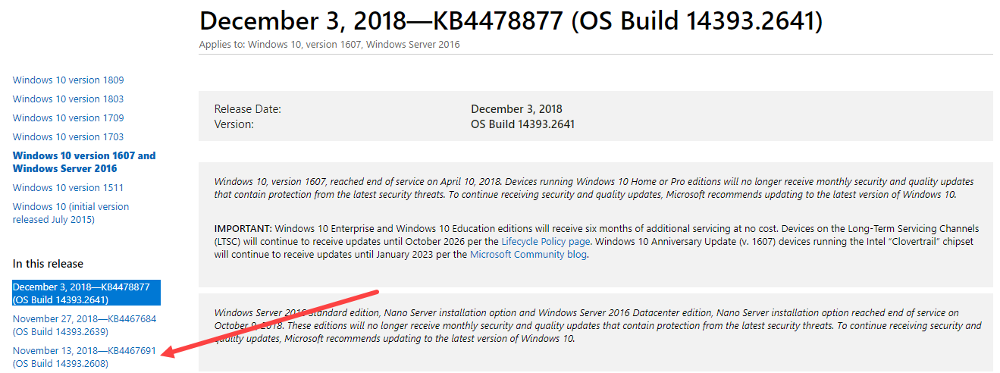

# New-OSBUpdate

OSBuilder uses Microsoft Update Catalogs that are generated from WSUS, but these may not be the latest versions available

## Windows 10 and Windows Server 2016 Update History

The best way to find out the latest OS Version and Build \(UBR\) that you need is to go to the Microsoft Windows Update History link 



## Latest Latest Cumulative Update

This was originally a typo that Sudhagar made on Twitter, but there may be more to the story.





You see, while WSUS typically releases a Windows LCU \(Latest Cumulative Update\) on Patch Tuesday, once a month, additional non-Patch Tuesday Cumulative Updates may be released as needed.  I believe that these non-Patch Tuesday updates are not published in WSUS to allow an Enterprise to maintain a proper update cadence.

## Microsoft Update Catalog

You can easily search for updates using the Microsoft Update Catalog



New-OSBUpdate is a new function to allow you to manually cre

