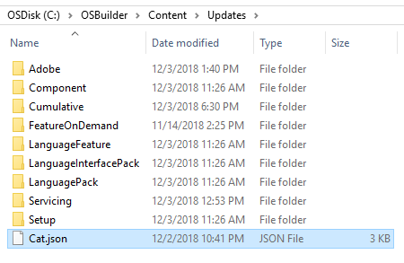
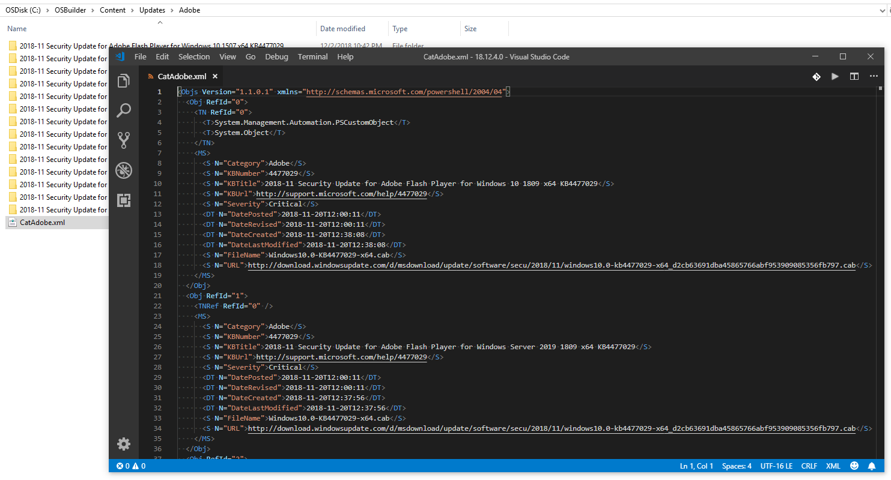

# Update Catalogs

Catalogs provide all the information that OSBuilder needs for applying Microsoft Updates to an Operating System.

## Catalog Information

To know which catalogs OSBuilder needs to download, it pulls a master Content JSON file from GitHub



This file is copied to the Updates directory in Content

And tells OSBuilder which Update Catalog XML files to download

## Catalog XML Files

The Catalog XML files are then copied into an Updates Category subdirectory and is then used by OSBuilder to know which Microsoft Updates to download and apply

## WSUS Content

WSUS provides the content for the Catalogs, and I simply use PowerShell to export the information after reviewing it for errors

