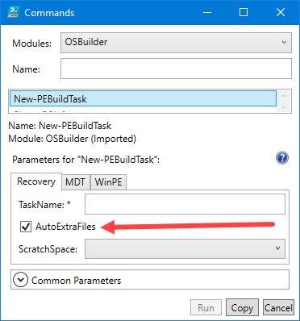
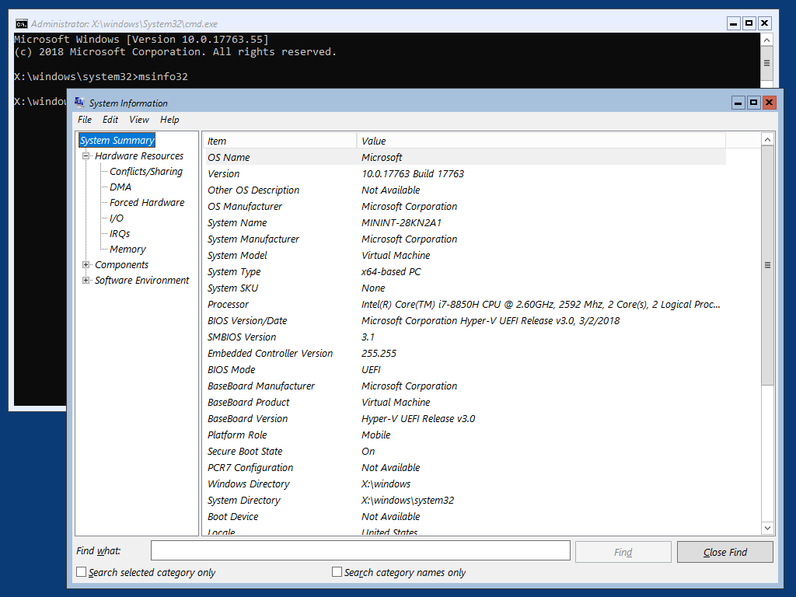
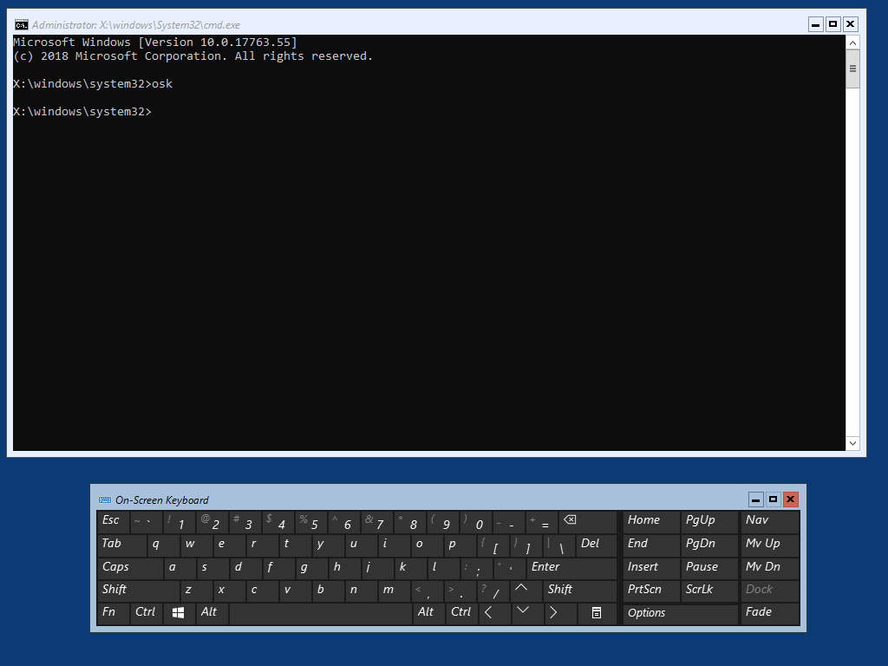

# Auto ExtraFiles

Auto ExtraFiles are files that are copied from a Windows Install.wim during an OSMedia or an OSBuild Task and copied to WinPE\AutoExtraFiles.  The purpose is to inject these files into WinPE when executing a PEBuild Task.

The following files are collected \(contact me if I need to add things\)

* AeroLite Styles
* MSInfo32
* OSK \(On Screen Keyboard\)

##  New-PEBuildTask

When creating a PEBuild, you have the option to copy the Auto ExtraFiles to WinPE using the -AutoExtraFiles parameter

## WinPE Examples

When adding Auto ExtraFiles to a PEBuild, you will be able to execute the commands in a completed PEBuild.

