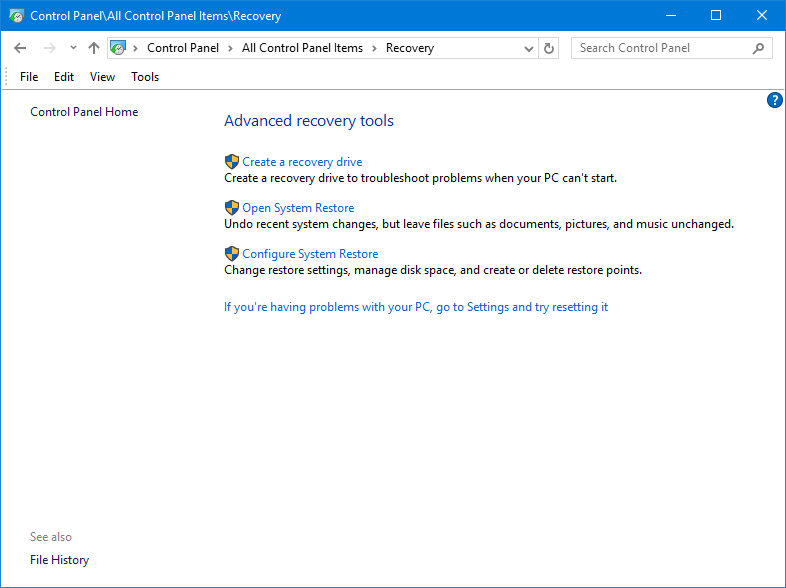

# Recovery \(WinRE.wim\)

Windows 10 allows you to create a simple Recovery Drive to USB without much effort.  This uses WinRE, but you can't easily add Drivers and other content using this method



## PEBuild Recovery

You can create a PEBuild Recovery Image that allows you to add ADK Components, Windows Drivers, Extra Files, and run custom PowerShell Scripts during the PEBuild process.

## New-PEBuildTask

The following New-PEBuildTask JSON was used to create a Recovery Image

```text
{
    "TaskName":  "Recovery Win10 x64 1809",
    "TaskVersion":  "18.10.15.0",
    "TaskType":  "PEBuild",
    "AutoExtraFiles":  "True",
    "DeploymentShare":  "",
    "MediaName":  "Win10 Ent x64 1809 17763.1",
    "PEOutput":  "Recovery",
    "ScratchSpace":  "256",
    "SourceWim":  "WinRE",
    "WinPEAddADK":  null,
    "WinPEAddDaRT":  "",
    "WinPEAddWindowsDriver":  null,
    "WinPEInvokeScript":  null,
    "WinPERobocopyExtraFiles":  null
}
```

## Demo


