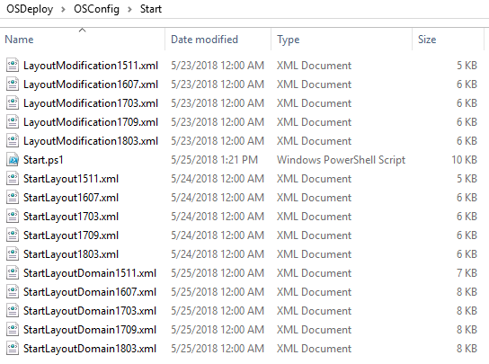
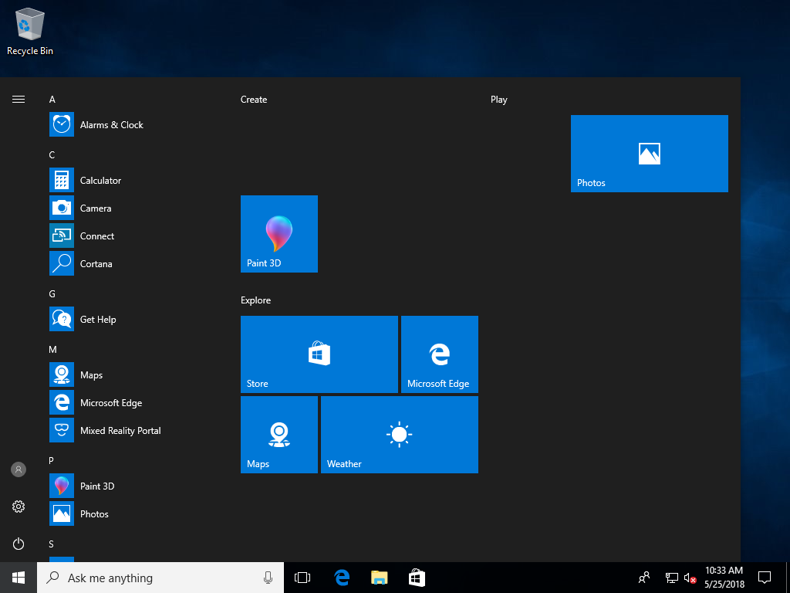
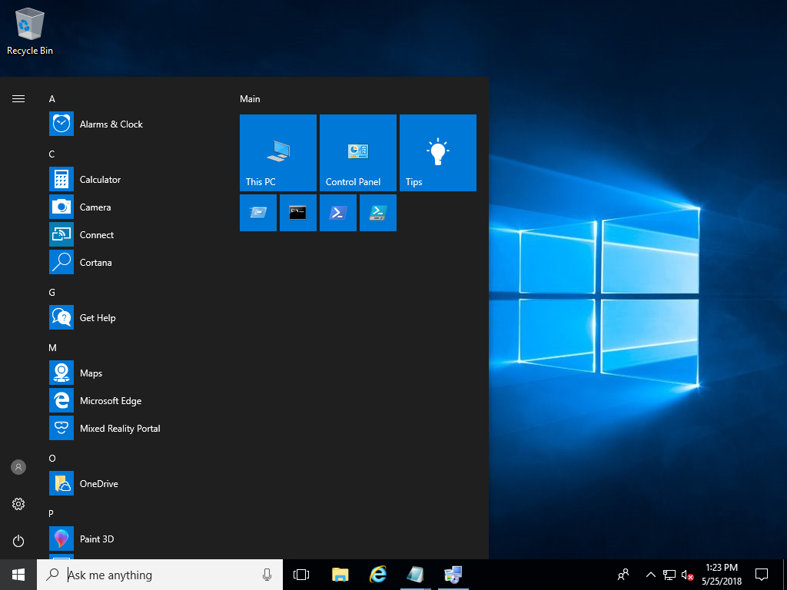
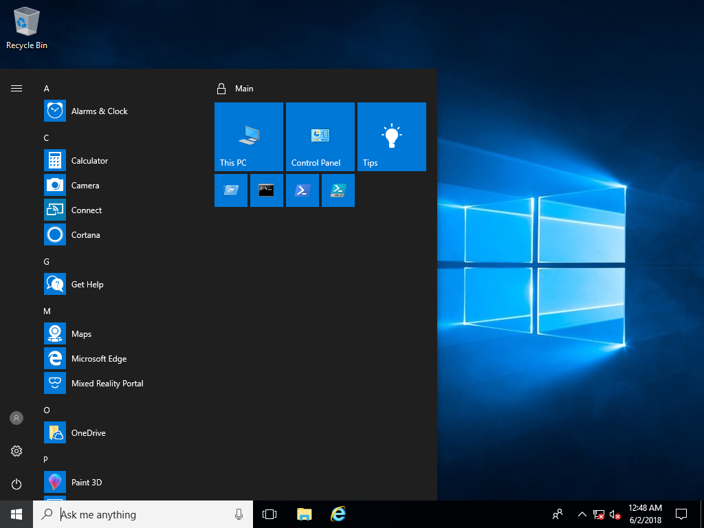
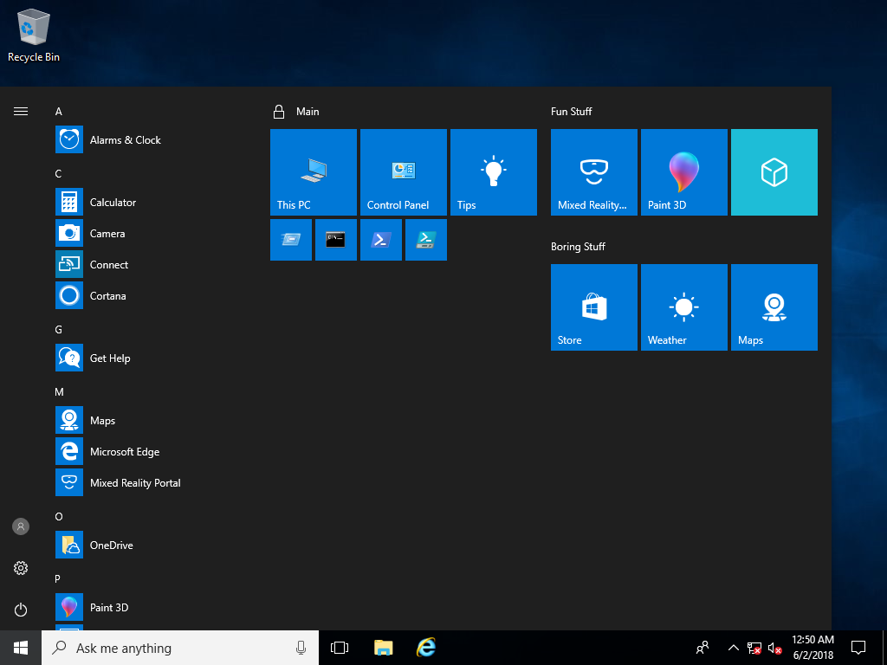

# Customizing the Start Menu

Now it is time to configure my Default Start Menu. I won't go into too much detail of what you should or should not have on yours, although you don't see Office 2016 on mine, this will show up AFTER Office 2016 has been installed for any NEW User Profiles.

If you are going to do this the right way, you need three types of StartLayout XML's.

* **LayoutModification.xml** - This will go in C:\Users\\*\AppData\Local\Microsoft\Windows\Shell and will control the Start Menu for NEW PROFILES
* **StartLayout.xml** - If you are going to Lock down some of your Start Menu using Local Policy, then you will need these files as well.  They are identical to LayoutModification.xml, with the exception that it contains 

```text
<DefaultLayoutOverride LayoutCustomizationRestrictionType="OnlySpecifiedGroups">
```

* **StartLayoutDomain.xml** - Similar to StartLayout.xml but this one is what will be pushed down from a GPO and will contain things like Software Center or Intranet URL's.  No need to add these links to non-Domain computers

## Start.ps1

Download the following script to OSConfig\Start\Start.ps1 [https://raw.githubusercontent.com/OSDeploy/OSConfig/master/Start/Start.ps1](https://raw.githubusercontent.com/OSDeploy/OSConfig/master/Start/Start.ps1)

Adjust the script as needed for your Start Layout XML files.

## Layout XML Files

Copy your Start Layout XML files in to the OSConfig\Start. I have included samples below

One thing to note is that the Date and Time is DIFFERENT for each type of Start Layout XML. This is because Windows will not refresh the StartLayout.xml from Policy if the Date / Time Stamp had not changed. So since these are applied on a level based \(Layout Modification &lt; Start Layout &lt; Start Layout Domain\), you want to keep the one you want to OVERWRITE as the never Date Time Stamp.



## Before

This is how my Start Layout looked before processing the script after removing Appx Packages.



## Using LayoutModification\*.xml

This looks much nicer. My Office 2016 Group will show up after it is installed, for any new profiles that have been created. Using the LayoutModification\*.xml will only set the Start Menu for new User Profiles.

When using my script, it will apply the LayoutModification.xml using the PowerShell Import-StartLayout command. This Start Menu is fully editable.



## Using StartLayout\*.xml

Using a StartLayout\*.xml triggers the setting of the Start Layout in Local Policy. The PowerShell script will take the proper StartLayout\*.xml and copy it to C:\ProgramData\OSConfig\Start\StartLayout.xml. A Local Policy will then set by a reg add command to have Windows use the Start Layout for All Users, even if the Profile has already been created.

It is also possible to Lock a Group on the Start Menu, as long as we include the proper change in the DefaultLayoutOverride XML node. Main will be locked, but we still allow the user to customize anything on the Start Menu that is not in Main. The following shows the differences between the XML files

**LayoutModification\*.xml**

```text
<DefaultLayoutOverride>
```

**StartLayout\*.xml**

```text
<DefaultLayoutOverride LayoutCustomizationRestrictionType="OnlySpecifiedGroups">
```

In this image, the Main group is Locked and cannot be edited.



But the user can add other Groups and modify those freely.



## Using StartLayoutDomain\*.xml

Use your Domain Group Policy Preferences to overwrite the file at C:\ProgramData\OSConfig\Start\StartLayout.xml

Add Enterprise links like Software Center or your Intranet.

## Sample LayoutModification1803.xml

```text
<?xml version="1.0" encoding="utf-8"?>
<LayoutModificationTemplate
    xmlns="http://schemas.microsoft.com/Start/2014/LayoutModification"
    xmlns:defaultlayout="http://schemas.microsoft.com/Start/2014/FullDefaultLayout"
    xmlns:start="http://schemas.microsoft.com/Start/2014/StartLayout"
    xmlns:taskbar="http://schemas.microsoft.com/Start/2014/TaskbarLayout"
    Version="1">
    <LayoutOptions StartTileGroupCellWidth="6" />
    <DefaultLayoutOverride>
        <StartLayoutCollection>
            <defaultlayout:StartLayout GroupCellWidth="6" xmlns:defaultlayout="http://schemas.microsoft.com/Start/2014/FullDefaultLayout">
                <start:Group Name="Main" xmlns:start="http://schemas.microsoft.com/Start/2014/StartLayout">
                    <start:DesktopApplicationTile Size="2x2" Column="0" Row="0" DesktopApplicationLinkPath="%APPDATA%\Microsoft\Windows\Start Menu\Programs\System Tools\Computer.lnk" />
                    <start:DesktopApplicationTile Size="2x2" Column="2" Row="0" DesktopApplicationLinkPath="%APPDATA%\Microsoft\Windows\Start Menu\Programs\System Tools\Control Panel.lnk" />
                    <start:Tile    Size="2x2" Column="4" Row="0" AppUserModelID="Microsoft.Getstarted_8wekyb3d8bbwe!App" />
                    <start:DesktopApplicationTile Size="1x1" Column="0" Row="2" DesktopApplicationLinkPath="%APPDATA%\Microsoft\Windows\Start Menu\Programs\System Tools\Run.lnk" />
                    <start:DesktopApplicationTile Size="1x1" Column="1" Row="2" DesktopApplicationLinkPath="%APPDATA%\Microsoft\Windows\Start Menu\Programs\System Tools\Command Prompt.lnk" />
                    <start:DesktopApplicationTile Size="1x1" Column="2" Row="2" DesktopApplicationLinkPath="%APPDATA%\Microsoft\Windows\Start Menu\Programs\Windows PowerShell\Windows PowerShell.lnk" />
                    <start:DesktopApplicationTile Size="1x1" Column="3" Row="2" DesktopApplicationLinkPath="%APPDATA%\Microsoft\Windows\Start Menu\Programs\Windows PowerShell\Windows PowerShell ISE.lnk" />
                </start:Group>
                <start:Group Name="Office" xmlns:start="http://schemas.microsoft.com/Start/2014/StartLayout">
                    <start:DesktopApplicationTile Size="2x2" Column="0" Row="0" DesktopApplicationLinkPath="%ALLUSERSPROFILE%\Microsoft\Windows\Start Menu\Programs\Outlook 2016.lnk" />
                    <start:DesktopApplicationTile Size="2x2" Column="2" Row="0" DesktopApplicationLinkPath="%ALLUSERSPROFILE%\Microsoft\Windows\Start Menu\Programs\Word 2016.lnk" />
                    <start:DesktopApplicationTile Size="2x2" Column="4" Row="0" DesktopApplicationLinkPath="%ALLUSERSPROFILE%\Microsoft\Windows\Start Menu\Programs\Excel 2016.lnk" />
                    <start:DesktopApplicationTile Size="1x1" Column="0" Row="2" DesktopApplicationLinkPath="%ALLUSERSPROFILE%\Microsoft\Windows\Start Menu\Programs\PowerPoint 2016.lnk" />
                    <start:DesktopApplicationTile Size="1x1" Column="1" Row="2" DesktopApplicationLinkPath="%ALLUSERSPROFILE%\Microsoft\Windows\Start Menu\Programs\OneNote 2016.lnk" />
                    <start:DesktopApplicationTile Size="1x1" Column="2" Row="2" DesktopApplicationLinkPath="%ALLUSERSPROFILE%\Microsoft\Windows\Start Menu\Programs\Publisher 2016.lnk" />
                    <start:DesktopApplicationTile Size="1x1" Column="3" Row="2" DesktopApplicationLinkPath="%ALLUSERSPROFILE%\Microsoft\Windows\Start Menu\Programs\Access 2016.lnk" />
                    <start:DesktopApplicationTile Size="1x1" Column="4" Row="2" DesktopApplicationLinkPath="%ALLUSERSPROFILE%\Microsoft\Windows\Start Menu\Programs\Skype for Business 2016.lnk" />
                    <start:DesktopApplicationTile Size="2x2" Column="0" Row="0" DesktopApplicationLinkPath="%ALLUSERSPROFILE%\Microsoft\Windows\Start Menu\Programs\Microsoft Office 2013\Outlook 2013.lnk" />
                    <start:DesktopApplicationTile Size="2x2" Column="2" Row="0" DesktopApplicationLinkPath="%ALLUSERSPROFILE%\Microsoft\Windows\Start Menu\Programs\Microsoft Office 2013\Word 2013.lnk" />
                    <start:DesktopApplicationTile Size="2x2" Column="4" Row="0" DesktopApplicationLinkPath="%ALLUSERSPROFILE%\Microsoft\Windows\Start Menu\Programs\Microsoft Office 2013\Excel 2013.lnk" />
                    <start:DesktopApplicationTile Size="1x1" Column="0" Row="2" DesktopApplicationLinkPath="%ALLUSERSPROFILE%\Microsoft\Windows\Start Menu\Programs\Microsoft Office 2013\PowerPoint 2013.lnk" />
                    <start:DesktopApplicationTile Size="1x1" Column="1" Row="2" DesktopApplicationLinkPath="%ALLUSERSPROFILE%\Microsoft\Windows\Start Menu\Programs\Microsoft Office 2013\OneNote 2013.lnk" />
                    <start:DesktopApplicationTile Size="1x1" Column="2" Row="2" DesktopApplicationLinkPath="%ALLUSERSPROFILE%\Microsoft\Windows\Start Menu\Programs\Microsoft Office 2013\Publisher 2013.lnk" />
                    <start:DesktopApplicationTile Size="1x1" Column="3" Row="2" DesktopApplicationLinkPath="%ALLUSERSPROFILE%\Microsoft\Windows\Start Menu\Programs\Microsoft Office 2013\Access 2013.lnk" />
                    <start:DesktopApplicationTile Size="1x1" Column="4" Row="2" DesktopApplicationLinkPath="%ALLUSERSPROFILE%\Microsoft\Windows\Start Menu\Programs\Microsoft Office 2013\Skype for Business 2015.lnk" />
                    <start:DesktopApplicationTile Size="1x1" Column="4" Row="2" DesktopApplicationLinkPath="%ALLUSERSPROFILE%\Microsoft\Windows\Start Menu\Programs\Microsoft Office 2013\Skype for Business 2013.lnk" />
                </start:Group>
            </defaultlayout:StartLayout>
        </StartLayoutCollection>
    </DefaultLayoutOverride>
    <CustomTaskbarLayoutCollection PinListPlacement="Replace">
        <defaultlayout:TaskbarLayout>
            <taskbar:TaskbarPinList>
                <taskbar:DesktopApp DesktopApplicationLinkPath="%APPDATA%\Microsoft\Windows\Start Menu\Programs\System Tools\File Explorer.lnk" />
                <taskbar:DesktopApp DesktopApplicationLinkPath="%APPDATA%\Microsoft\Windows\Start Menu\Programs\Accessories\Internet Explorer.lnk"/>
                <taskbar:DesktopApp DesktopApplicationLinkPath="%ALLUSERSPROFILE%\Microsoft\Windows\Start Menu\Programs\Microsoft Office 2013\Outlook 2013.lnk"/>
                <taskbar:DesktopApp DesktopApplicationLinkPath="%ALLUSERSPROFILE%\Microsoft\Windows\Start Menu\Programs\Outlook 2016.lnk"/>
            </taskbar:TaskbarPinList>
        </defaultlayout:TaskbarLayout>
    </CustomTaskbarLayoutCollection>
</LayoutModificationTemplate>
```

## Sample StartLayout1803.xml

```text
<?xml version="1.0" encoding="utf-8"?>
<LayoutModificationTemplate
    xmlns="http://schemas.microsoft.com/Start/2014/LayoutModification"
    xmlns:defaultlayout="http://schemas.microsoft.com/Start/2014/FullDefaultLayout"
    xmlns:start="http://schemas.microsoft.com/Start/2014/StartLayout"
    xmlns:taskbar="http://schemas.microsoft.com/Start/2014/TaskbarLayout"
    Version="1">
    <LayoutOptions StartTileGroupCellWidth="6" />
    <DefaultLayoutOverride LayoutCustomizationRestrictionType="OnlySpecifiedGroups">
        <StartLayoutCollection>
            <defaultlayout:StartLayout GroupCellWidth="6" xmlns:defaultlayout="http://schemas.microsoft.com/Start/2014/FullDefaultLayout">
                <start:Group Name="Main" xmlns:start="http://schemas.microsoft.com/Start/2014/StartLayout">
                    <start:DesktopApplicationTile Size="2x2" Column="0" Row="0" DesktopApplicationLinkPath="%APPDATA%\Microsoft\Windows\Start Menu\Programs\System Tools\Computer.lnk" />
                    <start:DesktopApplicationTile Size="2x2" Column="2" Row="0" DesktopApplicationLinkPath="%APPDATA%\Microsoft\Windows\Start Menu\Programs\System Tools\Control Panel.lnk" />
                    <start:Tile    Size="2x2" Column="4" Row="0" AppUserModelID="Microsoft.Getstarted_8wekyb3d8bbwe!App" />
                    <start:DesktopApplicationTile Size="1x1" Column="0" Row="2" DesktopApplicationLinkPath="%APPDATA%\Microsoft\Windows\Start Menu\Programs\System Tools\Run.lnk" />
                    <start:DesktopApplicationTile Size="1x1" Column="1" Row="2" DesktopApplicationLinkPath="%APPDATA%\Microsoft\Windows\Start Menu\Programs\System Tools\Command Prompt.lnk" />
                    <start:DesktopApplicationTile Size="1x1" Column="2" Row="2" DesktopApplicationLinkPath="%APPDATA%\Microsoft\Windows\Start Menu\Programs\Windows PowerShell\Windows PowerShell.lnk" />
                    <start:DesktopApplicationTile Size="1x1" Column="3" Row="2" DesktopApplicationLinkPath="%APPDATA%\Microsoft\Windows\Start Menu\Programs\Windows PowerShell\Windows PowerShell ISE.lnk" />
                </start:Group>
                <start:Group Name="Office" xmlns:start="http://schemas.microsoft.com/Start/2014/StartLayout">
                    <start:DesktopApplicationTile Size="2x2" Column="0" Row="0" DesktopApplicationLinkPath="%ALLUSERSPROFILE%\Microsoft\Windows\Start Menu\Programs\Outlook 2016.lnk" />
                    <start:DesktopApplicationTile Size="2x2" Column="2" Row="0" DesktopApplicationLinkPath="%ALLUSERSPROFILE%\Microsoft\Windows\Start Menu\Programs\Word 2016.lnk" />
                    <start:DesktopApplicationTile Size="2x2" Column="4" Row="0" DesktopApplicationLinkPath="%ALLUSERSPROFILE%\Microsoft\Windows\Start Menu\Programs\Excel 2016.lnk" />
                    <start:DesktopApplicationTile Size="1x1" Column="0" Row="2" DesktopApplicationLinkPath="%ALLUSERSPROFILE%\Microsoft\Windows\Start Menu\Programs\PowerPoint 2016.lnk" />
                    <start:DesktopApplicationTile Size="1x1" Column="1" Row="2" DesktopApplicationLinkPath="%ALLUSERSPROFILE%\Microsoft\Windows\Start Menu\Programs\OneNote 2016.lnk" />
                    <start:DesktopApplicationTile Size="1x1" Column="2" Row="2" DesktopApplicationLinkPath="%ALLUSERSPROFILE%\Microsoft\Windows\Start Menu\Programs\Publisher 2016.lnk" />
                    <start:DesktopApplicationTile Size="1x1" Column="3" Row="2" DesktopApplicationLinkPath="%ALLUSERSPROFILE%\Microsoft\Windows\Start Menu\Programs\Access 2016.lnk" />
                    <start:DesktopApplicationTile Size="1x1" Column="4" Row="2" DesktopApplicationLinkPath="%ALLUSERSPROFILE%\Microsoft\Windows\Start Menu\Programs\Skype for Business 2016.lnk" />
                    <start:DesktopApplicationTile Size="2x2" Column="0" Row="0" DesktopApplicationLinkPath="%ALLUSERSPROFILE%\Microsoft\Windows\Start Menu\Programs\Microsoft Office 2013\Outlook 2013.lnk" />
                    <start:DesktopApplicationTile Size="2x2" Column="2" Row="0" DesktopApplicationLinkPath="%ALLUSERSPROFILE%\Microsoft\Windows\Start Menu\Programs\Microsoft Office 2013\Word 2013.lnk" />
                    <start:DesktopApplicationTile Size="2x2" Column="4" Row="0" DesktopApplicationLinkPath="%ALLUSERSPROFILE%\Microsoft\Windows\Start Menu\Programs\Microsoft Office 2013\Excel 2013.lnk" />
                    <start:DesktopApplicationTile Size="1x1" Column="0" Row="2" DesktopApplicationLinkPath="%ALLUSERSPROFILE%\Microsoft\Windows\Start Menu\Programs\Microsoft Office 2013\PowerPoint 2013.lnk" />
                    <start:DesktopApplicationTile Size="1x1" Column="1" Row="2" DesktopApplicationLinkPath="%ALLUSERSPROFILE%\Microsoft\Windows\Start Menu\Programs\Microsoft Office 2013\OneNote 2013.lnk" />
                    <start:DesktopApplicationTile Size="1x1" Column="2" Row="2" DesktopApplicationLinkPath="%ALLUSERSPROFILE%\Microsoft\Windows\Start Menu\Programs\Microsoft Office 2013\Publisher 2013.lnk" />
                    <start:DesktopApplicationTile Size="1x1" Column="3" Row="2" DesktopApplicationLinkPath="%ALLUSERSPROFILE%\Microsoft\Windows\Start Menu\Programs\Microsoft Office 2013\Access 2013.lnk" />
                    <start:DesktopApplicationTile Size="1x1" Column="4" Row="2" DesktopApplicationLinkPath="%ALLUSERSPROFILE%\Microsoft\Windows\Start Menu\Programs\Microsoft Office 2013\Skype for Business 2015.lnk" />
                    <start:DesktopApplicationTile Size="1x1" Column="4" Row="2" DesktopApplicationLinkPath="%ALLUSERSPROFILE%\Microsoft\Windows\Start Menu\Programs\Microsoft Office 2013\Skype for Business 2013.lnk" />
                </start:Group>
            </defaultlayout:StartLayout>
        </StartLayoutCollection>
    </DefaultLayoutOverride>
    <CustomTaskbarLayoutCollection PinListPlacement="Replace">
        <defaultlayout:TaskbarLayout>
            <taskbar:TaskbarPinList>
                <taskbar:DesktopApp DesktopApplicationLinkPath="%APPDATA%\Microsoft\Windows\Start Menu\Programs\System Tools\File Explorer.lnk" />
                <taskbar:DesktopApp DesktopApplicationLinkPath="%APPDATA%\Microsoft\Windows\Start Menu\Programs\Accessories\Internet Explorer.lnk"/>
                <taskbar:DesktopApp DesktopApplicationLinkPath="%ALLUSERSPROFILE%\Microsoft\Windows\Start Menu\Programs\Microsoft Office 2013\Outlook 2013.lnk"/>
                <taskbar:DesktopApp DesktopApplicationLinkPath="%ALLUSERSPROFILE%\Microsoft\Windows\Start Menu\Programs\Outlook 2016.lnk"/>
            </taskbar:TaskbarPinList>
        </defaultlayout:TaskbarLayout>
    </CustomTaskbarLayoutCollection>
</LayoutModificationTemplate>
```

## Sample StartLayoutDomain1803.xml

```text
<?xml version="1.0" encoding="utf-8"?>
<LayoutModificationTemplate
    xmlns="http://schemas.microsoft.com/Start/2014/LayoutModification"
    xmlns:defaultlayout="http://schemas.microsoft.com/Start/2014/FullDefaultLayout"
    xmlns:start="http://schemas.microsoft.com/Start/2014/StartLayout"
    xmlns:taskbar="http://schemas.microsoft.com/Start/2014/TaskbarLayout"
    Version="1">
    <LayoutOptions StartTileGroupCellWidth="6" />
    <DefaultLayoutOverride LayoutCustomizationRestrictionType="OnlySpecifiedGroups">
        <StartLayoutCollection>
            <defaultlayout:StartLayout GroupCellWidth="6" xmlns:defaultlayout="http://schemas.microsoft.com/Start/2014/FullDefaultLayout">
                <start:Group Name="Main" xmlns:start="http://schemas.microsoft.com/Start/2014/StartLayout">
                    <start:DesktopApplicationTile Size="2x2" Column="0" Row="0" DesktopApplicationLinkPath="%APPDATA%\Microsoft\Windows\Start Menu\Programs\System Tools\Computer.lnk" />
                    <start:DesktopApplicationTile Size="2x2" Column="2" Row="0" DesktopApplicationLinkPath="%APPDATA%\Microsoft\Windows\Start Menu\Programs\System Tools\Control Panel.lnk" />
                    <start:Tile    Size="2x2" Column="4" Row="0" AppUserModelID="Microsoft.Getstarted_8wekyb3d8bbwe!App" />
                    <start:DesktopApplicationTile Size="1x1" Column="0" Row="2" DesktopApplicationLinkPath="%APPDATA%\Microsoft\Windows\Start Menu\Programs\System Tools\Run.lnk" />
                    <start:DesktopApplicationTile Size="1x1" Column="1" Row="2" DesktopApplicationLinkPath="%APPDATA%\Microsoft\Windows\Start Menu\Programs\System Tools\Command Prompt.lnk" />
                    <start:DesktopApplicationTile Size="1x1" Column="2" Row="2" DesktopApplicationLinkPath="%APPDATA%\Microsoft\Windows\Start Menu\Programs\Windows PowerShell\Windows PowerShell.lnk" />
                    <start:DesktopApplicationTile Size="1x1" Column="3" Row="2" DesktopApplicationLinkPath="%APPDATA%\Microsoft\Windows\Start Menu\Programs\Windows PowerShell\Windows PowerShell ISE.lnk" />
                </start:Group>
                <start:Group Name="Office" xmlns:start="http://schemas.microsoft.com/Start/2014/StartLayout">
                    <start:DesktopApplicationTile Size="2x2" Column="0" Row="0" DesktopApplicationLinkPath="%ALLUSERSPROFILE%\Microsoft\Windows\Start Menu\Programs\Outlook 2016.lnk" />
                    <start:DesktopApplicationTile Size="2x2" Column="2" Row="0" DesktopApplicationLinkPath="%ALLUSERSPROFILE%\Microsoft\Windows\Start Menu\Programs\Word 2016.lnk" />
                    <start:DesktopApplicationTile Size="2x2" Column="4" Row="0" DesktopApplicationLinkPath="%ALLUSERSPROFILE%\Microsoft\Windows\Start Menu\Programs\Excel 2016.lnk" />
                    <start:DesktopApplicationTile Size="1x1" Column="0" Row="2" DesktopApplicationLinkPath="%ALLUSERSPROFILE%\Microsoft\Windows\Start Menu\Programs\PowerPoint 2016.lnk" />
                    <start:DesktopApplicationTile Size="1x1" Column="1" Row="2" DesktopApplicationLinkPath="%ALLUSERSPROFILE%\Microsoft\Windows\Start Menu\Programs\OneNote 2016.lnk" />
                    <start:DesktopApplicationTile Size="1x1" Column="2" Row="2" DesktopApplicationLinkPath="%ALLUSERSPROFILE%\Microsoft\Windows\Start Menu\Programs\Publisher 2016.lnk" />
                    <start:DesktopApplicationTile Size="1x1" Column="3" Row="2" DesktopApplicationLinkPath="%ALLUSERSPROFILE%\Microsoft\Windows\Start Menu\Programs\Access 2016.lnk" />
                    <start:DesktopApplicationTile Size="1x1" Column="4" Row="2" DesktopApplicationLinkPath="%ALLUSERSPROFILE%\Microsoft\Windows\Start Menu\Programs\Skype for Business 2016.lnk" />
                    <start:DesktopApplicationTile Size="2x2" Column="0" Row="0" DesktopApplicationLinkPath="%ALLUSERSPROFILE%\Microsoft\Windows\Start Menu\Programs\Microsoft Office 2013\Outlook 2013.lnk" />
                    <start:DesktopApplicationTile Size="2x2" Column="2" Row="0" DesktopApplicationLinkPath="%ALLUSERSPROFILE%\Microsoft\Windows\Start Menu\Programs\Microsoft Office 2013\Word 2013.lnk" />
                    <start:DesktopApplicationTile Size="2x2" Column="4" Row="0" DesktopApplicationLinkPath="%ALLUSERSPROFILE%\Microsoft\Windows\Start Menu\Programs\Microsoft Office 2013\Excel 2013.lnk" />
                    <start:DesktopApplicationTile Size="1x1" Column="0" Row="2" DesktopApplicationLinkPath="%ALLUSERSPROFILE%\Microsoft\Windows\Start Menu\Programs\Microsoft Office 2013\PowerPoint 2013.lnk" />
                    <start:DesktopApplicationTile Size="1x1" Column="1" Row="2" DesktopApplicationLinkPath="%ALLUSERSPROFILE%\Microsoft\Windows\Start Menu\Programs\Microsoft Office 2013\OneNote 2013.lnk" />
                    <start:DesktopApplicationTile Size="1x1" Column="2" Row="2" DesktopApplicationLinkPath="%ALLUSERSPROFILE%\Microsoft\Windows\Start Menu\Programs\Microsoft Office 2013\Publisher 2013.lnk" />
                    <start:DesktopApplicationTile Size="1x1" Column="3" Row="2" DesktopApplicationLinkPath="%ALLUSERSPROFILE%\Microsoft\Windows\Start Menu\Programs\Microsoft Office 2013\Access 2013.lnk" />
                    <start:DesktopApplicationTile Size="1x1" Column="4" Row="2" DesktopApplicationLinkPath="%ALLUSERSPROFILE%\Microsoft\Windows\Start Menu\Programs\Microsoft Office 2013\Skype for Business 2015.lnk" />
                    <start:DesktopApplicationTile Size="1x1" Column="4" Row="2" DesktopApplicationLinkPath="%ALLUSERSPROFILE%\Microsoft\Windows\Start Menu\Programs\Microsoft Office 2013\Skype for Business 2013.lnk" />
                </start:Group>
                <start:Group Name="Support" xmlns:start="http://schemas.microsoft.com/Start/2014/StartLayout">
                    <start:SecondaryTile AppUserModelID="Microsoft.MicrosoftEdge_8wekyb3d8bbwe!MicrosoftEdge"
                        TileID="CustomizeMe1"
                        Arguments="http://intranet/link/one"
                        DisplayName="My Hot Link"
                        Square150x150LogoUri="ms-appx:///Assets/MicrosoftEdgeSquare150x150.png" 
                        Wide310x150LogoUri="ms-appx:///Assets/MicrosoftEdgeWide310x150.png"
                        ShowNameOnSquare150x150Logo="true"
                        ShowNameOnWide310x150Logo="true"
                        Size="2x2" Column="0" Row="0"
                    />
                    <start:SecondaryTile AppUserModelID="Microsoft.MicrosoftEdge_8wekyb3d8bbwe!MicrosoftEdge"
                        TileID="CustomizeMe2"
                        Arguments="http://intanet/link/two"
                        DisplayName="My Cool Link"
                        Square150x150LogoUri="ms-appx:///Assets/MicrosoftEdgeSquare150x150.png" 
                        Wide310x150LogoUri="ms-appx:///Assets/MicrosoftEdgeWide310x150.png"
                        ShowNameOnSquare150x150Logo="true"
                        ShowNameOnWide310x150Logo="true"
                        Size="2x2" Column="2" Row="0"
                    />
                    <start:DesktopApplicationTile Size="2x2" Column="4" Row="0" DesktopApplicationLinkPath="%ALLUSERSPROFILE%\Microsoft\Windows\Start Menu\Programs\Microsoft System Center\Configuration Manager\Software Center.lnk" />
                </start:Group>
            </defaultlayout:StartLayout>
        </StartLayoutCollection>
    </DefaultLayoutOverride>
    <CustomTaskbarLayoutCollection PinListPlacement="Replace">
        <defaultlayout:TaskbarLayout>
            <taskbar:TaskbarPinList>
                <taskbar:DesktopApp DesktopApplicationLinkPath="%APPDATA%\Microsoft\Windows\Start Menu\Programs\System Tools\File Explorer.lnk" />
                <taskbar:DesktopApp DesktopApplicationLinkPath="%APPDATA%\Microsoft\Windows\Start Menu\Programs\Accessories\Internet Explorer.lnk"/>
                <taskbar:DesktopApp DesktopApplicationLinkPath="%ALLUSERSPROFILE%\Microsoft\Windows\Start Menu\Programs\Microsoft Office 2013\Outlook 2013.lnk"/>
                <taskbar:DesktopApp DesktopApplicationLinkPath="%ALLUSERSPROFILE%\Microsoft\Windows\Start Menu\Programs\Outlook 2016.lnk"/>
            </taskbar:TaskbarPinList>
        </defaultlayout:TaskbarLayout>
    </CustomTaskbarLayoutCollection>
</LayoutModificationTemplate>
```

