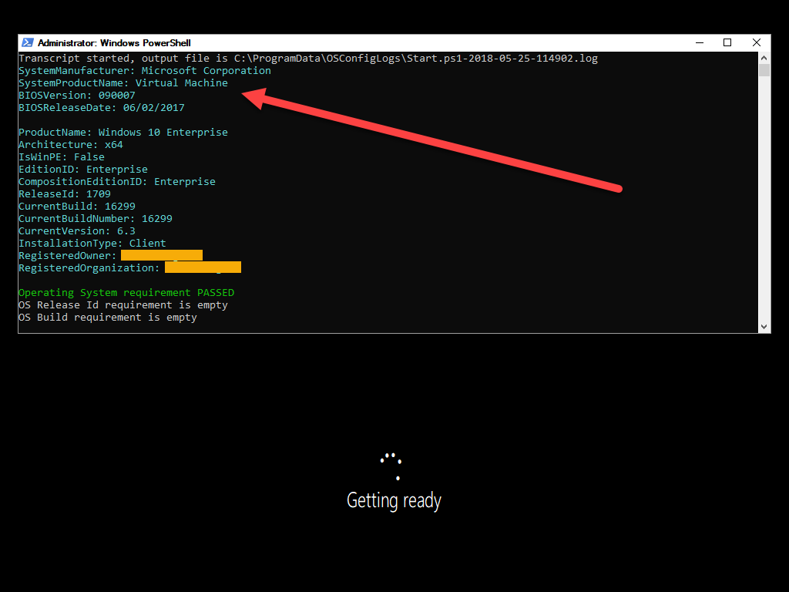
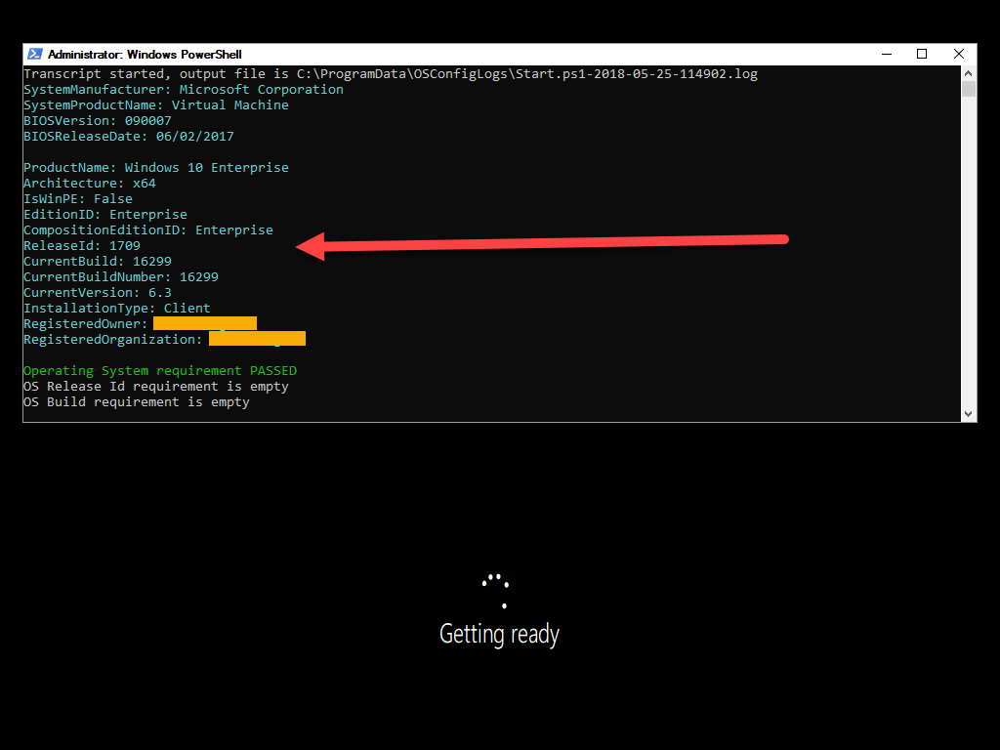
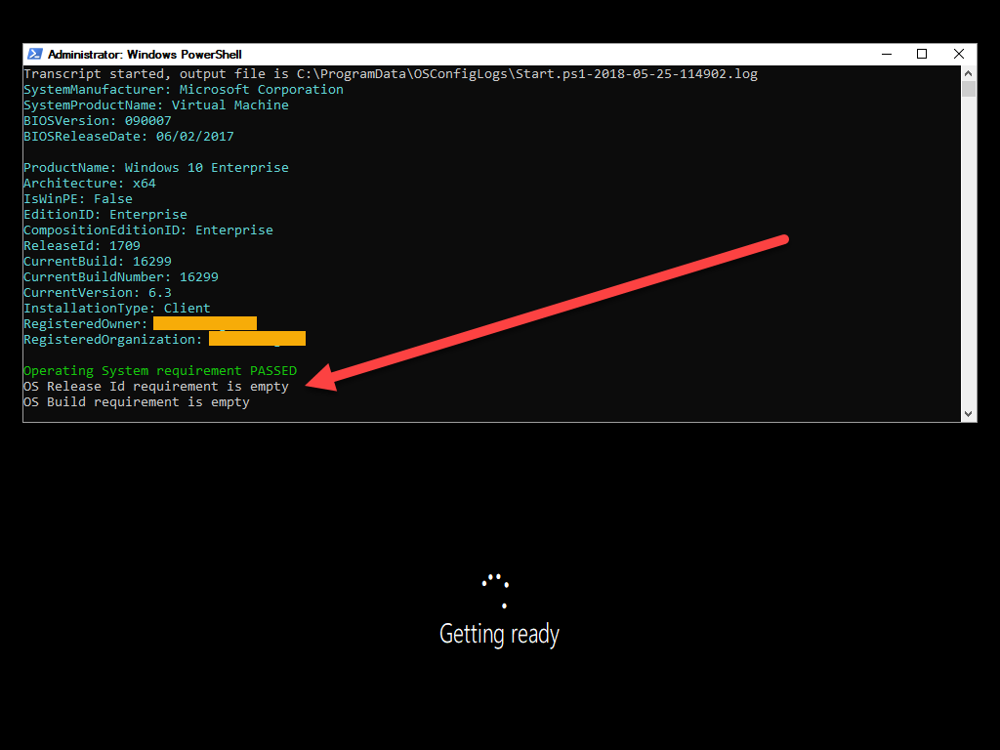

# Decoding My PowerShell Scripts

Before getting to deep into customizations, if you are going to use any of my following Sample Scripts, you need to understand what they are doing

## Requirements

I add a Requirements section to my scripts to filter out Operating System compatibility. In the first example, this script will only execute on Windows 10 1803

```text
#======================================================================================
#    Requirements
#======================================================================================
$RequiresOS = "Windows 10"
$RequiresReleaseId = "1803"
$RequiresBuild = ""
#$VerbosePreference = 'Continue'
#======================================================================================
```

In the example below, this will run the script on Windows 7 computers only

```text
#======================================================================================
#    Requirements
#======================================================================================
$RequiresOS = "Windows 7"
$RequiresReleaseId = ""
$RequiresBuild = ""
#$VerbosePreference = 'Continue'
#======================================================================================
```

## Transcript

I make sure to include a PowerShell Transcript which will create a LOG in C:\ProgramData\OSConfigLogs. Each LOG will be Date and Time stamped so I can have multiple logs if necessary \(think Feature Upgrades\).

```text
#======================================================================================
#    Create the Log Directory
#======================================================================================
if (!(Test-Path "$env:ProgramData\OSConfigLogs")) {New-Item -ItemType Directory -Path $env:ProgramData\OSConfigLogs}
#======================================================================================
#    Start the Transcript
#======================================================================================
$ScriptName = $MyInvocation.MyCommand.Name
$LogName = "$ScriptName-$((Get-Date).ToString('yyyy-MM-dd-HHmmss')).log"
Start-Transcript -Path (Join-Path $env:ProgramData\OSConfigLogs $LogName)
Write-Host ""
#======================================================================================
```

## System Information

I go ahead and gather System Information that I set to Variables. This allows me to perform filtering in my script if necessary. This is displayed in the Console, and included in the Transcript.

```text
#======================================================================================
#    System Information
#======================================================================================
$SystemManufacturer = (Get-ItemProperty -Path HKLM:\System\CurrentControlSet\Control\SystemInformation).SystemManufacturer.Trim()
$SystemProductName = (Get-ItemProperty -Path HKLM:\System\CurrentControlSet\Control\SystemInformation).SystemProductName.Trim()
$BIOSVersion = (Get-ItemProperty -Path HKLM:\System\CurrentControlSet\Control\SystemInformation).BIOSVersion.Trim()
$BIOSReleaseDate = (Get-ItemProperty -Path HKLM:\System\CurrentControlSet\Control\SystemInformation).BIOSReleaseDate.Trim()
if ($SystemManufacturer -like "*Dell*") {$SystemManufacturer = "Dell"}
Write-Host "SystemManufacturer: $SystemManufacturer" -ForegroundColor Cyan
Write-Host "SystemProductName: $SystemProductName" -ForegroundColor Cyan
Write-Host "BIOSVersion: $BIOSVersion" -ForegroundColor Cyan
Write-Host "BIOSReleaseDate: $BIOSReleaseDate" -ForegroundColor Cyan
Write-Host ""
#======================================================================================
```



## Windows Information

Normally I would use WMI, but since WMI is not available in OOBE, I'll gather some common Windows information and save those as Variables. Output is in the Console and in the Transcript. WMI will work in SCCM Task Sequences though, but I'll keep everything this way for MDT backward compatibility

```text
#======================================================================================
#    Windows Information
#======================================================================================
if (Test-Path -Path "HKLM:\Software\Microsoft\Windows NT\CurrentVersion") {
    $ProductName = (Get-ItemProperty -Path "HKLM:\Software\Microsoft\Windows NT\CurrentVersion").ProductName.Trim()
    $EditionID = (Get-ItemProperty -Path "HKLM:\Software\Microsoft\Windows NT\CurrentVersion").EditionID.Trim()
    if ($ProductName -like "*Windows 10*") {
        $CompositionEditionID = (Get-ItemProperty -Path "HKLM:\Software\Microsoft\Windows NT\CurrentVersion").CompositionEditionID.Trim()
        $ReleaseId = (Get-ItemProperty -Path "HKLM:\Software\Microsoft\Windows NT\CurrentVersion").ReleaseId.Trim()
    }
    $CurrentBuild = (Get-ItemProperty -Path "HKLM:\Software\Microsoft\Windows NT\CurrentVersion").CurrentBuild.Trim()
    $CurrentBuildNumber = (Get-ItemProperty -Path "HKLM:\Software\Microsoft\Windows NT\CurrentVersion").CurrentBuildNumber.Trim()
    $CurrentVersion = (Get-ItemProperty -Path "HKLM:\Software\Microsoft\Windows NT\CurrentVersion").CurrentVersion.Trim()
    $InstallationType = (Get-ItemProperty -Path "HKLM:\Software\Microsoft\Windows NT\CurrentVersion").InstallationType.Trim()
    $RegisteredOwner = (Get-ItemProperty -Path "HKLM:\Software\Microsoft\Windows NT\CurrentVersion").RegisteredOwner.Trim()
    $RegisteredOrganization = (Get-ItemProperty -Path "HKLM:\Software\Microsoft\Windows NT\CurrentVersion").RegisteredOrganization.Trim()
} else {
    $ProductName = (Get-ItemProperty -Path "HKLM:\Software\Microsoft\Windows\CurrentVersion").ProductName.Trim()
    $EditionID = (Get-ItemProperty -Path "HKLM:\Software\Microsoft\Windows\CurrentVersion").EditionID.Trim()
    if ($ProductName -like "*Windows 10*") {
        $CompositionEditionID = (Get-ItemProperty -Path "HKLM:\Software\Microsoft\Windows\CurrentVersion").CompositionEditionID.Trim()
        $ReleaseId = (Get-ItemProperty -Path "HKLM:\Software\Microsoft\Windows\CurrentVersion").ReleaseId.Trim()
    }
    $CurrentBuild = (Get-ItemProperty -Path "HKLM:\Software\Microsoft\Windows\CurrentVersion").CurrentBuild.Trim()
    $CurrentBuildNumber = (Get-ItemProperty -Path "HKLM:\Software\Microsoft\Windows\CurrentVersion").CurrentBuildNumber.Trim()
    $CurrentVersion = (Get-ItemProperty -Path "HKLM:\Software\Microsoft\Windows\CurrentVersion").CurrentVersion.Trim()
    $InstallationType = (Get-ItemProperty -Path "HKLM:\Software\Microsoft\Windows\CurrentVersion").InstallationType.Trim()
    $RegisteredOwner = (Get-ItemProperty -Path "HKLM:\Software\Microsoft\Windows\CurrentVersion").RegisteredOwner.Trim()
    $RegisteredOrganization = (Get-ItemProperty -Path "HKLM:\Software\Microsoft\Windows\CurrentVersion").RegisteredOrganization.Trim()
}

if ($env:PROCESSOR_ARCHITECTURE -like "*64") {
    #64-bit
    $Arch = "x64"
    $Bits = "64-bit"
} else {
    #32-bit
    $Arch = "x86"
    $Bits = "32-bit"
}

if ($env:SystemDrive -eq "X:") {
    $IsWinPE = "True"
    Write-Host "System is running in WinPE" -ForegroundColor Green
} else {
    $IsWinPE = "False"
}

Write-Host "ProductName: $ProductName" -ForegroundColor Cyan
Write-Host "Architecture: $Arch" -ForegroundColor Cyan
Write-Host "IsWinPE: $IsWinPE" -ForegroundColor Cyan
Write-Host "EditionID: $EditionID" -ForegroundColor Cyan
Write-Host "CompositionEditionID: $CompositionEditionID" -ForegroundColor Cyan
Write-Host "ReleaseId: $ReleaseId" -ForegroundColor Cyan
Write-Host "CurrentBuild: $CurrentBuild" -ForegroundColor Cyan
Write-Host "CurrentBuildNumber: $CurrentBuildNumber" -ForegroundColor Cyan
Write-Host "CurrentVersion: $CurrentVersion" -ForegroundColor Cyan
Write-Host "InstallationType: $InstallationType" -ForegroundColor Cyan
Write-Host "RegisteredOwner: $RegisteredOwner" -ForegroundColor Cyan
Write-Host "RegisteredOrganization: $RegisteredOrganization" -ForegroundColor Cyan
Write-Host ""
#======================================================================================
```



## Filter Requirements

If anything was populated in the Requirements section, this is processed in this section. In the script I executed, I put a condition of Windows 10, and in the screenshot below, it shows that the Requirement passed.

```text
#======================================================================================
#    Filter Requirements
#======================================================================================
if (!(Test-Path variable:\RequiresOS)) {
    Write-Host "OS Build requirement does not exist"
} else {
    if ($RequiresOS -eq "") {
        Write-Host "Operating System requirement is empty"
    } elseif ($ProductName -like "*$RequiresOS*") {
        Write-Host "Operating System requirement PASSED" -ForegroundColor Green
    } else {
        Write-Host "Operating System requirement FAILED ... Exiting" -ForegroundColor Red
        Stop-Transcript
        Return
    }
}

if (!(Test-Path variable:\RequiresReleaseId)) {
    Write-Host "OS Release Id requirement does not exist"
} else {
    if ($RequiresReleaseId -eq "") {
        Write-Host "OS Release Id requirement is empty"
    } elseif ($ReleaseId -eq $RequiresReleaseId) {
        Write-Host "OS Release Id requirement PASSED" -ForegroundColor Green
    } else {
        Write-Host "OS Release Id requirement FAILED ... Exiting" -ForegroundColor Red
        Stop-Transcript
        Return
    }
}

if (!(Test-Path variable:\RequiresBuild)) {
    Write-Host "OS Build requirement does not exist"
} else {
    if ($RequiresBuild -eq "") {
        Write-Host "OS Build requirement is empty"
    } elseif ($CurrentBuild -eq $RequiresBuild) {
        Write-Host "OS Build requirement PASSED" -ForegroundColor Green
    } else {
        Write-Host "OS Build requirement FAILED" -ForegroundColor Red
    }
}
Write-Host ""
#======================================================================================
```



## Closing

I make sure to include a PowerShell ISE and Read-Host prompt \(commented out\) that I can enable for script testing.

```text
#======================================================================================
Write-Host ""
#======================================================================================
#    Enable the following lines for testing
#======================================================================================
#Start-Process PowerShell_ISE.exe -Wait
#Read-Host -Prompt "Press Enter to Continue"
#======================================================================================
Write-Host ""
Stop-Transcript
Return
#======================================================================================
```

### Template

Use the following PowerShell script as a template, placing your logic in the Main section

```text
#======================================================================================
#    Author: 
#    Version: 
#======================================================================================
#    Requirements
#======================================================================================
$RequiresOS = ""
$RequiresReleaseId = ""
$RequiresBuild = ""
#$VerbosePreference = 'Continue'
#======================================================================================
#    Create the Log Directory
#======================================================================================
if (!(Test-Path "$env:ProgramData\OSConfigLogs")) {New-Item -ItemType Directory -Path $env:ProgramData\OSConfigLogs}
#======================================================================================
#    Start the Transcript
#======================================================================================
$ScriptName = $MyInvocation.MyCommand.Name
$LogName = "$ScriptName-$((Get-Date).ToString('yyyy-MM-dd-HHmmss')).log"
Start-Transcript -Path (Join-Path $env:ProgramData\OSConfigLogs $LogName)
Write-Host ""
#======================================================================================
#    System Information
#======================================================================================
$SystemManufacturer = (Get-ItemProperty -Path HKLM:\System\CurrentControlSet\Control\SystemInformation).SystemManufacturer.Trim()
$SystemProductName = (Get-ItemProperty -Path HKLM:\System\CurrentControlSet\Control\SystemInformation).SystemProductName.Trim()
$BIOSVersion = (Get-ItemProperty -Path HKLM:\System\CurrentControlSet\Control\SystemInformation).BIOSVersion.Trim()
$BIOSReleaseDate = (Get-ItemProperty -Path HKLM:\System\CurrentControlSet\Control\SystemInformation).BIOSReleaseDate.Trim()
if ($SystemManufacturer -like "*Dell*") {$SystemManufacturer = "Dell"}
Write-Host "SystemManufacturer: $SystemManufacturer" -ForegroundColor Cyan
Write-Host "SystemProductName: $SystemProductName" -ForegroundColor Cyan
Write-Host "BIOSVersion: $BIOSVersion" -ForegroundColor Cyan
Write-Host "BIOSReleaseDate: $BIOSReleaseDate" -ForegroundColor Cyan
Write-Host ""
#======================================================================================
#    Windows Information
#======================================================================================
if (Test-Path -Path "HKLM:\Software\Microsoft\Windows NT\CurrentVersion") {
    $ProductName = (Get-ItemProperty -Path "HKLM:\Software\Microsoft\Windows NT\CurrentVersion").ProductName.Trim()
    $EditionID = (Get-ItemProperty -Path "HKLM:\Software\Microsoft\Windows NT\CurrentVersion").EditionID.Trim()
    if ($ProductName -like "*Windows 10*") {
        $CompositionEditionID = (Get-ItemProperty -Path "HKLM:\Software\Microsoft\Windows NT\CurrentVersion").CompositionEditionID.Trim()
        $ReleaseId = (Get-ItemProperty -Path "HKLM:\Software\Microsoft\Windows NT\CurrentVersion").ReleaseId.Trim()
    }
    $CurrentBuild = (Get-ItemProperty -Path "HKLM:\Software\Microsoft\Windows NT\CurrentVersion").CurrentBuild.Trim()
    $CurrentBuildNumber = (Get-ItemProperty -Path "HKLM:\Software\Microsoft\Windows NT\CurrentVersion").CurrentBuildNumber.Trim()
    $CurrentVersion = (Get-ItemProperty -Path "HKLM:\Software\Microsoft\Windows NT\CurrentVersion").CurrentVersion.Trim()
    $InstallationType = (Get-ItemProperty -Path "HKLM:\Software\Microsoft\Windows NT\CurrentVersion").InstallationType.Trim()
    $RegisteredOwner = (Get-ItemProperty -Path "HKLM:\Software\Microsoft\Windows NT\CurrentVersion").RegisteredOwner.Trim()
    $RegisteredOrganization = (Get-ItemProperty -Path "HKLM:\Software\Microsoft\Windows NT\CurrentVersion").RegisteredOrganization.Trim()
} else {
    $ProductName = (Get-ItemProperty -Path "HKLM:\Software\Microsoft\Windows\CurrentVersion").ProductName.Trim()
    $EditionID = (Get-ItemProperty -Path "HKLM:\Software\Microsoft\Windows\CurrentVersion").EditionID.Trim()
    if ($ProductName -like "*Windows 10*") {
        $CompositionEditionID = (Get-ItemProperty -Path "HKLM:\Software\Microsoft\Windows\CurrentVersion").CompositionEditionID.Trim()
        $ReleaseId = (Get-ItemProperty -Path "HKLM:\Software\Microsoft\Windows\CurrentVersion").ReleaseId.Trim()
    }
    $CurrentBuild = (Get-ItemProperty -Path "HKLM:\Software\Microsoft\Windows\CurrentVersion").CurrentBuild.Trim()
    $CurrentBuildNumber = (Get-ItemProperty -Path "HKLM:\Software\Microsoft\Windows\CurrentVersion").CurrentBuildNumber.Trim()
    $CurrentVersion = (Get-ItemProperty -Path "HKLM:\Software\Microsoft\Windows\CurrentVersion").CurrentVersion.Trim()
    $InstallationType = (Get-ItemProperty -Path "HKLM:\Software\Microsoft\Windows\CurrentVersion").InstallationType.Trim()
    $RegisteredOwner = (Get-ItemProperty -Path "HKLM:\Software\Microsoft\Windows\CurrentVersion").RegisteredOwner.Trim()
    $RegisteredOrganization = (Get-ItemProperty -Path "HKLM:\Software\Microsoft\Windows\CurrentVersion").RegisteredOrganization.Trim()
}

if ($env:PROCESSOR_ARCHITECTURE -like "*64") {
    #64-bit
    $Arch = "x64"
    $Bits = "64-bit"
} else {
    #32-bit
    $Arch = "x86"
    $Bits = "32-bit"
}

if ($env:SystemDrive -eq "X:") {
    $IsWinPE = "True"
    Write-Host "System is running in WinPE" -ForegroundColor Green
} else {
    $IsWinPE = "False"
}

Write-Host "ProductName: $ProductName" -ForegroundColor Cyan
Write-Host "Architecture: $Arch" -ForegroundColor Cyan
Write-Host "IsWinPE: $IsWinPE" -ForegroundColor Cyan
Write-Host "EditionID: $EditionID" -ForegroundColor Cyan
Write-Host "CompositionEditionID: $CompositionEditionID" -ForegroundColor Cyan
Write-Host "ReleaseId: $ReleaseId" -ForegroundColor Cyan
Write-Host "CurrentBuild: $CurrentBuild" -ForegroundColor Cyan
Write-Host "CurrentBuildNumber: $CurrentBuildNumber" -ForegroundColor Cyan
Write-Host "CurrentVersion: $CurrentVersion" -ForegroundColor Cyan
Write-Host "InstallationType: $InstallationType" -ForegroundColor Cyan
Write-Host "RegisteredOwner: $RegisteredOwner" -ForegroundColor Cyan
Write-Host "RegisteredOrganization: $RegisteredOrganization" -ForegroundColor Cyan
Write-Host ""
#======================================================================================
#    Filter Requirements
#======================================================================================
if (!(Test-Path variable:\RequiresOS)) {
    Write-Host "OS Build requirement does not exist"
} else {
    if ($RequiresOS -eq "") {
        Write-Host "Operating System requirement is empty"
    } elseif ($ProductName -like "*$RequiresOS*") {
        Write-Host "Operating System requirement PASSED" -ForegroundColor Green
    } else {
        Write-Host "Operating System requirement FAILED ... Exiting" -ForegroundColor Red
        Stop-Transcript
        Return
    }
}

if (!(Test-Path variable:\RequiresReleaseId)) {
    Write-Host "OS Release Id requirement does not exist"
} else {
    if ($RequiresReleaseId -eq "") {
        Write-Host "OS Release Id requirement is empty"
    } elseif ($ReleaseId -eq $RequiresReleaseId) {
        Write-Host "OS Release Id requirement PASSED" -ForegroundColor Green
    } else {
        Write-Host "OS Release Id requirement FAILED ... Exiting" -ForegroundColor Red
        Stop-Transcript
        Return
    }
}

if (!(Test-Path variable:\RequiresBuild)) {
    Write-Host "OS Build requirement does not exist"
} else {
    if ($RequiresBuild -eq "") {
        Write-Host "OS Build requirement is empty"
    } elseif ($CurrentBuild -eq $RequiresBuild) {
        Write-Host "OS Build requirement PASSED" -ForegroundColor Green
    } else {
        Write-Host "OS Build requirement FAILED" -ForegroundColor Red
    }
}
Write-Host ""
#======================================================================================
#    Main
#======================================================================================
#    Place your content in here
#======================================================================================
Write-Host ""
#======================================================================================
#    Enable the following lines for testing
#======================================================================================
#Start-Process PowerShell_ISE.exe -Wait
#Read-Host -Prompt "Press Enter to Continue"
#======================================================================================
Stop-Transcript
Return
#======================================================================================
```

