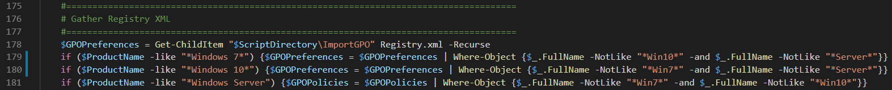
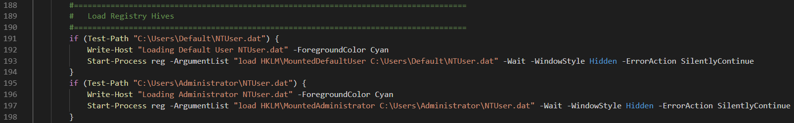
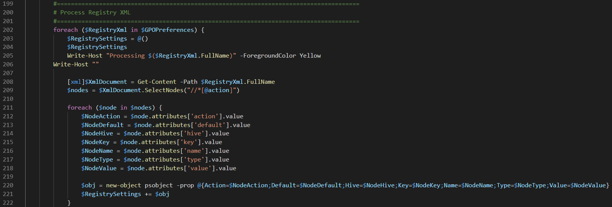
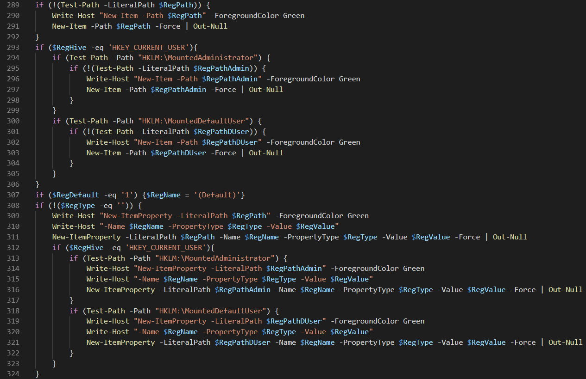
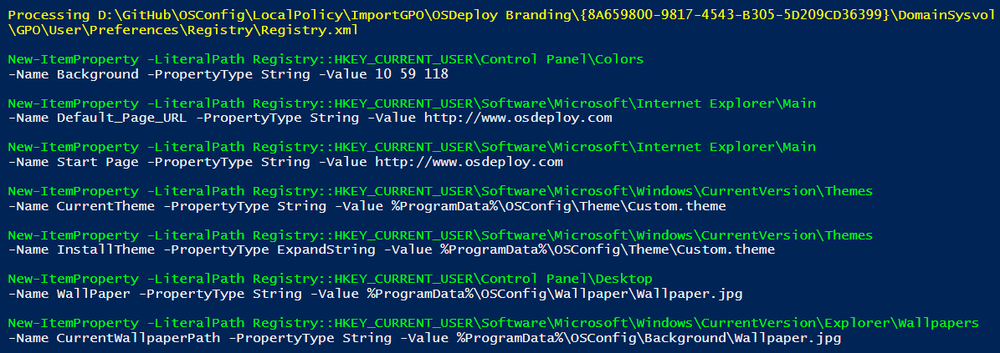

# Import-GPO.ps1

This script is the key to importing Group Policy.  The script imports all GPO's in the ImportGPO directory.  Pay attention to the naming standards.  If you need a GPO in this directory applied to Windows 10 and not any other Operating System, make sure Win10 is in the name of the GPO.  The same pattern applies to Win7 and Windows Server \(Windows Server filtering was added to this script in version 18.9.2\)

## Import Registry Preferences

The same filtering is used in finding GPO Registry.xml files \(Windows Server filtering was added to this script in version 18.9.2\).

The next step is to mount the Default User and Administrator Registry Hives

And then to go through all the XML nodes

And write the Registry Values into the Registry \(hives will be dismounted when complete\)

During execution of the script, the console output will look like this

