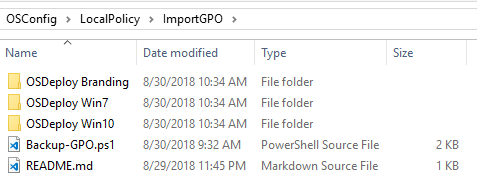
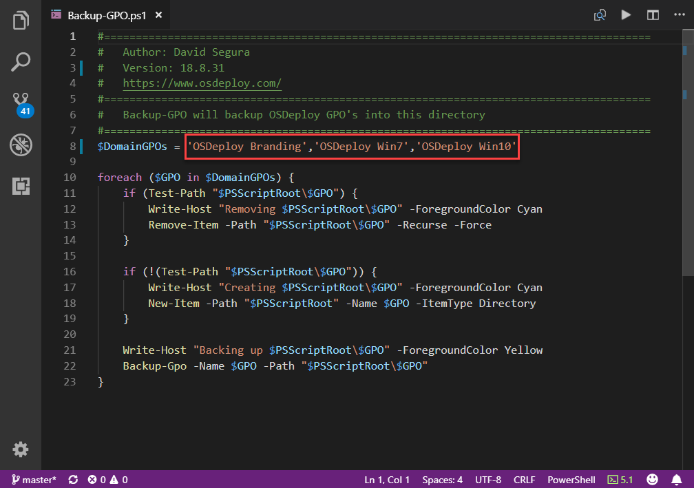

# ImportGPO

Group Policy Objects placed in this directory will be applied with OSConfig

In the image above, the following GPOs will be applied

* OSDeploy Branding
* OSDeploy Win7
* OSDeploy Win10

## Backup-GPO.ps1

Script to copy specified GPOs into the ImportGPO directory.  This file can be edited as needed with the names of your GPOs

