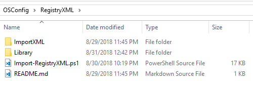

# RegistryXML

RegistryXML is a method to add Registry entries into your Windows Image.

## ImportXML

Registry XML files added to this directory will be imported by Import-RegistryXML.ps1

## Library

Sample Registry XML files

## Import-RegistryXML.ps1

Applies Registry XML files located in the ImportXML subdirectory

## Reg2GPP

You can easily convert existing REG files to RegistryXML files by using the following website



## Convert-RegToGppXml.ps1

Or use a PowerShell Script



