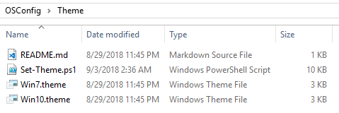

# Theme

Theme customization is important if you want to get rid of the "Hero" wallpaper for new users.

## Set-Theme.ps1

This script will determine the Operating System and copy either the Win7.theme or the Win10.theme to Custom.theme \(in this directory\).  Set the Theme file to %ProgramData%\OSConfig\Theme\Custom.theme in Group Policy

## Win7.theme

Windows 7 Aero Theme file with the Wallpaper entry removed

## Win10.theme

Windows 10 Aero Theme file with the Wallpaper entry removed

