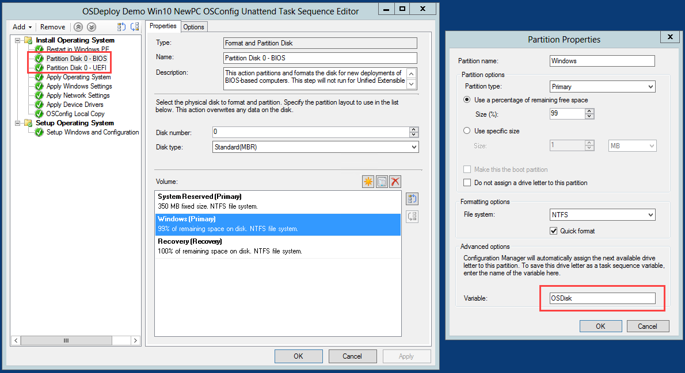

# ConfigMgr New PC TS Unattend.xml

You can deploy OSConfig in a Configuration Manager Task Sequence in the Specialize Phase of an Unattend.xml.  The following requirements must be met

* OSConfig must be created as a Package \(no Program\)
* Windows Partition Drive Letter must be saved as a Task Sequence Variable
* Unattend.xml must be edited
* OSConfig must be copied locally to C:\ProgramData\OSConfig\\*

### Create an OSConfig Package

Create a new Package with Source Files to the root of your OSConfig content.  Do not create a Program.  Distribute Content to your Distribution Points

### Task Sequence Partition Steps

Edit your Partition Disk steps to ensure that the Windows Partition Drive Letter is assigned a Variable.  This is typically OSDisk.  Repeat this process for both BIOS and UEFI Windows Partitions



### Package Run Command Line

Inset a Run Command Line step with your OSConfig Package to copy the contents locally.  Use the following Command Line

```text
cmd.exe /c md %OSDisk%\ProgramData\OSConfig & cmd.exe /c xcopy ".\*" %OSDisk%\ProgramData\OSConfig /y /e
```


### Unattend.xml

OSConfig is executed by adding the following command line to the Specialize Phase in the Unattend.xml

```text
PowerShell.exe -ExecutionPolicy Bypass -File C:\ProgramData\OSConfig\OSConfig.ps1
```

Here is a minimal Unattend.xml \(x64 and x86\) for reference that can be used.  Create a Package for your Unattend.xml

```text
<?xml version="1.0" encoding="utf-8"?>
<unattend xmlns="urn:schemas-microsoft-com:unattend">
	<settings pass="specialize">
		<component name="Microsoft-Windows-Deployment" processorArchitecture="amd64" publicKeyToken="31bf3856ad364e35" language="neutral" versionScope="nonSxS" xmlns:wcm="http://schemas.microsoft.com/WMIConfig/2002/State" xmlns:xsi="http://www.w3.org/2001/XMLSchema-instance">
			<RunSynchronous>
				<RunSynchronousCommand wcm:action="add">
					<Description>EnableAdmin</Description>
					<Order>1</Order>
					<Path>cmd /c net user Administrator /active:yes</Path>
				</RunSynchronousCommand>
				<RunSynchronousCommand wcm:action="add">
					<Description>UnfilterAdministratorToken</Description>
					<Order>2</Order>
					<Path>cmd /c reg add HKLM\SOFTWARE\Microsoft\Windows\CurrentVersion\Policies\System /v FilterAdministratorToken /t REG_DWORD /d 0 /f</Path>
				</RunSynchronousCommand>
				<RunSynchronousCommand wcm:action="add">
					<Description>disable async RunOnce</Description>
					<Order>3</Order>
					<Path>reg add HKLM\Software\Microsoft\Windows\CurrentVersion\Explorer /v AsyncRunOnce /t REG_DWORD /d 0 /f</Path>
				</RunSynchronousCommand>
				<RunSynchronousCommand wcm:action="add">
					<Description>OSConfig</Description>
					<Order>4</Order>
					<Path>PowerShell.exe -ExecutionPolicy Bypass -File C:\ProgramData\OSConfig\OSConfig.ps1</Path>
				</RunSynchronousCommand>
			</RunSynchronous>
		</component>
		<component name="Microsoft-Windows-Deployment" processorArchitecture="x86" publicKeyToken="31bf3856ad364e35" language="neutral" versionScope="nonSxS" xmlns:wcm="http://schemas.microsoft.com/WMIConfig/2002/State" xmlns:xsi="http://www.w3.org/2001/XMLSchema-instance">
			<RunSynchronous>
				<RunSynchronousCommand wcm:action="add">
					<Description>EnableAdmin</Description>
					<Order>1</Order>
					<Path>cmd /c net user Administrator /active:yes</Path>
				</RunSynchronousCommand>
				<RunSynchronousCommand wcm:action="add">
					<Description>UnfilterAdministratorToken</Description>
					<Order>2</Order>
					<Path>cmd /c reg add HKLM\SOFTWARE\Microsoft\Windows\CurrentVersion\Policies\System /v FilterAdministratorToken /t REG_DWORD /d 0 /f</Path>
				</RunSynchronousCommand>
				<RunSynchronousCommand wcm:action="add">
					<Description>disable async RunOnce</Description>
					<Order>3</Order>
					<Path>reg add HKLM\Software\Microsoft\Windows\CurrentVersion\Explorer /v AsyncRunOnce /t REG_DWORD /d 0 /f</Path>
				</RunSynchronousCommand>
				<RunSynchronousCommand wcm:action="add">
					<Description>OSConfig</Description>
					<Order>4</Order>
					<Path>PowerShell.exe -ExecutionPolicy Bypass -File C:\ProgramData\OSConfig\OSConfig.ps1</Path>
				</RunSynchronousCommand>
			</RunSynchronous>
		</component>
	</settings>
</unattend>
```

### Apply Operating System

Make sure the Apply Operating System step contains the proper Unattend.xml and the OSDisk settings


### Deployment

During OS Deployment you will see progress during the Specialize phase before first logon


If everything worked fine, your Operating System should show your customizations immediately.


