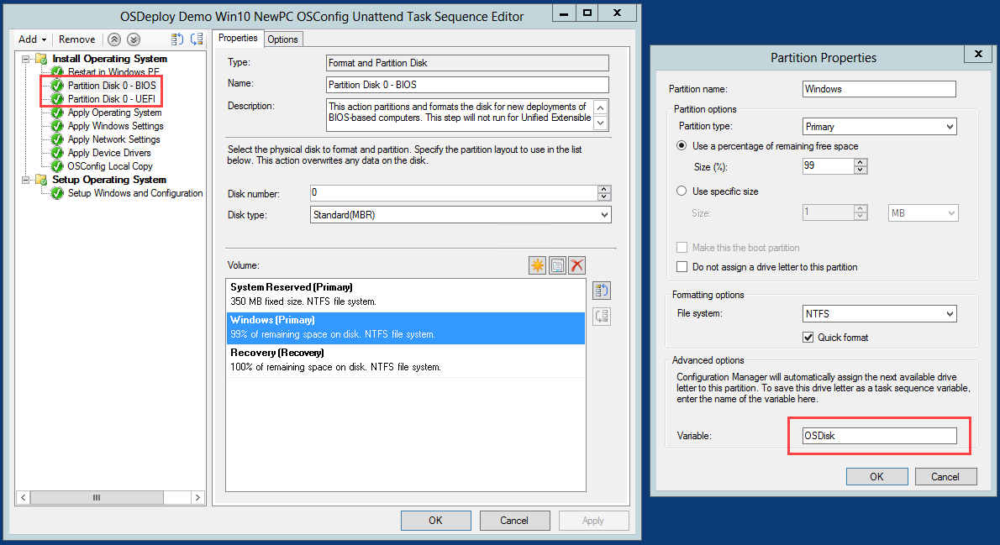
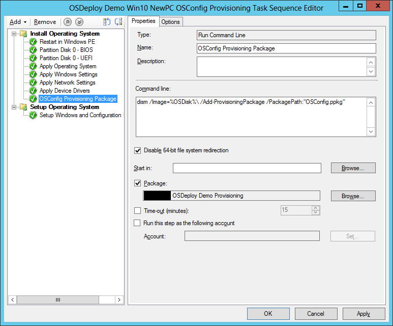
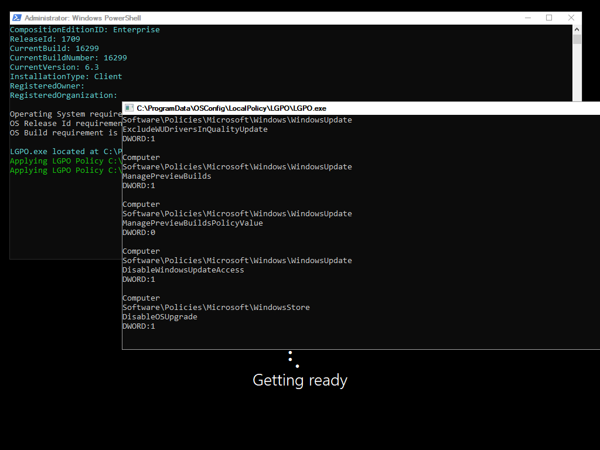
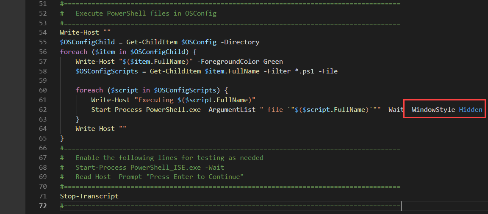

# ConfigMgr NewPC TS Provisioning Package

To use OSConfig in a Provisioning Package, the following changes to the Task Sequence need to be made

* OSConfig.ppkg must be created as a Package \(no Program\)
* Windows Partition Drive Letter must be saved as a Task Sequence Variable

### Create an OSConfig Package for the PPKG File

Create a new Package with Source Files to the root of your OSConfig PPKG content.  The package will contain only the PPKG file, nothing else.  Do not create a Program.  Distribute Content to your Distribution Points

### Task Sequence Partition Steps

Edit your Partition Disk steps to ensure that the Windows Partition Drive Letter is assigned a Variable.  This is typically OSDisk.  Repeat this process for both BIOS and UEFI Windows Partitions



### Package Run Command Line

Inset a Run Command Line step with your OSConfig PPKG Package to inject the PPKG to the Offline Windows Image \(in WinPE\).  Use the following Command Line

```text
dism /Image=%OSDisk%\ /Add-ProvisioningPackage /PackagePath:"OSConfig.ppkg"
```



### Deployment

OSConfig.ps1 will execute silently during the OOBE Phase, but the child scripts will not



For fully silent operation during OOBE, you can edit OSConfig.ps1 file to make everything run hidden



When complete, everything should have applied properly.  You can check the PPKG LOG file or the OSConfig Log files to determine if there were any issues.


