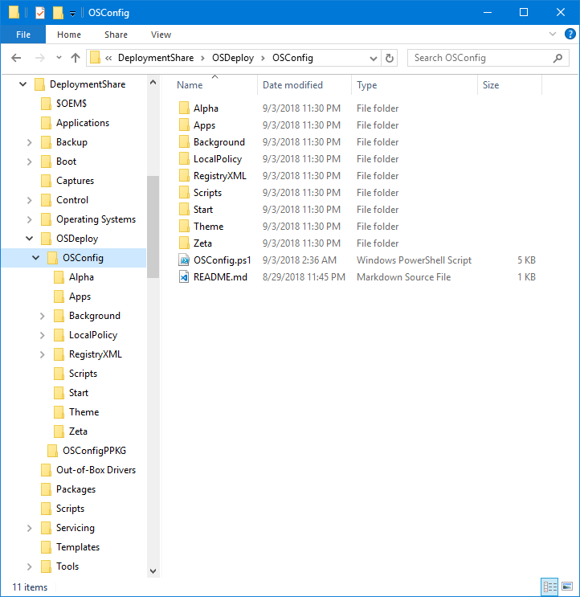
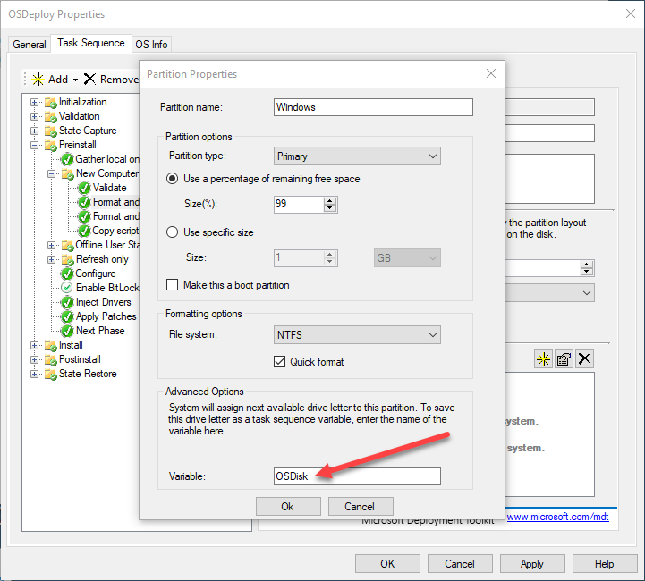
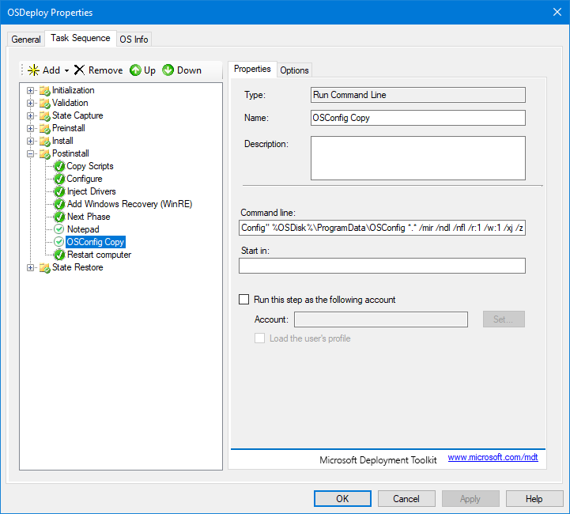
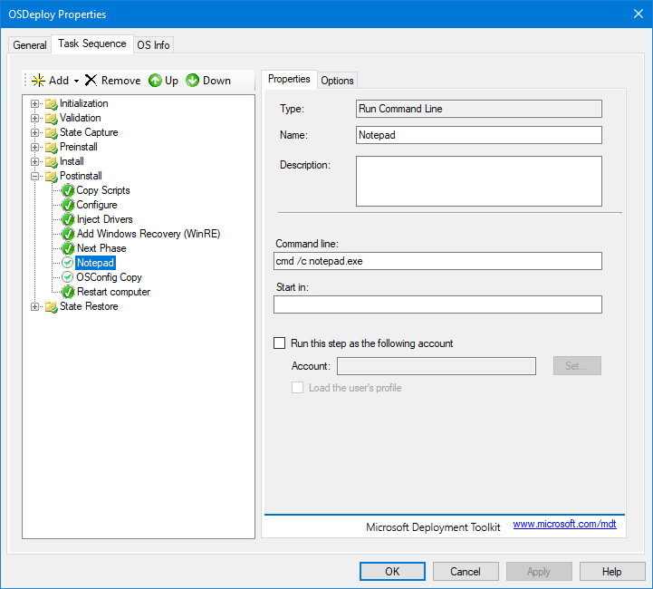
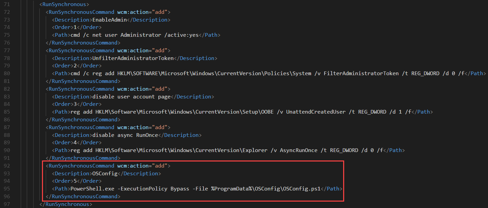
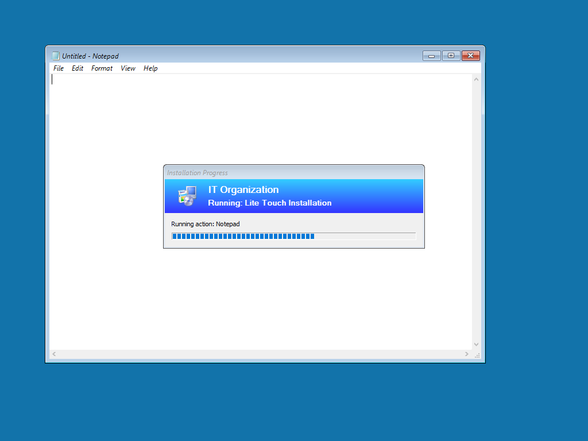
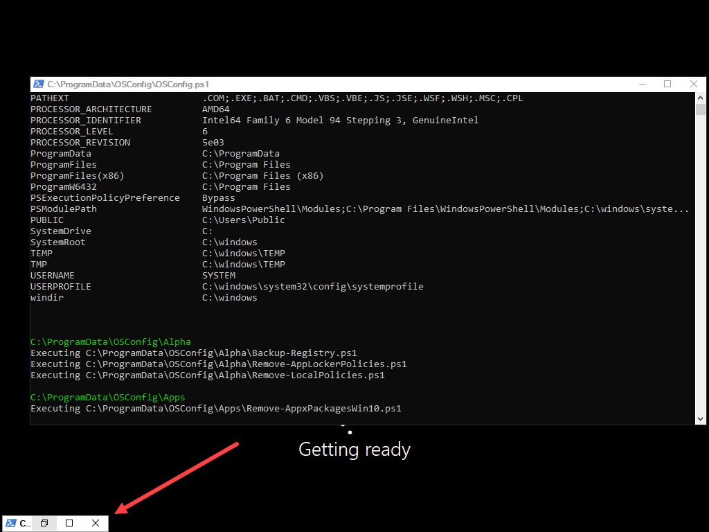
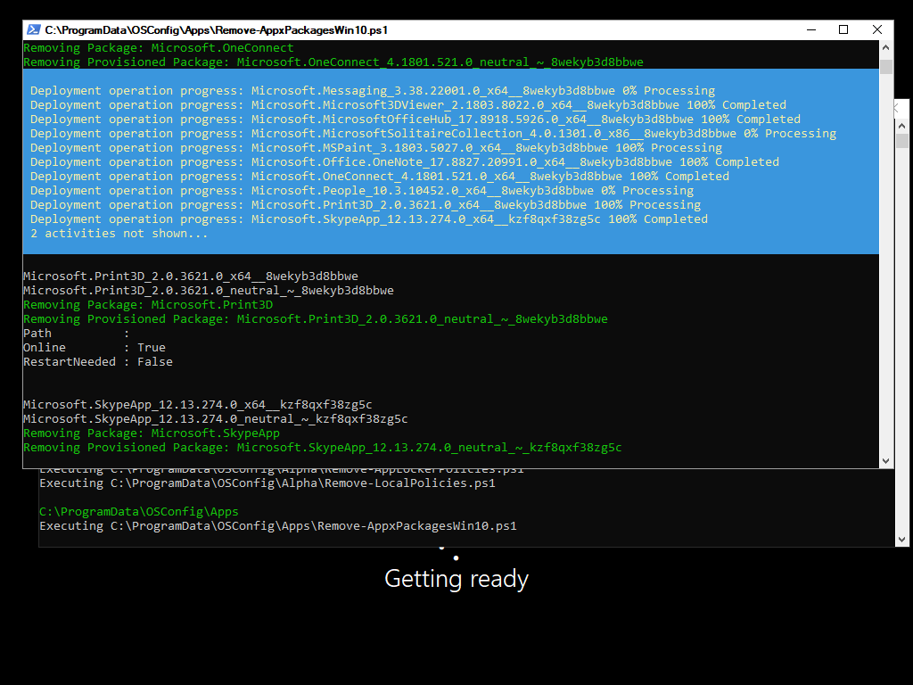

# MDT New PC TS

OSConfig can be added to an MDT Task Sequence in a few steps.  

## Add OSConfig to the Deployment Share

Once you have OSConfig properly configured, copy it to your MDT Deployment Share.  I prefer to keep mine in the following location

```text
<DeploymentShare>\OSDeploy\OSConfig\*
```



## Verify OSDisk

Make sure that your Format Partition steps use OSDisk for your Windows Partition



## Task Sequence Copy OSConfig Step

Edit your task Sequence and in the Postinstall Phase, add a **Run Command Line** step right before Restart computer called **Copy OSConfig** with the following **Command line**

```text
cmd /c robocopy "%DeployRoot%\OSDeploy\OSConfig" %OSDisk%\ProgramData\OSConfig *.* /mir /ndl /nfl /r:1 /w:1 /xj /z
```



In the Options tab, add a 1 to the **Success codes** and check **Continue on error**


## Task Sequence Pause Step

I add a Run Command Line step to open Notepad with 'Continue on Error' during testing.  This allows the Task Sequence to pause so I can take a VM Snapshot.  You must open Notepad with 'cmd /c', otherwise Notepad will be hidden.  Use the following Command Line

```text
cmd /c notepad.exe
```



## Edit the Task Sequence Unattend.xml

Add a new RunSynchronousCommand entry to your Unattend.xml file at &lt;DeploymentShare&gt;\Control\&lt;TaskSequenceID&gt;\Unattend.xml

```text
<RunSynchronousCommand wcm:action="add">
  <Description>OSConfig</Description>
  <Order>5</Order>
  <Path>PowerShell.exe -ExecutionPolicy Bypass -File %ProgramData%\OSConfig\OSConfig.ps1</Path>
</RunSynchronousCommand>
```

When complete, it should look like this:



Save and close it.

## Run the Task Sequence

If you added Notepad to pause the Task Sequence, take a VM Snapshot.  Close Notepad and the Task Sequence will continue.



OSConfig will be copied to OSDisk and the computer will restart.  During the Specialize Phase \(OOBE\), OSConfig will execute.  Depending on how you have your Child scripts set to process, you can maximize the minimized Window.



In the image below, the Appx Packages are being removed



## 


