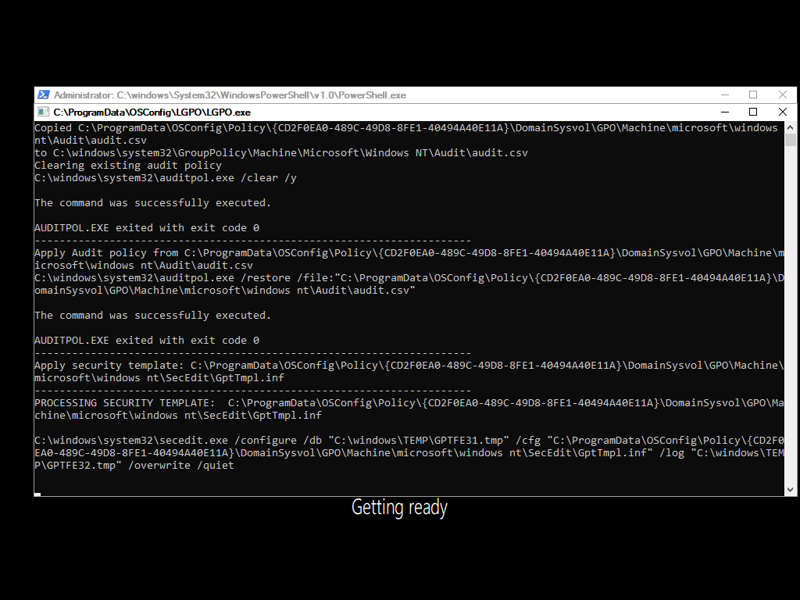
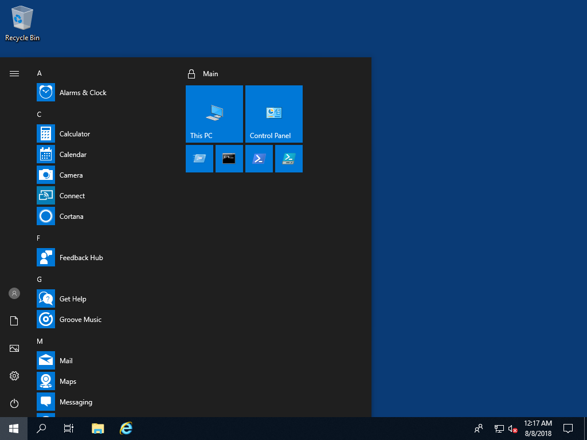
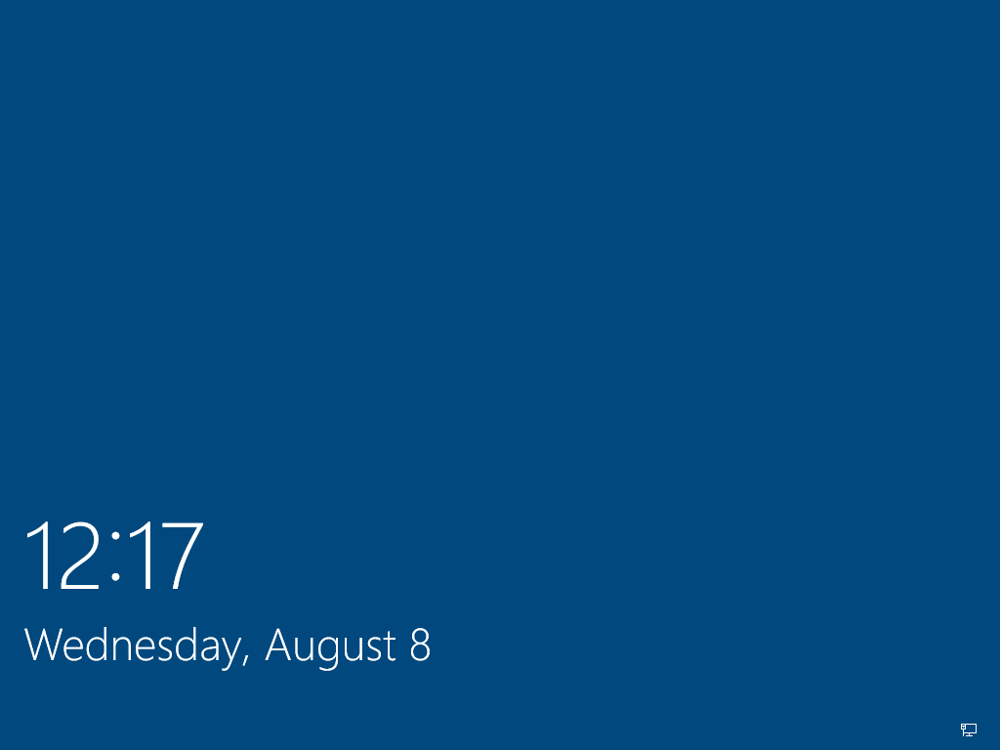
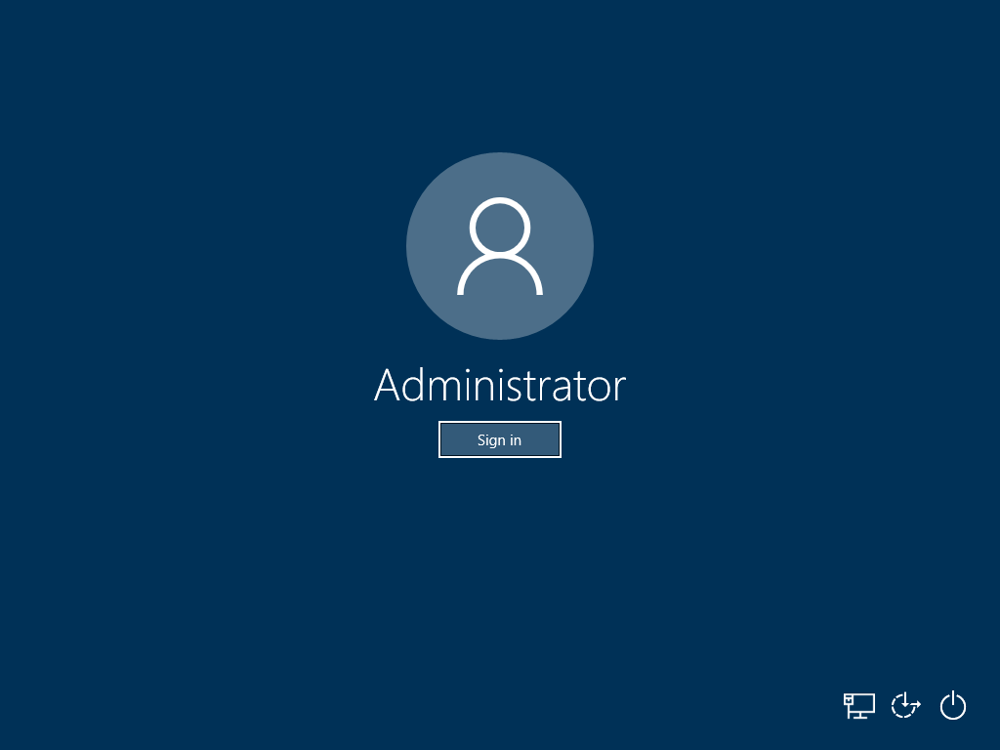
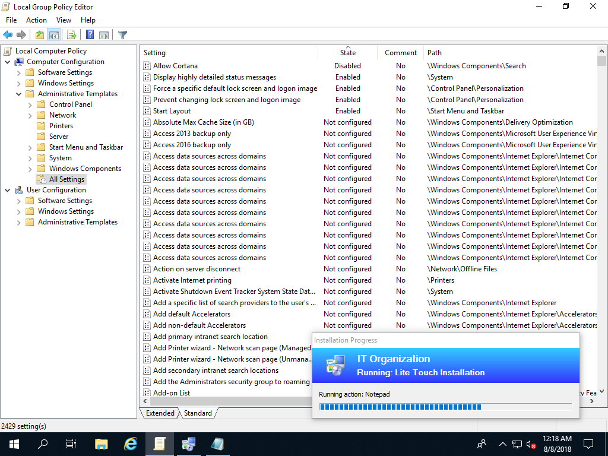

# Apply Local Policies

Now comes the fun part.  Replace your OSConfig.ps1 with this code and try run through your test again

```text
#======================================================================================
#	Author: David Segura
#	Version: 18.8.8
#	https://www.osdeploy.com/osconfig/development/apply-local-policies
#======================================================================================
#	Start OSConfig
Write-Host "Starting OSConfig..." -ForegroundColor Yellow
Write-Host ""
#======================================================================================
#	OSConfig Content
Write-Host "Importing LGPO Policy..." -ForegroundColor Yellow
Start-Process "$PSScriptRoot\LGPO\LGPO.exe" -ArgumentList ('/g',"$PSScriptRoot\Policy",'/v') -Wait
#======================================================================================
#	For Testing Only
#	Start-Process PowerShell_ISE.exe -Wait
#	Read-Host -Prompt "Press Enter to Continue"
#======================================================================================
```


You can download this script from [GitHub](https://github.com/OSDeploy/OSConfig.Development/tree/master/Apply%20Local%20Policies)


### Getting Ready

After your VM restarts from WinPE, you will see the the exported Policies being applied with LGPO



### Windows Start Layout and Wallpaper

When Windows comes up, enjoy the sweet customizations



### Lock Screen



### Logon Screen



### Local Computer Policy

And best of all, since this configuration was done with a Policy, every change is visible in the Local Group Policy Editor.  When you "hack" the registry to add customizations, you don't see your changes reflected here.




