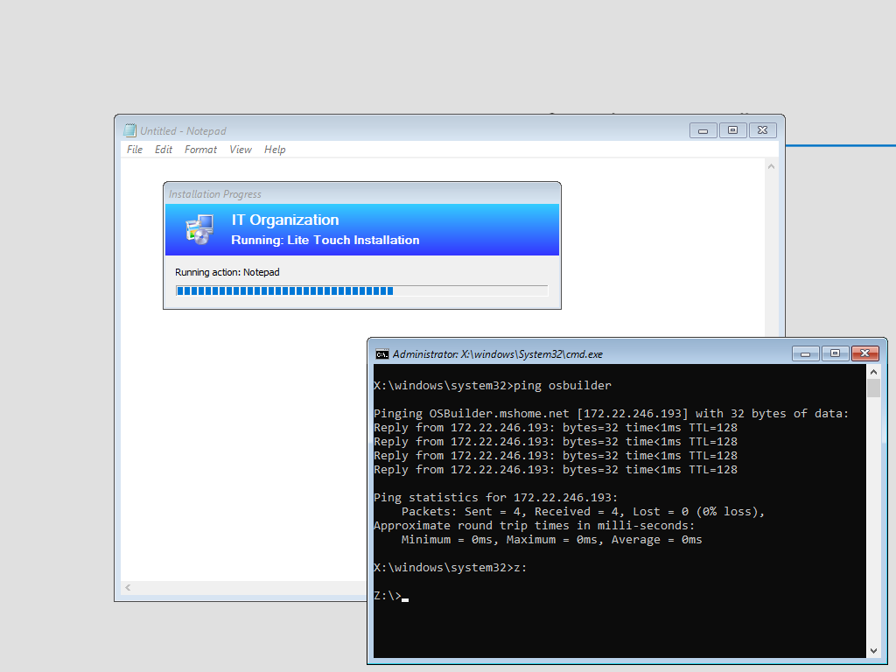
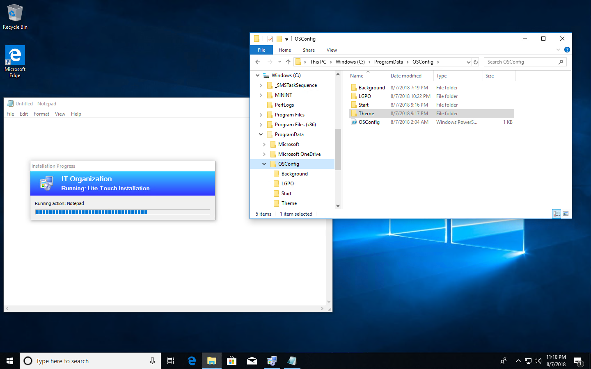

# Create Local Policies

Restore your Virtual Machine back to WinPE where Notepad was opened.  You may need to press F8 to open a command prompt and wait for the Z: drive to connect



The Task Sequence will restart the computer to continue with Windows Setup.  Once the computer gets to the Desktop, the second Notepad step will halt the process.  Windows Explorer should show C:\ProgramData\OSConfig and all out content.  Minimize Notepad \(don't close it\) . . . 



### Local Group Policy Editor

Start editing the Local Group Policy.  You are free to make whatever changes you want, I will show you the important stuff

```text
Computer Configuration\Administrative Templates\*

\Control Panel\Personalization
Force a specific default lock screen and logon image
Enabled
Path to lock screen image:
%ProgramData%\OSConfig\Background\LockScreen.jpg
Turn off fun facts, tips, tricks, and more on lock screen

\Control Panel\Personalization
Prevent changing lock screen and logon image
Enabled

\Start Menu and Taskbar
Start Layout
%ProgramData%\OSConfig\Start\StartLayout.xml

\System
Display highly detailed status messages
Enabled

\Windows Components\Search
Allow Cortana
Disabled
```

```text
User Configuration\Administrative Templates\*

\Control Panel\Personalization
Prevent changing theme
Enabled

\Control Panel\Personalization
Load a specific theme
Enabled
Path to theme file:
%ProgramData%\OSConfig\Theme\Custom.theme

\Start Menu and Taskbar
Show "Run as different user" command on Start
Enabled

\Windows Components\Cloud Content
Turn off all Windows spotlight features
Enabled
```

### Create a LGPO Backup

Create a directory at Z:\OSDeploy\OSConfig\Policy

Open an elevated Command Prompt and run the following command

```text
Z:\OSDeploy\OSConfig\LGPO\LGPO.exe /b Z:\OSDeploy\OSConfig\Policy
```

You now have a backup of your Local Group Policy


Now revert back to WinPE!


